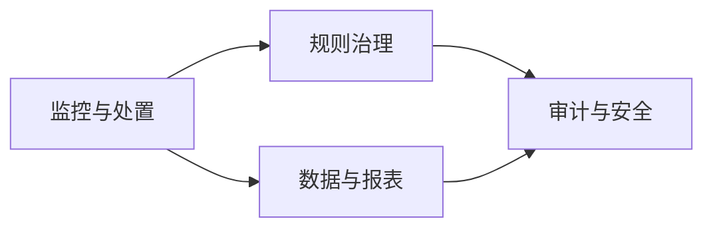

# 三客一危值班助手：产品理解与阶段规划 V2

版本：`2.0`  
形成日期：`2026-07-19`

## 1. 产品定义

产品是叠加在省平台之上的报警处置与数据治理辅助系统，不重建省平台。浏览器插件只是平台侧采集与执行端，目标产品还包括规则中心、数据与报表中心、审计与安全中心。

## 2. 产品角色

| 角色 | 职责 |
| --- | --- |
| 监控值班员 | 监控报警、接管失败、备注和提交处置 |
| 处置复核员 | 复核高风险或异常处置 |
| 规则配置员 | 创建规则、文本模板、语音模板草案 |
| 规则审核员 | 审核、批准、发布和回滚规则 |
| 数据分析/报表员 | 授权企业展示、日报、月报和脱敏导出 |
| 系统管理员 | 用户、组织、企业范围和技术配置 |
| 安全审计员 | 查看规则、动作、处置、导出和敏感访问日志 |

规则配置员与规则审核员不能是同一规则版本上的同一人；监控值班员不能修改或审核运行规则。

## 3. 四个产品域



- 监控与处置：报警、字段、规则结果、文本/语音动作、失败转人工。
- 规则治理：草拟、仿真、审核、发布、回滚和版本追溯。
- 数据与报表：企业展示、处置台账、日报、月报和授权导出。
- 审计与安全：角色、企业范围、职责分离、敏感访问和导出审计。

## 4. 响应模型

目标模型将“处理策略”和“响应渠道”分离：

```text
handlingMode = AUTO / MANUAL / RECORD_ONLY / DISABLED
channels = TEXT / VOICE
orchestration = 单渠道 / 顺序 / 并行 / 失败兜底
```

文本和语音都使用经过配置、审核和发布的固定模板。生产模式不允许 AI 自由生成司机提醒内容。

## 5. 数据展示与导出

- 插件只保留当前报警和工作状态。
- 独立数据与报表中心按集团、分公司、企业和车辆展示。
- 支持日报、月报、处置台账、趋势和数据质量。
- 正式报表以 XLSX/PDF 为主，CSV 用于脱敏明细交换。
- 完整 JSON 不属于普通导出，改为专门权限控制的敏感证据包。

## 6. 敏感数据

车辆、司机、企业、精确位置、时间、备注、原始响应和证据引用均可能是敏感信息。普通页面按权限展示，普通导出默认脱敏或聚合；完整证据导出必须记录用途、企业范围、文件哈希、下载和过期信息。

Cookie、Authorization、Token 和密码禁止进入业务存储与导出。

## 7. 当前实现与目标差距

| 能力 | 当前实现 | 目标产品 |
| --- | --- | --- |
| 角色 | 浏览器本机操作 | 多角色、企业范围和职责分离 |
| 规则 | 本地 JSON 导入 | 配置、审核、发布、回滚 |
| 响应 | 主要实现语音运行路径 | 文本、语音和组合策略 |
| 展示 | 插件最近事件 | 独立企业数据中心 |
| 报表 | 本地 CSV/JSON | 日报、月报、XLSX/PDF |
| 完整 JSON | 本机确认导出 | 高敏证据包和全程审计 |

## 8. 阶段规划

1. 产品逻辑、角色、流程、报表和安全边界确认。
2. 真实接口、字段、组织企业关系和 DOM 只读校准。
3. 建设多角色监控处置工作台。
4. 建设规则配置、审核、发布和回滚中心。
5. 完成固定文本与固定语音双渠道适配。
6. 建设企业数据展示、日报和月报中心。
7. 建设敏感数据、证据包和导出审计。
8. 在授权测试账号和车辆上进行受控真实联调。

## 9. 权威产品文档

完整逻辑见：

- [产品逻辑规划 V2](../../product/三客一危值班助手-产品逻辑规划-v2.md)
- [角色权限与职责分离](../../product/角色权限与职责分离设计.md)
- [数据展示、日报月报与导出](../../product/数据展示日报月报与导出规划.md)
- [文本、语音响应与敏感数据安全](../../product/文本语音响应与敏感数据安全规划.md)

