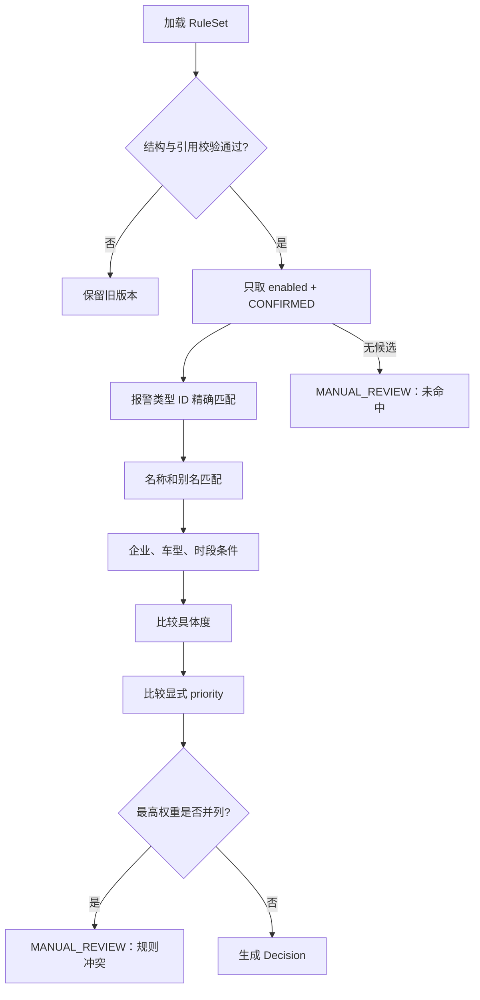

# 三客一危值班助手：通用规则逻辑与实现计划

版本：`1.0`  
形成日期：`2026-07-19`

> 产品 V2 调整：规则不再只输出“自动语音”。目标模型将处理策略与文本/语音渠道分离，并增加配置、审核、发布的职责分离。本文保留当前 JSON v1 实现，同时给出 V2 迁移目标。

## 1. 设计目标

规则会持续变化，因此规则数据必须与采集、去重和对讲代码分离。运行时使用版本化 JSON；取得正式 Excel 模板后，通过离线转换和同一校验器生成 JSON，不让插件在运行时直接读取业务 Excel。

规则引擎的首要目标是确定性和安全：相同事件、相同规则版本必须产生相同判断；不完整、冲突或未确认的输入不得触发真实动作。

## 2. 领域对象

| 对象 | 含义 | 关键标识 |
| --- | --- | --- |
| `Capture` | 一次脱敏请求/响应或弹窗观察 | `captureId` |
| `AlarmEvent` | 跨接口归并后的唯一报警 | `eventId`、`alarmId` |
| `RuleSet` | 一批同时使用的版本化规则 | `version` |
| `Rule` | 一条匹配条件和动作定义 | `id` |
| `Decision` | 某事件在某规则版本下的判断 | `decisionId` |
| `ActionAttempt` | 一次动作尝试 | `actionId` |
| `LedgerRow` | 面向值班人员的扁平台账 | `eventId` |

## 3. 运行时规则结构

```json
{
  "schemaVersion": 1,
  "version": "2026-07-19-v1",
  "status": "CONFIRMED",
  "updatedAt": "2026-07-19T00:00:00.000Z",
  "changeNote": "业务确认版本",
  "rules": [
    {
      "id": "identity-voice",
      "name": "身份识别报警固定语音",
      "enabled": true,
      "approvalStatus": "CONFIRMED",
      "priority": 100,
      "match": {
        "alarmTypeIds": ["64"],
        "alarmNames": ["驾驶员身份识别报警"],
        "alarmAliases": [],
        "vehicleTypes": [],
        "companyIds": [],
        "companyNames": [],
        "timeRanges": []
      },
      "action": "AUTO_VOICE",
      "voiceTemplateId": "voice-identity-v1",
      "audioAssetId": "audio-identity-v1",
      "allowRealIntercom": false,
      "requireVehicleAllowlist": true,
      "failureAction": "MANUAL_REVIEW",
      "effectiveFrom": null,
      "updatedAt": "2026-07-19T00:00:00.000Z",
      "changeNote": "示例；真实启用需业务确认"
    }
  ]
}
```

## 4. 当前运行时动作枚举

| 动作 | 行为 |
| --- | --- |
| `AUTO_VOICE` | 通过全部安全闸门后，使用固定音频执行演练、沙箱或受控真实对讲 |
| `MANUAL_REVIEW` | 交给值班人员查看、备注和后续处理 |
| `RECORD_ONLY` | 只记录，不触发任何文本或语音外部动作 |
| `DISABLED` | 规则停用，运行时按转人工处理 |

### 4.1 目标 V2 响应模型

```text
handlingMode = AUTO / MANUAL / RECORD_ONLY / DISABLED
channels = TEXT / VOICE
orchestration = SINGLE / SEQUENTIAL / PARALLEL / FALLBACK
```

- 当前 `AUTO_VOICE` 映射为 `AUTO + VOICE`。
- 新增 `TEXT` 固定文本渠道。
- 规则可定义先文本后语音、文本失败升级语音、语音失败转文本或人工。
- 文本模板和音频资产都必须经过配置人与审核人分离的发布流程。

## 5. 匹配顺序



具体顺序：

1. 只加载结构校验通过的新规则集。
2. 只使用 `enabled=true` 且 `approvalStatus=CONFIRMED` 的规则。
3. 报警类型 ID 精确匹配优先于报警名称和别名。
4. 企业、车型和时段条件越具体，排序越靠前。
5. 再比较显式 `priority`，数值高者优先。
6. 最高权重并列时不自动执行，输出 `MANUAL_REVIEW`。
7. 没有候选规则时输出 `MANUAL_REVIEW`。
8. 必需字段缺失时不猜测，输出 `MANUAL_REVIEW`。

## 6. 导入校验

当前实现会校验：

- `schemaVersion` 必须为 `1`。
- 规则集版本必须存在且长度合法。
- 单个规则集最多 500 条。
- 规则 ID 必须存在且不能重复。
- `enabled`、`priority`、`approvalStatus`、`action` 类型和枚举合法。
- 匹配字段必须为非空字符串或数字数组。
- 时间段必须是合法 `HH:mm`。
- `AUTO_VOICE` 必须引用话术和音频资产。
- 已确认自动语音规则只能引用已确认音频。
- 未确认规则不得允许真实对讲。
- 已确认规则的同条件、同优先级冲突会被拒绝。
- 校验失败时保留旧规则集，不切换到不完整版本。

### 风险条件边界

`match.risks` 目前没有业务方确认的字段、运算符和空值语义。当前运行时拒绝导入非空风险条件，避免静默忽略后错误触发。取得正式规则表后再定义，例如：

```json
{
  "field": "locationSpeed",
  "operator": "GTE",
  "value": 60
}
```

在定义 `EQ/NE/GT/GTE/LT/LTE/IN/EXISTS` 等运算符前，不启用该能力。

## 7. 决策与动作状态机

```text
DISCOVERED
→ READY
→ RULE_MATCHED
→ PLANNED
→ EXECUTING / MANUAL_REQUIRED / RECORD_ONLY
→ SUCCEEDED / FAILED / UNKNOWN
→ RECORDED
```

约束：

- 原始报警必须先保存，再执行规则。
- 规则判断失败不能删除报警。
- 没有明确回执只能写 `UNKNOWN`。
- `FAILED`、`UNKNOWN`、`BLOCKED` 最终都转 `MANUAL_REQUIRED`。
- 同一报警默认只产生一次自动动作。
- 同一车辆存在执行中动作时，后续动作被阻断。
- 人工重试必须由值班人员确认，生成新的 `ActionAttempt` 并引用上一次动作。

## 8. 自动语音安全闸门

### 8.1 演练模式

- 规则必须选择 `AUTO_VOICE`。
- 固定音频必须存在且已确认。
- 不调用任何平台动作接口。
- 生成模拟成功记录，用于验证规则和台账。

### 8.2 沙箱动作

- 规则必须选择 `AUTO_VOICE`。
- 固定音频必须存在且已确认。
- 只允许调用固定地址 `127.0.0.1:18080`。
- 只接受沙箱固定音频和合成报警/车辆。
- 成功和失败都必须保存回执。

### 8.3 真实动作目标闸门

未来真实动作必须同时满足：

1. `action=AUTO_VOICE`。
2. `approvalStatus=CONFIRMED`。
3. `allowRealIntercom=true`。
4. 固定音频已确认且哈希有效。
5. 插件运行模式为 `LIVE`。
6. 车辆在真实动作白名单。
7. 车辆在线且当前账号有对讲权限。
8. 当前车辆没有进行中对讲。
9. 启动、WebSocket、保活和关闭链路已在测试车辆验证。

当前代码只实现闸门和固定阻断，不包含生产动作实现。

## 9. 规则版本管理

- 每次导入形成新的不可变规则集版本。
- 历史 `Decision` 永远引用当时的 `ruleSetVersion` 和 `ruleId`。
- 新规则不重新改变已经处理的历史报警。
- 同一事件已有动作后，不因后台规则变化自动重新执行。
- 规则导入、设置变更和导出台账写入 `Audit`。
- 音频更新必须生成新的资产版本；历史动作保留旧资产 ID 和哈希。
- 目标规则中心状态为 `DRAFT → VALIDATING → IN_REVIEW → APPROVED → PUBLISHED → RETIRED`。
- 规则配置人与规则审核人不能是同一规则版本上的同一人。
- 已发布规则、文本模板和语音资产都不能原地覆盖。

## 10. Excel 转 JSON 计划

正式 Excel 模板到位后增加离线转换器：

1. 所有长 ID 按文本读取。
2. 表头映射到 Rule 字段。
3. 空单元格转换为空数组或 `null`，不猜默认值。
4. 一行转换为一条规则。
5. 检查重复 ID、非法动作、非法时间、条件冲突和音频引用。
6. 生成新的版本化 JSON。
7. 调用现有 `validateRuleSet` 校验。
8. 当前本地 MVP 由开发/测试人员导入验证；目标产品由规则配置员提交规则中心，经不同的规则审核员批准并发布后下发运行时。

不直接持续写入用户正在打开的原始 Excel。

## 11. 实现计划

| 优先级 | 工作项 | 交付 | 验收 |
| --- | --- | --- | --- |
| P0 | 校准真实报警类型 ID、名称和别名 | 正式字段表 | ID 和名称来源可追溯 |
| P0 | 获取正式规则表和确认状态 | 规则集 v1 | 无未确认规则驱动真实动作 |
| P0 | 获取固定话术和音频 | 版本化音频资产 | 格式、时长、哈希通过 |
| P0 | 定义固定文本模板和变量白名单 | 版本化文本模板 | 内容、变量、适用范围通过审核 |
| P0 | 定义配置/审核/发布权限 | 规则治理权限矩阵 | 配置人不能自审自发 |
| P1 | 定义风险条件字段和运算符 | `risks` schema v2 | 空值和边界测试明确 |
| P1 | Excel 离线转换器 | XLSX→JSON 工具 | 与手工 JSON 结果一致 |
| P1 | 规则差异和回滚界面 | 导入预览、回滚 | 失败时旧版本继续运行 |
| P2 | 规则仿真批量测试 | 历史脱敏事件回放 | 无意外自动动作 |

## 12. 测试矩阵

- 19 位报警 ID 字符串。
- ID 精确匹配优先于名称。
- 名称和别名匹配。
- 企业、车型、跨午夜时间段。
- 未命中默认转人工。
- 字段不足转人工。
- 同权重冲突转人工。
- 未确认规则不参与匹配。
- 重复 ID、非法枚举和非法时间导入失败。
- 未确认音频和错误哈希导入失败。
- 规则版本切换不改变历史动作。
- 演练、沙箱成功、沙箱失败三条路径。
- 失败不自动重播，人工重试产生新动作记录。
- 文本单渠道、语音单渠道、文本转语音和失败转人工。
- 规则配置人与审核人互斥。
