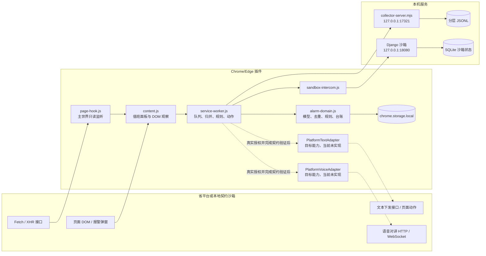
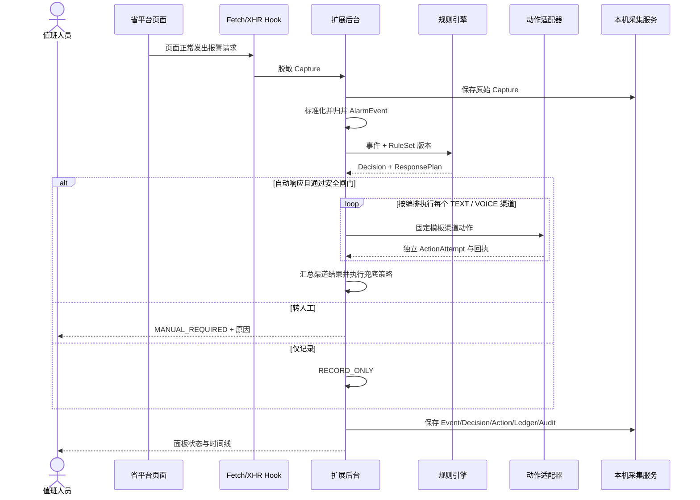
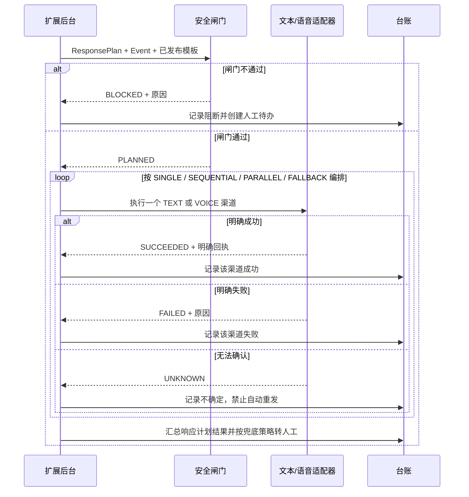

# 三客一危值班助手：数据采集插件响应、对讲与台账实施说明

版本：`1.0`  
形成日期：`2026-07-19`  
插件版本：`0.2.4`

> 产品 V2 调整：浏览器插件继续作为省平台采集与执行端；规则审核、企业数据展示、日报月报和敏感证据包不再由普通插件设置页承担。目标响应同时包含固定文本和固定语音，当前代码主要完成语音沙箱路径。

## 1. 建设目标

完善现有浏览器插件，使其能够在省平台已登录页面中：

1. 监听白名单 Fetch/XHR、指定报警弹窗和详情弹窗。
2. 采集并归并报警、车辆、司机、企业、时间、位置、速度和平台状态。
3. 形成唯一标准报警事件并执行业务去重。
4. 使用版本化规则生成自动、人工或仅记录的处理策略，以及文本/语音响应计划。
5. 在演练或沙箱中执行当前已实现的固定语音动作。
6. 在真实授权条件具备后，通过独立文本和语音适配器触发省平台已有页面能力。
7. 记录所有采集、判断、动作、失败、备注和导出行为。

## 2. 总体架构



### 2.1 架构决策

| 决策项 | 选择 | 原因 |
| --- | --- | --- |
| 项目结构 | 按插件、采集服务、沙箱三个可运行边界组织 | 与部署和安全边界一致，避免为了文档重构现有稳定代码 |
| 页面接口 | 原生 Fetch/XHR 包装 | 不增加页面依赖，能够复用省平台现有请求 |
| 前后端集成 | REST + 原生 Fetch | 沙箱规模小、契约明确，不引入 DRF 或前端框架 |
| 实时发现 | 页面现有请求 + 定点 MutationObserver | 不增加省平台高频轮询；沙箱页面只使用 3 秒低频轮询模拟弹窗 |
| 认证 | 真实平台复用已登录页面会话；沙箱仅监听本机 | 插件不保存账号、密码、Cookie 或 Token |
| 业务持久化 | `chrome.storage.local` + 本机分层 JSONL | 支持离线队列、追加证据和无需额外数据库依赖 |
| 沙箱状态 | Django + SQLite | 只保存场景状态和模拟对讲尝试，不作为生产业务库 |
| 错误处理 | 结构化状态与明确失败原因 | `FAILED/UNKNOWN/BLOCKED` 均可追溯并转人工 |

## 3. 组件职责

| 文件/组件 | 职责 |
| --- | --- |
| `manifest.json` | 权限、目标域名、主世界和隔离世界脚本注册 |
| `page-hook.js` | 包装页面 Fetch/XHR，只读捕获白名单请求和响应并脱敏 |
| `content.js` | 当前本地 MVP 的值班面板、定点 DOM 观察、开发期规则/音频导入、备注和诊断导出 |
| `alarm-domain.js` | AlarmEvent 标准化、归并、规则判断、音频校验和台账转换 |
| `service-worker.js` | 持久队列、规则版本、动作编排、多标签锁和本机服务同步 |
| `sandbox-intercom.js` | 当前语音沙箱适配器，只调用固定本机沙箱对讲端点 |
| `collector-server.mjs` | 本机 JSONL 追加落盘、健康检查和台账读取 |
| `sandbox/` | 已知接口、稳定 DOM、合成数据和异常场景 |

## 4. 当前监听白名单

| 规则名 | 已知接口用途 | 业务作用 |
| --- | --- | --- |
| `alarm-types` | 报警类型字典 | 补充类型 ID/名称，不创建业务报警 |
| `realtime-alarms` | 实时未处理报警 | 主要报警发现入口 |
| `alarm-query` | 报警列表查询 | 报警发现和字段补齐 |
| `alarm-count` | 未处理计数 | 状态监控，不创建业务报警 |
| `alarm-details` | 报警详情 | 详情和证据字段补齐 |
| `technical-alarms` | 技术报警 | 设备故障等报警事件 |
| `vehicle-tree` | 组织树 | 企业和机构补齐 |
| `vehicle-info` | 车辆详情 | 车辆、司机、位置、速度、在线状态补齐 |
| `vehicle-types` | 车辆分类 | 车型补齐 |
| `check-post` | 查岗列表 | 查岗观察和留痕入口 |

监听原则：

- 复用页面已经发出的请求，不额外高频轮询省平台。
- 只捕获白名单接口，不记录无关网络请求。
- 不改变请求 URL、方法、参数、请求体或返回值。
- 认证头、Cookie、Token、手机号和身份证等字段脱敏。
- 单条文本响应最大保留 5MB，超出部分标记截断。

## 5. 标准 AlarmEvent

核心字段：

```text
alarmId                 报警记录 ID，字符串
alarmTypeId             报警类型 ID，字符串
alarmName               报警名称
alarmTime               报警时间
vehicleId / vehicleNo   车辆 ID / 车牌
vehicleType             车型
driverName              驾驶员
companyId / companyName 企业
location                位置
locationSpeed           定位速度
pulseSpeed              脉冲速度
platformStatus          平台处理状态
onlineStatus            车辆在线状态
sources                 每个字段的来源 Capture
conflicts               业务字段来源冲突
notes                   值班备注
state                   事件状态
```

### 5.1 唯一键

优先：

```text
alarmId
```

报警 ID 缺失时：

```text
车辆 ID 或车牌 + 报警类型 ID 或名称 + 报警时间
```

兜底字段不完整时标记弱身份，不用于自动真实动作。

### 5.2 合并规则

- 空字段可以由后续接口补齐。
- 已有非空值与新值不同，保留原值并写入 `conflicts`。
- `discoveredAt`、`updatedAt` 等元数据不作为业务字段冲突。
- 每个字段保留 Capture ID、接口名和采集时间。

## 6. 数据流



## 7. 多标签页与重复动作保护

- 所有匹配页面都可以采集。
- 后台选择一个主要动作页面。
- 业务事件通过持久化 `eventId` 去重。
- 同一报警已有动作时，不因重复接口再次创建动作。
- 同一车辆已有进行中动作时，后续动作被阻断。
- 执行页面关闭且动作结果不明时应记录 `UNKNOWN`，不得自动重播。
- 人工重试生成新 `actionId`，并通过 `retryOf` 追溯上一次动作。

## 8. 响应渠道与动作适配器

### 8.1 DryRunIntercomAdapter

已实现，属于当前语音路径的过渡命名。用于验证规则、音频、动作状态和台账，不连接车辆，生成明确的演练结果。目标模型应拆分为文本和语音两个演练适配器，分别产生独立 `ActionAttempt`，不能用一次“整体成功”替代两个渠道的结果。

### 8.2 SandboxIntercomAdapter

已实现。固定调用：

```text
http://127.0.0.1:18080/sandbox/api/intercom/simulate
```

沙箱只接受固定测试音频、已知合成报警、对应合成车辆和允许的调用来源。已验证：

- 正常场景返回 `SUCCEEDED`。
- 对讲失败场景返回 `FAILED`。
- 失败事件转 `MANUAL_REQUIRED`。
- 失败不自动重播。

该适配器只覆盖语音沙箱路径；文本沙箱接口和文本失败场景尚未实现。

### 8.3 PlatformTextAdapter

目标能力，当前未实现。它通过省平台已经存在并经授权验证的文本下发接口或页面动作发送已发布固定文本模板，不允许插件临时生成自由文本。

正式实现前必须确认：

1. 文本提醒的接收对象，是车载终端、司机账号、企业联系人还是平台站内对象。
2. 人工发送文本时的页面入口、完整请求链、会话要求和权限校验。
3. 请求路径、方法、车辆/终端标识、模板变量、长度与字符限制。
4. 同步响应与异步回执的字段含义，以及什么状态可以判定为明确成功。
5. 离线、无权限、对象不存在、内容拒绝、频率限制、超时和结果未知等错误。
6. 文本模板必须为 `PUBLISHED`，变量只能来自白名单字段并进行转义。
7. 每次发送单独记录模板版本、收件对象、请求时间、回执和失败原因。
8. 仅在真实动作模式、企业/车辆范围和规则授权同时满足时执行。

### 8.4 PlatformVoiceAdapter

当前代码中的占位名称为 `PlatformIntercomAdapter`，目标产品命名为 `PlatformVoiceAdapter`。生产实现未完成，当前 `LIVE` 分支固定阻断。

正式实现步骤：

1. 在授权测试账号和测试车辆上抓取人工对讲完整链路。
2. 验证启动接口路径、方法、请求体、必需头和返回字段。
3. 验证 WebSocket URL、子协议、鉴权、二进制帧格式和关闭码。
4. 验证 8kHz、16bit、单声道 PCM，每帧 320 个采样点。
5. 验证保活接口和时间间隔。
6. 验证正常结束时关闭接口。
7. 验证拒绝、离线、无权限、超时、断线和关闭失败。
8. 只对白名单测试车辆启用。
9. 首次真实动作由具备授权的监控值班员二次确认。
10. 完整记录启动、发送、保活、关闭和平台回执。

不能仅依据历史静态 JavaScript 或接口名称直接对生产车辆执行。

## 9. 动作成功与失败时序



文本和语音是两个独立动作。每个渠道都必须有自己的 `actionId`、模板版本、开始/结束时间、回执和失败原因；响应计划只汇总结果，不能覆盖单渠道证据。顺序或兜底编排必须使用前一渠道的明确结果，`UNKNOWN` 不得被当作失败后自动重试或自动切换的依据。

## 10. 本地数据分层

| 文件前缀 | 内容 |
| --- | --- |
| `captures-*` | 原始脱敏网络证据 |
| `alarms-*` | 从 Capture 拆出的原始报警行 |
| `alarm-events-*` | 归并后的标准报警事件 |
| `decisions-*` | 规则判断结果 |
| `action-attempts-*` | 动作计划、执行和结果快照 |
| `ledger-*` | 值班台账最新快照 |
| `audit-*` | 设置、规则、音频和导出操作 |

本机服务默认：

```text
http://127.0.0.1:17321
```

离线队列上限 1000 条，业务事件索引上限 2000 条；达到上限时显示异常，不静默无限增长。

## 11. 台账字段

- 报警 ID、事件 ID。
- 车辆、司机、企业。
- 报警类型、报警时间、位置、速度和平台状态。
- 数据来源和字段冲突。
- 规则集版本、规则 ID、判断原因和处理方式。
- 处理策略、渠道编排和兜底方式。
- 文本模板版本、文本接收对象；语音资产版本和音频哈希。
- 每个文本/语音动作的动作模式、状态、开始和结束时间。
- 平台文本回执、语音 HTTP/WebSocket 回执或失败原因。
- 是否转人工。
- 值班备注和最终状态。

本地台账是运行证据来源，不等同于正式报表。正式日报、月报和企业维度导出由独立数据与报表中心生成，默认使用聚合或脱敏数据。

完整 JSON 可能包含车辆、司机、企业、精确位置、备注、字段来源、原始接口摘要和证据引用，属于高敏证据。它必须从普通值班员导出入口移除，改为受控“敏感证据包”：仅允许专门角色在最小企业/事件范围内申请或导出，并记录用途、权限或审批、字段清单、文件哈希、保留期限和下载审计。Cookie、Authorization、Token、密码和未脱敏原始抓包始终禁止进入证据包。

## 12. 当前插件面板与目标产品边界

下面的页签是插件 `0.2.4` 的本地开发 MVP，不代表最终角色权限设计：

| 页签 | 功能 |
| --- | --- |
| 状态 | 本机服务、运行模式、规则版本、报警和动作统计 |
| 报警 | 最近报警、规则结果、动作状态、失败原因、备注和本地脱敏诊断导出 |
| 抓取 | 当前页面最近脱敏 Capture |
| 设置 | 开发期模式、白名单、弹窗选择器、本地规则和固定音频 |

目标产品拆分为：

- 监控值班插件：连接状态、当前报警、文本/语音进度、人工待办、备注和受控重试。
- 规则中心：由规则配置员创建规则和模板，由不同的规则审核员审核、发布和回滚。
- 数据与报表中心：由授权报表人员按企业查看数据，生成日报、月报、XLSX/PDF 和脱敏明细。
- 审计与安全中心：管理角色、企业范围、职责分离、敏感证据包和访问审计。

因此，目标版本不能因为监控值班员打开了插件设置页，就授予其规则审核、规则发布、正式报表或完整 JSON 权限。当前本地规则导入和诊断导出只用于开发验证，迁移到目标产品时必须受服务端身份和权限控制。

防误触：

- 切换真实模式二次确认。
- 真实动作仍由后台硬阻断。
- 手工重试显示车辆和动作并要求确认。
- 进行中动作不能重复触发。
- 设置表单编辑时不被定时刷新覆盖。

## 13. 当前测试证据

### 浏览器插件

当前 19 项自动化测试覆盖：

- 19 位 ID、嵌套分页、归并和冲突。
- 规则优先级、未命中和冲突。
- 规则导入、音频 SHA-256 和格式。
- Fetch/XHR 脱敏和字典防误判。
- 本机服务落盘和台账最新快照。
- 真实动作硬阻断和沙箱地址限制。
- 设置编辑保护和小窗口滚动。
- 沙箱对讲成功与失败。

### Django 沙箱

当前 10 项测试覆盖：

- 分页和字符串 ID。
- 触发报警、实时接口和重置后新 ID。
- 重复、缺字段、结构变化。
- 401 和 500。
- 沙箱对讲成功、失败和输入校验。
- 下载音频/规则和稳定 DOM。

## 14. 运行方式

终端一：

```powershell
cd "C:\Users\28368\Documents\Edge 浏览器插件\san-ke-yi-wei-ai-alarm-assistant-main\sandbox"
python manage.py migrate
python manage.py runserver 127.0.0.1:18080
```

终端二：

```powershell
cd "C:\Users\28368\Documents\Edge 浏览器插件\san-ke-yi-wei-ai-alarm-assistant-main\browser-extension"
npm.cmd start
```

加载已解压扩展目录：

```text
C:\Users\28368\Documents\Edge 浏览器插件\san-ke-yi-wei-ai-alarm-assistant-main\browser-extension
```

打开：

```text
http://127.0.0.1:18080/
```

## 15. 真实平台联调计划

| 顺序 | 工作 | 输出 | 退出条件 |
| --- | --- | --- | --- |
| 1 | 只读核对页面和接口 | 真实接口/字段映射 | 不改变平台状态 |
| 2 | 演练模式运行规则 | 命中结果清单 | 无意外自动动作 |
| 3 | 校准报警和详情弹窗 | 版本化选择器 | 页面升级异常可见 |
| 4 | 获取人工对讲完整链路 | 脱敏调用链记录 | 启动/发送/关闭明确 |
| 5 | 单台白名单车辆真实测试 | ActionAttempt 证据 | 成功有明确回执 |
| 6 | 失败场景验证 | 失败矩阵 | 失败停止并转人工 |
| 7 | 少量车辆试运行 | 运行报告 | 不影响视频和人工操作 |

真实联调未完成前，交付状态必须写“待联调”，不能写“仅修改域名即可上线”。
