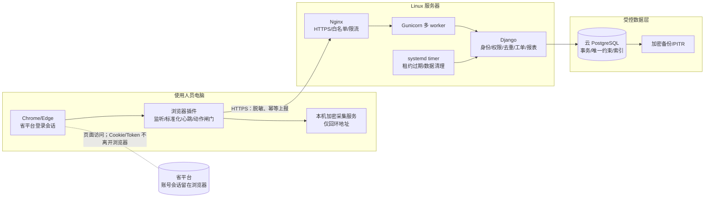

# 三客一危值班助手：服务器计划部署书 V3

版本：`3.0`  
编制日期：`2026-07-21`  
文档状态：**部署前计划，待 BOSS/客户确认后执行**  
适用范围：将当前本机 Django、浏览器插件和本机采集服务，部署为多用户共用的 Linux 服务器系统。

> 本文是部署和验收依据，不代表服务器已经上线。第 16 节列出的事项会影响地址、权限、报表口径或真实动作，确认前不应擅自写死。当前优先顺序是：先完成数据采集、标准化、去重和审计，再根据确认的日报/月报模板固化导出；未确认内容全部保留为待决策项。

## 1. 已确认的部署决策

下表是目前已经确认的结论；未列入“已确认”的内容仍以第 16 节为准。

| 项目 | 当前确认结论 | 部署含义 |
| --- | --- | --- |
| 服务器系统 | Linux | 使用 Gunicorn；不使用 Django `runserver` 承载生产流量 |
| 数据库 | 云 PostgreSQL | PostgreSQL 是多人生产环境的唯一权威数据库；本地 SQLite 只用于开发/演示 |
| HTTPS | 目前没有证书，先做内网测试 | 内网测试可临时使用受限 HTTP；正式生产和真实动作必须先启用 HTTPS |
| 使用方式 | 普通人员通过浏览器登录后台；只有技术人员维护服务器 | 不给普通人员服务器或数据库权限 |
| 助手账号 | 每名使用人员使用独立 Django 账号 | 不使用共享账号；后台按角色审计 |
| 省平台账号 | 每人独立；同一省平台账号不能同时由多个设备使用 | 服务器登记 `platformAccountRef` 与设备唯一绑定；冲突时拒绝新设备绑定 |
| 企业范围 | 当前所有授权人员可以查看全部授权企业 | 导出时按企业、集团、分公司筛选；后续可再细分权限 |
| 省平台会话 | 保持在各使用人员自己的浏览器中 | 中央服务器不保存 Cookie、Token，也不代替浏览器登录省平台 |
| 数据保留 | 目标保留 1 年 | 过期清理需保护工单、动作租约和审计链；归档规则仍需确认 |
| 实时采集 | 优先监听平台主动请求；无法监听时才轮询 | 轮询目标为 3 秒一次，不默认每秒主动请求 |
| 实时展示 | 平台数据到达后，插件应在 1 秒内展示并上报 | 平台自身延迟、网络中断和页面未登录不属于插件可保证范围 |
| 会话保活 | 所有账号默认 30 分钟一次 | 只执行固定报警预处理页的唯一“查询”按钮；不自动登录或绕过挑战 |
| 报表 | 只导出 Excel（XLSX） | 现在先存全底层数据，正式日报/月报模板确认后再固化字段和统计口径 |
| 真实动作 | 规则选择 `TEXT_TTS` 或 `VOICE_INTERCOM` | 目前没有测试车辆，真实适配器保持阻断，只能进行本机沙箱测试 |
| 失败处理 | 明确失败可在 5 秒、10 秒重试；30 秒内转人工 | 超时、未知、阻断不自动重试；不在两个渠道之间自动切换 |

## 2. 目标和边界

### 2.1 一期目标

- 支持不超过 50 个浏览器插件设备同时在线。
- 每个使用人员使用独立助手账号和独立省平台账号。
- 多个账号看到交叉企业数据时，由服务器统一去重，插件本地去重不能作为唯一性依据。
- 报警事实、采集来源、工单、规则、保活审计和报表基础数据集中保存。
- 人员离线或交接时，其他有权限人员可以在后台继续查看中央台账。
- 实时报警、预警列表和技术检测使用平台原始分类，不在插件中互相改名。
- 后续可按企业、集团、分公司导出 Excel；现在先保证底层字段完整和可追溯。

### 2.2 明确不在本次服务器部署范围内

- 服务器代替浏览器登录省平台或集中保存省平台会话。
- 自动填写密码、验证码、人机挑战或绕过登录限制。
- React/Vue 重写后台、FastAPI 双后端、WebSocket 中央通信、Redis/Celery/Kafka。
- 没有测试车辆时在真实平台发送文本、终端 TTS 或自动语音。
- 契约沙箱的触发报警、模拟文本和模拟对讲接口只允许开发模式；生产环境仅保留 `/health` 和检查 PostgreSQL 的 `/ready`，不暴露演练动作路由。
- 司机回传录音、录音长期保存或第三方语音转写；这些需要另行授权和隐私确认。

## 3. 技术选型和架构决定

| 决策 | 方案 | 选择理由 |
| --- | --- | --- |
| 业务后端 | Django 单体后端 | 已有身份、角色、企业权限、规则、工单、审计和报表模型，避免两套认证和事务边界 |
| 数据库 | 云 PostgreSQL | 支持并发事务、唯一约束、行级锁和可靠备份 |
| 前端 | Django 模板 | 当前后台是表单、表格和导出，不需要立即重写；未来复杂交互再渐进引入 Vue 3 |
| 插件通信 | HTTPS REST + 心跳 + 幂等上报 | 50 个以内设备不需要增加 WebSocket 后端 |
| 实时数据来源 | 页面 fetch/XHR/平台推送监听优先；3 秒轮询兜底 | 减少对省平台的主动请求，仍满足秒级展示目标 |
| Linux 进程 | Gunicorn 多 worker | 生产环境不使用 `runserver` |
| 反向代理 | Nginx | 负责 HTTPS、访问控制、请求大小和日志边界 |
| 后台任务 | 第一阶段使用轻量、幂等任务 | 报表生成和清理任务不得阻塞报警接收；达到规模门槛后再评估队列 |
| 身份认证 | Django 会话和短期操作令牌 | 不建立第二套 FastAPI 身份体系；插件不上传平台凭据 |

重新评估 FastAPI/队列的条件：持续在线插件接近 300 个、报警上报接口在 PostgreSQL 优化后仍长期超时、报表生成阻塞报警接收，或必须接入高频流式数据。

## 4. 部署拓扑

### 4.1 内网测试拓扑（无证书阶段）

```text
使用人员电脑
  ├─ Chrome/Edge + 插件
  ├─ 省平台页面及其登录会话
  └─ 本机加密采集服务（仅本机回环地址）
          │ 受限内网 HTTP（仅测试）
          ▼
      Nginx（可选，测试端口）
          ▼
      Gunicorn + Django
          │ TLS/白名单连接
          ▼
      云 PostgreSQL
          └─ 独立备份存储
```

无证书的 HTTP 仅用于受控内网测试，不得用于公网、正式生产或真实业务动作。测试阶段应使用测试数据或明确授权的数据，并限制可访问网段。

### 4.2 正式生产拓扑（必须 HTTPS）

```text
Chrome/Edge 插件 ── HTTPS:443 ──► Nginx
                                      │
                                      ▼
                               Gunicorn 多 worker
                                      │
                                      ▼
                               Django 业务服务
                                      │ TLS + IP 白名单
                                      ▼
                               云 PostgreSQL
                                      │
                                      ▼
                             加密备份/恢复存储
```

中央服务器只接收插件已经脱敏和标准化的数据，不代理省平台 Cookie、Token、Authorization 或页面登录请求。

### 4.3 数据与权限边界（部署图）



图中虚线表示省平台会话边界：服务器和本机采集服务都不接收省平台 Cookie、Token、密码、验证码或原始登录请求。

## 5. 组件职责

| 组件 | 负责事项 | 不负责事项 |
| --- | --- | --- |
| 浏览器插件 | 监听省平台页面、标准化报警、秒级展示、心跳、保活、按授权触发动作 | 不决定全局唯一性，不自动登录，不绕过挑战 |
| 本机采集服务 | 本机临时加密落盘和必要的本机接口 | 不作为中央唯一数据源，不开放公网 |
| Django | 身份、角色、企业范围、规则、去重、工单、保活策略、审计、报表数据 | 不持有省平台会话，不代替浏览器操作省平台页面 |
| PostgreSQL | 事务、唯一约束、索引、数据保留和恢复 | 不由普通用户直接访问 |
| Nginx | HTTPS、来源限制、反向代理、请求大小和访问日志边界 | 不承载业务规则 |
| BOSS/系统管理员 | 服务器、密钥、用户、设备和备份配置 | 不因技术权限自动获得业务审批权限 |
| 规则审核人员 | 审核、发布、回滚规则和文案 | 不直接改写待审草案 |
| 单位使用人员 | 监控、采集、查看报警、接管人工工单和导出允许范围内的 Excel | 不修改规则和企业权限 |

## 6. 服务器和网络要求

### 6.1 起步配置

| 项目 | 最低建议 | 推荐起步值 |
| --- | --- | --- |
| CPU | 4 核 | 8 核 |
| 内存 | 8 GB | 16 GB |
| 系统盘 | 100 GB SSD | 200 GB SSD |
| 应用数据盘 | 200 GB | 500 GB 以上 |
| PostgreSQL | 云服务 PostgreSQL 14+ | PostgreSQL 16+，开启自动备份/PITR |
| 网络 | 固定内网 IP | 固定内网 IP + 内网 DNS |
| 运行时间 | 工作时间在线 | 7×24 小时 |

实际容量应按报警频率、原始加密抓取数量、证据包大小和一年保留目标重新估算。

### 6.2 端口和访问控制

| 端口 | 用途 | 开放范围 |
| --- | --- | --- |
| 443 | 正式 Django HTTPS | 授权内网网段 |
| 测试 HTTP 端口 | 无证书内网联调 | 仅测试网段，禁止公网 |
| 5432 | 云 PostgreSQL | 仅服务器出口 IP 或专用数据库网段 |
| SSH | Linux 运维 | 仅技术人员 IP/VPN |

禁止直接暴露：Django/Gunicorn 内部端口、PostgreSQL 5432、本机采集服务 17321，以及任何省平台凭据或内部管理接口。

每台插件电脑仍必须能访问省平台；中央服务器不需要访问省平台登录会话。

## 7. 生产配置和密钥

生产配置使用环境变量或受控密钥管理，不写入代码、插件包和普通日志。当前项目提供 `sandbox/.env.production.example`，关键配置如下：

```text
SANDBOX_DEBUG=0
SANDBOX_SECRET_KEY=<独立随机密钥>
SANDBOX_ALLOWED_HOSTS=<正式域名或内网地址>
SANDBOX_CSRF_TRUSTED_ORIGINS=https://<正式域名>
SANDBOX_SECURE_SSL_REDIRECT=1
DATABASE_URL=postgresql://<user>:<password>@<cloud-host>:5432/<database>
DATABASE_SSLMODE=require
DATABASE_CONN_MAX_AGE=60
DATABASE_CONNECT_TIMEOUT=5
SENSITIVE_DATA_KEY=<32字节URL-safe base64密钥>
EVIDENCE_MASTER_KEY=<32字节URL-safe base64密钥>
COLLECTOR_DATA_KEY=<本机采集加密密钥>
DATA_RETENTION_DAYS=365
REPORT_EXPORT_RETENTION_DAYS=7
```

密钥要求：

- `SENSITIVE_DATA_KEY`、`EVIDENCE_MASTER_KEY`、`COLLECTOR_DATA_KEY` 用途分离。
- Linux Django 服务启动时会校验 `SENSITIVE_DATA_KEY` 和 `EVIDENCE_MASTER_KEY` 必须是解码后 32 字节的 URL-safe base64；缺失或长度错误时拒绝启动。`COLLECTOR_DATA_KEY` 由各插件电脑的本机采集服务单独保管。
- 密钥不通过聊天工具发送，不提交 Git。
- 记录保管责任人、恢复位置和轮换流程。
- 轮换前验证历史数据可解密恢复；泄露时立即停用并轮换。

## 8. 账号、单位和权限模型

### 8.1 两套账号体系

1. **助手账号**：Django 实名账号，用于后台登录、角色权限、班次、审计和人工接管。
2. **省平台账号**：使用人员在自己的浏览器中登录省平台；插件只记录脱敏引用、会话状态和实际可见数据范围。

省平台的姓名、账号 ID、正式单位和角色目前不能稳定自动核验。因此身份无法核验时：

- 允许继续只读采集和集中保存；
- 禁止文本、终端 TTS、自动语音等真实动作；
- 提示人工复核，不自动登录或填写验证码。

插件会在浏览器本地观察可见用户标签、页面权限信号和可见企业范围，并仅向服务器上报显示姓名、`UNKNOWN/UNVERIFIED` 状态、企业范围 SHA-256 摘要和布尔权限信号；不上传账号 Cookie、Token、原始页面正文或企业名称清单。服务器不因这些观察信号自动判定正式单位或账号 ID，真实动作仍以服务器核验状态和动作租约为准。

### 8.2 角色分离

| 角色 | 主要权限 | 关键限制 |
| --- | --- | --- |
| `SYSTEM_ADMIN` | 用户、设备、企业范围、保活策略、系统配置 | 不因技术权限自动获得业务审批权限 |
| 规则配置人员 | 编辑规则草案、文案、适用企业 | 不能审核/发布自己改的规则 |
| 规则审核人员 | 审核、发布、驳回、回滚 | 不能直接修改待审内容 |
| `UNIT_USER` | 监控、只读采集、查看报警、人工工单、查看语音证据摘要、导出 | 不能改规则、保活间隔、企业权限或读取司机转写内容 |

同一省平台账号只能绑定一台 active 设备；设备冲突由服务器返回 `PLATFORM_ACCOUNT_DEVICE_CONFLICT`，插件不能自行覆盖。

## 9. 数据模型、去重和敏感数据

### 9.1 核心数据

- `AlarmFact`：全局主报警事实，使用省平台记录 ID；没有可靠 ID 时使用规范化业务指纹。
- `CaptureSource`：每个助手账号、平台账号引用和设备的采集来源留痕。
- `DeviceRegistration`：设备 ID、插件版本、心跳、会话状态和绑定关系。
- `SessionKeepaliveAudit`：策略版本、路由、结果码、耗时和执行时间。
- `DisposalCase`：人工/自动处置工单及接管记录。
- `ActionLease`：未来真实动作的唯一租约，防止多个插件重复发送。
- `VoiceInteractionPolicy`：系统管理员发布的录音/转写开关、同意要求和保留期限；默认关闭。
- `VoiceInteractionEvidence`：与报警事实和动作租约关联的音频哈希、受控引用、时长、录音时间、加密转写和保留截止时间；不保存明文凭据。
- `ReportSnapshot/Export`：报表参数、统计口径、导出审计和文件生命周期。

### 9.2 多插件并发入库

服务器必须使用 PostgreSQL 唯一约束、事务和冲突处理，禁止“先查询、再插入”的竞态写法：

```text
多个插件上报同一报警
        ├─ 一条 AlarmFact 主事实
        ├─ 每个账号/设备各一条 CaptureSource
        └─ 一个处置工单和动作租约决策
```

字段冲突不静默覆盖，要保留来源和冲突状态。相同请求重复提交只能更新同一幂等记录，不能每秒膨胀来源数量。

### 9.3 敏感数据边界

车辆、司机、企业、位置、页面原文和平台账号引用属于敏感字段：

- 业务需要的字段进入受控数据库，并按密钥加密或脱敏保存。
- 普通日志只记录计数、类型、状态、耗时、错误码和哈希引用。
- 不记录 Cookie、Token、Authorization、密码或验证码。
- 普通使用人员不下载完整敏感 JSON；导出只走受控 XLSX 字段。

## 10. 实时采集、报警分类和优先级

### 10.1 采集原则

```text
省平台主动 fetch/XHR/推送
          ↓（优先）
插件白名单监听并标准化
          ↓（监听不到且页面确需查询）
3 秒轮询兜底
          ↓
本地去重 → Django 幂等上报 → PostgreSQL 全局去重
```

平台数据已到达浏览器后，插件目标是在 1 秒内展示并开始上报。插件不通过每秒主动请求来“制造”实时性；若平台请求监听可靠，优先使用监听结果。

### 10.2 分类口径

- `REALTIME`：平台实时报警页面/接口的实时报警；按平台事实记录，不与预警互换名称。
- `PREWARNING`：预警列表数据，需要实时抓取、展示和保存，但默认不进入司机提醒优先队列。
- `TECHNICAL`：技术检测类事件，按规则配置进入对应优先队列。
- 其他报警类型：除 `PREWARNING` 外，按报警类型和风险等级进入优先队列。

报警持续时间、超速持续多久、报警升级和解除由省平台判定；本系统只负责抓取、入库、规则动作、人工通知和报表，不重新判定平台状态。

### 10.3 服务器动作和通知接口

当真实动作适配器进入 LIVE 联调后，插件必须先向服务器取得动作租约，再调用省平台动作；动作结束后只上传脱敏结果码和最小回执字段：

- `POST /assistant/reports/api/action-leases/acquire`：按报警事实、设备和动作类型申请唯一租约。
- `POST /assistant/reports/api/action-leases/{leaseId}/result`：提交 `SUCCEEDED`、`FAILED`、`UNKNOWN`、`BLOCKED` 或 `MANUAL_REQUIRED` 结果；租约令牌只短时使用，不写普通日志。
- `GET /assistant/reports/api/notifications`：当前登录值班人员查看自己的未读动作通知。
- `POST /assistant/reports/api/notifications/{notificationId}/ack`：值班人员确认已经查看并接管。
- `POST /assistant/reports/api/action-leases/{leaseId}/voice-evidence`：在语音策略已授权且动作租约允许时登记最小语音证据元数据；拒绝 Cookie、Token、原始页面内容和未授权原始音频。
- `POST /assistant/reports/api/voice-evidence/{evidenceId}/transcript`：在转写已授权时提交加密转写结果和引擎元数据；非本地/未登记来源默认拒绝。
- `GET /assistant/reports/api/voice-evidence/{evidenceId}`：按权限查看证据状态和审计摘要，不默认返回原始音频或明文转写。

服务器在失败、超时、未知或安全阻断时生成中央通知和审计；网络电话、短信等外部渠道以后作为通知适配器接入，不改变报警动作本身。

`VOICE_INTERCOM` 即使收到成功回执，也会为当前值班人员生成一条 `VOICE_REVIEW_REQUIRED` 未读通知，提示查看动作回执和可用语音证据；文本/TTS 成功不额外生成审核通知，失败、超时、未知和阻断仍按人工接管规则处理。

超时租约由 `python manage.py expire_action_leases` 定时运行：把没有回执的 `ACTIVE/EXECUTING` 租约标记为 `UNKNOWN`，生成当前值班人员未读通知，禁止其他插件自动重发。

## 11. 动作、重试和安全闸门

### 11.1 规则动作

每条自动规则必须使用 `channelStrategy=SINGLE`，二选一：

- `TEXT_TTS`：下发文本，并要求终端 TTS 播读成功；两步都成功才算成功。
- `VOICE_INTERCOM`：由 AI 自动触发平台语音通道并播放固定语音，不等同于人工实时通话。

规则不允许在两个渠道之间自动切换。一个渠道的任一必要步骤失败，转人工并保留失败原因。

### 11.2 重试语义

```json
{
  "maxRetries": 2,
  "delaysMs": [5000, 10000],
  "retryOn": ["FAILED"],
  "maxDurationMs": 30000
}
```

- 明确 `FAILED`：5 秒后重试，仍失败时 10 秒后再次重试。
- `UNKNOWN`、超时、`BLOCKED`、权限异常：不自动重试，立即记录并转人工。
- 30 秒内没有确定成功：转人工；不因结果未知而重复发送。
- 所有真实动作先取得数据库 `ActionLease`，同一报警同一动作最多一个有效租约。

### 11.3 当前真实动作闸门

当前没有测试车辆，真实平台适配器必须保持阻断；`--allow-real-intercom` 只能用于规则配置，不会绕过扩展执行层的 LIVE 阻断。完成测试车辆联调、平台授权和回执验收前，只允许本机沙箱模拟。

### 11.4 语音回传和转写（预留接口，默认关闭）

服务器可以登记动作后的语音证据元数据，但这不表示已经接通省平台语音回传链路。`VoiceInteractionPolicy` 初始状态必须为关闭，只有 `SYSTEM_ADMIN` 可以发布以下策略：是否允许录音、是否允许转写、是否需要司机同意、以及证据保留天数。

- 默认不录音、不上传原始音频、不调用第三方转写服务。
- 如果未来获得书面授权，插件只上传音频哈希、受控引用、时长、录音时间和结果状态；原始音频不得进入普通 JSON 动作回执接口。
- 转写结果必须加密保存，并记录引擎、置信度、创建时间和保留截止时间；不允许把转写文本写入普通日志。
- 单位使用人员只能查看证据状态和摘要；转写内容仅向具备 `evidence.review` 的规则审核人员或系统管理员开放，并按企业范围过滤。
- 司机隐私授权、录音提示、音频存储位置、转写引擎、跨境/第三方处理和删除流程，必须在 E5/E6 确认后单独验收。
- 过期证据由 `python manage.py purge_expired_voice_evidence` 清理，只清除音频引用和转写内容，保留最小审计行。

当前阶段仅验证服务器接口的权限、加密和过期清理，不验证真实平台 WebSocket、音频帧、对讲回传或司机语音识别。

## 12. 会话保活和无人值守

服务器统一发布省平台保活策略：启用状态、间隔（默认 30 分钟）、固定路由和固定动作均由服务器控制。

插件只有同时满足以下条件才执行一次保活：

- Django 身份、班次和 `session.keepalive.execute` 权限有效；
- 已登记目标省平台标签页；
- 会话为 `AUTHENTICATED`；
- 当前严格位于报警预处理路由；
- 页面不存在登录表单、验证码或人机挑战；
- 冷却时间已到，且设备级没有另一轮保活。

执行时只查找可见、启用、文字严格等于“查询”的唯一按钮，每周期最多一次 `.click()`。用户位于实时监控等其他页面时记录 `ROUTE_NOT_APPROVED`，不导航、不刷新、不抢焦点。

出现登录页、401/403、验证码或挑战时，标记 `LOGIN_REQUIRED`/`CHALLENGE_DETECTED`，停止该设备后续保活并通知人工；不自动登录、不填写验证码、不绕过挑战。

## 13. 报表和数据保留

### 13.1 报表

- 当前只生成 Excel（`.xlsx`），不把 PDF 作为一期接口。
- 按报警发生时间统计，时区固定为北京时间（Asia/Shanghai）。
- 支持企业、集团、分公司筛选和分别导出；当前授权人员可查看全部授权企业。
- 同类型报警多次触发时，报表统计层选择指定时间窗口内最后一条；主报警事实仍全部保存。
- 报表接口支持可选 `sameTypeWindowMinutes` 参数；未确认窗口时不聚合，确认后只在报表快照层归并，不删除主报警事实。
- 正式日报/月报模板、字段映射和提交对象确认前，系统只提供底层数据和通用导出，不宣称正式报表口径。

### 13.2 保留和清理

- 报警事实、工单、审计和原始加密抓取目标默认保留 365 天。
- 导出文件默认保留 7 天，之后自动清理；如需更长周期由数据负责人确认。
- 语音证据默认不产生；只有管理员发布策略并取得授权后才按策略保留 1—365 天。过期清理不删除报警事实、工单和最小审计行。
- 清理命令必须先 `--dry-run`，受工单或动作租约保护的历史报警不得直接删除。
- 正式上线前必须确定备份保留周期、归档方式和行业/交管档案要求。

## 14. 生产配置、部署和迁移步骤

### 阶段 0：BOSS 环境确认

确定服务器 IP/域名、内网网段、云 PostgreSQL 连接、证书、备份位置、运维责任人和待确认业务口径。未完成前只建立测试环境。

### 阶段 1：基础设施

1. 安装 Linux、Docker（或 Python 3.12 虚拟环境）、Nginx 和监控组件。
2. 创建云 PostgreSQL 数据库、应用账号、TLS 要求和服务器出口 IP 白名单。
3. 创建应用目录、报告目录、证据目录和备份目录，设置最小权限。
4. 测试阶段只允许受限内网 HTTP；正式环境配置 HTTPS 证书和安全响应头。

### 阶段 2：Django 部署

在 `sandbox` 目录按 [`linux-postgresql.md`](../../sandbox/deploy/linux-postgresql.md) 执行；Docker 场景可直接使用 [`docker-compose.production.yml`](../../sandbox/deploy/docker-compose.production.yml)，Nginx 参考 [`assistant.conf.example`](../../sandbox/deploy/nginx/assistant.conf.example)：

```bash
cp .env.production.example .env.production
# 填入真实域名、云 PostgreSQL、密钥和保留周期
docker compose -f deploy/docker-compose.production.yml build
docker compose -f deploy/docker-compose.production.yml up -d
docker compose -f deploy/docker-compose.production.yml exec assistant python manage.py migrate
docker compose -f deploy/docker-compose.production.yml exec assistant python manage.py collectstatic --noinput
docker compose -f deploy/docker-compose.production.yml exec assistant python manage.py check --deploy
```

生产 Nginx 只代理到本机 8000，不直接暴露 Gunicorn；云 PostgreSQL 只允许服务器出口 IP。

部署后必须把维护命令加入受控的 systemd timer（或同等 cron），并记录每次执行结果。原生 venv 部署可参考 [`sandbox/deploy/systemd/`](../../sandbox/deploy/systemd/)，Docker 部署使用 Compose 执行等价命令。建议至少配置：

```text
每 1 分钟：expire_action_leases
每天：purge_expired_exports
每天：purge_expired_operational_data
每天：purge_expired_voice_evidence
```

所有清理命令首次上线使用 `--dry-run` 核对影响范围；清理失败不得影响报警上报进程。语音证据清理只在策略已启用并且证据达到保留截止时间后执行。

### 阶段 3：账号、规则和数据迁移

1. 建立系统管理员、规则配置人员、规则审核人员和单位使用人员的独立 Django 账号。
2. 配置全部授权企业范围和班次。
3. 导入已审核规则版本；未完成正式测试车辆联调前，真实动作保持阻断。
4. 如迁移本地 SQLite，先加密备份、脱敏检查、哈希校验，再通过幂等导入；禁止直接复制 SQLite 文件。
5. 核对 `AlarmFact`、`CaptureSource`、工单和审计计数。

### 阶段 4：插件接入

1. 通过受控部署配置写入服务器地址，禁止用户随意修改到任意域名。
2. 两个以上独立浏览器先接入测试服务器，确认助手登录、设备登记、心跳、策略同步和报警上报。
3. 验证同一省平台账号第二台设备被拒绝，换设备流程由人工完成。
4. 验证实时监控页无需整页刷新即可采集；监听不到时使用 3 秒轮询兜底。

### 阶段 5：并发、恢复和业务验收

使用 50 个模拟插件和至少两个真实浏览器实例进行去重、锁、心跳、保活、断线恢复、权限和报表测试。真实文本/TTS/语音必须另有测试车辆和书面授权后再验收。

## 15. 监控、备份和恢复

### 15.1 运行监控

至少监控：

- Django `/health`、`/ready`、Gunicorn worker 和 Nginx 错误；
- PostgreSQL连接数、慢查询、锁等待、事务回滚和存储空间；
- 报警上报耗时、4xx/5xx、幂等命中率和数据库冲突；
- 在线设备数、心跳年龄、插件版本和会话状态；
- 保活结果、登录失效、挑战、动作租约冲突和报表耗时；
- 备份成功率、恢复演练结果、导出文件和磁盘容量。

日志只保留脱敏后的类型、状态、计数、耗时、错误码和哈希引用，禁止写入敏感业务明细或平台凭据。

### 15.2 备份和恢复

- 每日数据库全量备份，备份文件加密并与生产服务器分离。
- 推荐云 PostgreSQL 开启 PITR/WAL；备份保留周期由第 16 节确认。
- 每月至少一次恢复演练，记录恢复点、耗时、数据计数和责任人。
- 数据库备份和密钥分开保管，但必须有受控恢复流程。

## 16. 部署前必须确认的问题

以下问题不会被代码默认猜测。每项都写明了未确认会影响什么，以及建议默认值。

### 16.1 服务器、网络和安全

| 编号 | 待确认问题 | 影响 | 建议默认值 |
| --- | --- | --- | --- |
| A1 | 测试服务器固定内网 IP、端口和访问网段是什么？ | 插件服务器地址和防火墙规则 | 仅授权办公网；测试端口不出公网 |
| A2 | 正式域名和 HTTPS 证书由谁申请、续期？ | 生产登录、Cookie 安全和真实动作是否可开 | 生产必须 HTTPS；无证书只能测试 |
| A3 | 云 PostgreSQL 服务商、区域、主机、端口、SSL 模式和白名单是什么？ | 数据库连接和故障恢复 | `DATABASE_SSLMODE=require`，仅允许服务器出口 IP |
| A4 | 备份位置、保留周期、PITR/WAL 是否启用？ | 一年数据能否恢复 | 至少 7 份日备份，月度恢复演练 |
| A5 | 运维责任人、故障响应时间和发布窗口是什么？ | 故障处置和升级流程 | 技术人员负责服务器，业务人员不直接运维 |
| A6 | 无证书内网测试是否允许使用真实平台敏感数据？ | HTTP 传输泄露风险 | 默认只用测试/脱敏数据，真实动作关闭 |

### 16.2 账号、身份和权限

| 编号 | 待确认问题 | 影响 | 建议默认值 |
| --- | --- | --- | --- |
| B1 | 省平台是否能提供稳定账号 ID、单位和权限接口或页面信号？ | 自动绑定助手账号和审计可信度 | 不能核验时允许只读，禁止真实动作 |
| B2 | 同一省平台账号更换设备时，谁批准解绑旧设备？ | 无人值守和设备冲突处理 | 系统管理员人工解绑并留审计 |
| B3 | 全部授权企业的正式集团/分公司归属关系由谁维护？ | 分层导出和报表统计 | 先人工维护映射，未确认的归属不自动推断 |

### 16.3 实时采集和保活

| 编号 | 待确认问题 | 影响 | 建议默认值 |
| --- | --- | --- | --- |
| C1 | 省平台是否有只读查询频率限制或正式接口说明？ | 3 秒轮询是否可长期运行 | 优先监听；必须轮询时 3 秒，并记录限流结果 |
| C2 | 30 分钟保活是否对所有省平台账号和班次都适用？ | 无人值守稳定性 | 默认适用，策略由系统管理员发布 |
| C3 | 登录失效、验证码和挑战由哪个值班岗位处理？ | 保活停止后的人工接管 | 插件只提示，不自动处理 |

### 16.4 报表和数据口径

| 编号 | 待确认问题 | 影响 | 建议默认值 |
| --- | --- | --- | --- |
| D1 | 同类型报警“时间窗口内最后一条”的窗口是 10 分钟、30 分钟、1 小时还是自然日？ | 日报/月报统计结果 | 先只保存全部事实，不硬编码窗口 |
| D2 | 正式日报/月报模板、字段、文件名、提交对象和截止时间何时提供？ | 正式导出验收 | 模板确认前只提供通用 XLSX |
| D3 | 导出文件和原始加密抓取是否都按 1 年保留，还是导出文件短期保留？ | 存储容量和清理任务 | 原始业务数据 365 天，导出文件默认 7 天 |

### 16.5 真实动作和人工通知

| 编号 | 待确认问题 | 影响 | 建议默认值 |
| --- | --- | --- | --- |
| E1 | 测试车辆何时提供，允许测试哪些车辆和时段？ | 是否可以打开 LIVE 文本/TTS/VOICE | 未有测试车辆前全部 LIVE 阻断 |
| E2 | 文本下发和终端 TTS 的成功回执分别以什么字段/平台状态为准？ | 成功、失败、重试判定 | 两步都成功才算 `SUCCEEDED` |
| E3 | 自动语音通道是否获得书面授权，固定语音资产由谁审核？ | `VOICE_INTERCOM` 安全闸门 | 仅沙箱可执行，真实适配器待授权联调 |
| E4 | 失败、超时和未知通知哪个人工岗位，通过短信、后台还是其他渠道？ | 30 秒转人工后的闭环 | 先记入工单和后台，通知渠道后续接入 |
| E5 | 是否允许录制司机回传语音并转文字？ | 新增隐私、授权、存储和转写服务 | 一期不录音、不上传第三方、不保存原音频 |
| E6 | 如果允许录音/转写，谁取得司机同意，是否需要录音提示、访问审批、删除证明和第三方处理备案？ | `VoiceInteractionPolicy` 能否启用、证据保留期限和合规边界 | 默认关闭；未书面确认前仅做接口和加密测试 |

## 17. 当前实现状态和上线前工作

### 已完成或已具备

- Django 生产环境变量、云 PostgreSQL 配置、Gunicorn/Docker 部署文件。
- 同一省平台账号单 active 设备唯一约束和冲突错误码。
- 365 天运营数据清理命令及受工单保护逻辑。
- 服务器只允许 XLSX 导出；PDF 请求会被拒绝。
- 会话保活策略、审计、设备心跳和登录/挑战停止逻辑。
- 动作租约结果接口、当前值班人员通知和通知确认审计；设备心跳支持脱敏省平台身份上下文。
- `TEXT_TTS` / `VOICE_INTERCOM` 规则校验、动作租约和 5 秒/10 秒重试策略。
- 沙箱动作模拟；真实 LIVE 文本/TTS/语音适配器仍保持阻断。
- 语音交互策略和证据接口已在代码中预留：默认关闭，支持加密转写元数据、权限控制和过期清理；迁移、自动化测试和真实平台语音 WebSocket/司机回传链路仍未完成。

### BOSS 部署前必须完成

1. 修正浏览器测试中仍断言旧文案的 1 个失败用例，确保 JS 测试全通过。
2. 单独运行 Django 测试、迁移检查和 PostgreSQL 集成测试。
3. 将生产轮询兜底确认并固定为 3 秒，验证同一响应不会每秒重复创建 `CaptureSource`。
4. 增加自动 `VOICE_INTERCOM` 的规则校验、沙箱执行和 LIVE 阻断测试。
5. 增加省平台账号上下文的脱敏留痕；账号无法核验时保持只读模式。
6. 报表统计层增加“同类型时间窗口最后一条”参数，但等待 D1 确认后再发布正式模板。
7. 执行语音交互迁移并完成默认关闭、管理员启用、加密保存、非授权来源拒绝和过期清理测试。
8. 将 `expire_action_leases`、`purge_expired_exports`、`purge_expired_operational_data` 和 `purge_expired_voice_evidence` 纳入 Linux 维护定时任务，并完成 dry-run 与恢复演练。
9. 更新旧文档顶部的历史版本提示，避免以旧的“只允许 TEXT_TTS”结论部署。

## 18. 验收标准

### 基础设施

- 测试环境可由授权内网访问；生产环境 HTTPS、Nginx、Gunicorn 和 PostgreSQL 均正常。
- `migrate`、`check --deploy`、健康检查和备份恢复演练通过。
- 普通用户不能访问数据库、Gunicorn 内部端口或本机采集端口。

### 多用户和并发

- 两个以上独立助手账号可同时在线。
- 同一省平台账号第二台设备绑定被拒绝；不同账号可同时采集交叉企业数据。
- 10—50 个插件同时上报同一报警时只产生一条 `AlarmFact`，所有 `CaptureSource` 均保留。
- 两台设备申请同一动作租约时仅一台成功，另一台得到可审计的冲突结果。

### 实时和保活

- 平台数据到达后 1 秒内进入插件展示和上报链路。
- 监听不到平台主动请求时使用 3 秒轮询；不以每秒主动请求作为默认生产方案。
- 页面无需整页刷新即可持续采集；相同响应不会每秒重复膨胀。
- 保活每 30 分钟最多点击一次固定“查询”；离开批准路由时只记录 `ROUTE_NOT_APPROVED`。
- 登录页、验证码和挑战出现后停止设备保活，不自动修复。

### 动作和报表

- 无测试车辆时，真实文本、TTS、VOICE 全部被阻断；沙箱动作可验证规则和重试。
- `TEXT_TTS` 必须文本和终端 TTS 均成功才结束；明确失败按 5 秒、10 秒重试，30 秒转人工。
- 语音录音/转写策略默认关闭；未取得司机隐私授权时不得产生原始音频。启用后的证据必须加密、可审计、按保留期限清理。
- 报表只导出 XLSX，按北京时间和企业层级筛选；正式模板未确认前不宣称正式日报/月报。
- 普通日志和保活审计不含车辆、司机、企业、位置、页面原文或省平台凭据。

## 19. BOSS 确认栏

服务器固定内网 IP/域名：____________________________  
测试访问端口和网段：____________________________  
正式 HTTPS 证书负责人：____________________________  
云 PostgreSQL 服务商/地址：____________________________  
数据库负责人：____________________________  
运维负责人和响应时间：____________________________  
备份位置及保留周期：____________________________  
同类型报警统计窗口：____________________________  
正式日报/月报模板提供日期：____________________________  
人工通知岗位和渠道：____________________________  
测试车辆及真实动作授权范围：____________________________  
语音录音/转写授权、同意方式及保留期限：____________________________  
其他确认意见：__________________________________________________

确认人：____________________________  
确认日期：____________________________
