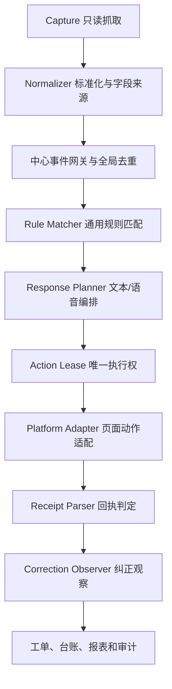

# 三客一危多单位报警规则逻辑与实现计划 V4

## 1. 设计原则

规则可能随官方政策、客户 SOP、企业范围、页面版本和报警类型变化，因此规则内容不得写死在插件代码中。插件只实现稳定的规则解释器、响应编排器和平台适配器；规则、文本模板和语音资产由服务器审核发布。

设计必须保证：

- 同一事件和同一规则版本得到同一决策。
- 规则配置人与审核人不是同一人。
- 多个独立账号采集到同一报警时只形成一个中心事件。
- 文本和语音是两个独立渠道，不默认双发。
- 失败、未知、字段冲突和无规则时转人工。
- 完整 JSON 和敏感字段不进入普通日志、浏览器长期缓存或普通报表。

## 2. 分层架构



规则决定“做什么”，适配器决定“如何在当前平台版本执行”。页面改版时优先替换适配器，不改业务规则。

## 3. 核心对象

| 对象 | 作用 |
| --- | --- |
| `Capture` | 一次白名单接口响应或已确认 DOM 弹窗观察 |
| `AlarmEvent` | 标准报警事实，包含字段来源、冲突和敏感级别 |
| `AccountCoverage` | 独立省平台账号可见企业/车辆范围与备用覆盖关系 |
| `RulePackage` | 经过不同人员审核发布的不可变规则版本 |
| `ResponseAsset` | 已发布文本模板或固定语音资产 |
| `Decision` | 某事件在某规则版本下的决定 |
| `ResponsePlan` | 渠道、顺序、模板、兜底和超时计划 |
| `ActionLease` | 服务器向唯一插件设备授予的短期执行权 |
| `ActionAttempt` | 单个文本或语音动作及平台回执 |
| `CorrectionAssessment` | 风险是否解除的独立判断 |
| `DisposalCase` | 失败、未知或高风险转人工工单 |
| `LedgerRow` | 事件、决策、动作、人工和复核时间线 |

## 4. 标准事件与敏感字段

建议标准字段分组：

```text
identity: eventId, alarmId, alarmTypeId, sourceKind
vehicle: vehicleId, vehicleNo, vehicleType
driver: driverIdRef, driverName
enterprise: companyId, companyName, responsibleUnitId
time: alarmTime, discoveredAt, firstSeenAt, lastSeenAt
status: platformStatus, onlineStatus, alarmStatus, finalState
risk: locationSpeed, alarmDurationSeconds, repeatCountWithinWindow
location: locationText, longitude, latitude
provenance: fieldSources, sourceEndpoints, conflicts
```

车辆、司机、企业、位置、经纬度和完整原始 JSON 标记为敏感字段。认证信息在抓取入口立即递归移除，不进入标准事件。

## 5. 事件唯一性与跨账号去重

优先使用平台稳定报警记录 ID：

```text
eventId = "alarm:id:" + platformAlarmRecordId
```

没有稳定 ID 时使用脱敏业务指纹：

```text
fingerprint = hash(vehicleKey + alarmTypeKey + normalizedAlarmTime + enterpriseKey)
```

兜底字段缺失时设置 `identityWeak=true`，只能记录或转人工，不得执行真实动作。

服务器对 `eventId` 设置唯一约束；不同账号上报重复事件时：

- 主事件只保留一条。
- 每次采集来源单独记录账号引用、设备、接口和时间。
- 高优先来源可以提升主来源，低优先来源不能覆盖高优先来源。
- 字段不一致写入 `conflicts`，不静默选择敏感值。

## 6. 报警来源闸门

```text
REALTIME   → 可进入规则匹配和受控响应
TECHNICAL  → 默认 MANUAL_TECHNICAL_REVIEW
PENDING    → RECORD_ONLY，人工待处理队列
PREWARNING → RECORD_ONLY
HISTORY    → RECORD_ONLY
DETAIL     → MERGE_ONLY
```

来源闸门在规则匹配前执行。即使规则配置错误，预警、历史和详情也不能直接触发司机响应。

## 7. 通用规则结构

当前代码运行时采用 Schema V2；后续通过新增可选字段演进，不破坏旧规则。建议结构：

```json
{
  "schemaVersion": 2,
  "version": "rules-example-v1",
  "status": "PUBLISHED",
  "rules": [
    {
      "id": "example-realtime-rule",
      "enabled": true,
      "priority": 100,
      "match": {
        "sourceKinds": ["REALTIME"],
        "alarmTypeIds": ["EXAMPLE_TYPE"],
        "alarmNames": ["模拟报警"],
        "alarmAliases": [],
        "companyIds": [],
        "companyNames": [],
        "vehicleTypes": [],
        "timeRanges": []
      },
      "handlingMode": "AUTO",
      "channels": [
        {
          "type": "TEXT",
          "order": 1,
          "templateId": "text-example-v1",
          "recipientType": "DRIVER_TERMINAL"
        }
      ],
      "channelStrategy": "SINGLE",
      "fallback": "MANUAL"
    }
  ]
}
```

真实规则包还应由服务端关联创建人、审核人、企业范围、内容哈希、生效时间和回滚来源，不能相信客户端自报的审批字段。

## 8. 规则匹配顺序

1. 规则包必须是服务器唯一已发布版本。
2. 规则启用且处理模式不是 `DISABLED`。
3. 来源类型必须匹配。
4. 报警类型 ID 精确匹配优先。
5. 名称和别名作为补充匹配，不代替稳定 ID。
6. 企业、车型和时间范围越具体，优先级越高。
7. 再比较显式 `priority`。
8. 最高结果并列、字段缺失或冲突时转人工。
9. 事件已经产生动作后，不因规则版本更新自动重新执行。

## 9. 处理模式和响应渠道

### 9.1 处理模式

| 值 | 行为 |
| --- | --- |
| `AUTO` | 生成 ResponsePlan，通过全部安全闸门后执行 |
| `MANUAL` | 创建人工处置工单 |
| `RECORD_ONLY` | 只记录和统计 |
| `DISABLED` | 规则停用并安全转人工 |

### 9.2 渠道

| 渠道 | 要求 |
| --- | --- |
| `TEXT` | 已发布固定模板、变量白名单、接收对象和明确回执 |
| `VOICE` | 已发布固定音频、格式和哈希有效、车辆在线、对讲链路已验证 |

### 9.3 编排方式

| 策略 | 行为 |
| --- | --- |
| `SINGLE` | 只执行一个渠道，默认方案 |
| `SEQUENTIAL` | 按顺序执行，前序不成功则停止 |
| `FALLBACK` | 主渠道明确失败后执行备用渠道 |
| `PARALLEL` | 同时执行，仅用于经过审批的特殊高风险规则 |

`UNKNOWN` 不属于明确失败，不能触发自动兜底。

## 10. 生产动作安全闸门

真实文本或语音必须同时满足：

1. 主来源为允许实时动作的来源。
2. 事件身份稳定、关键字段完整且无未处理冲突。
3. 当前实名用户、独立省平台账号、企业范围和班次均有效。
4. 规则和响应资产均为服务器已发布版本。
5. 客户已授权该报警、企业、车辆和渠道。
6. 当前省平台会话已登录且退出后的断点补采完成。
7. 服务器已授予唯一 `ActionLease`。
8. 同一事件、车辆和渠道幂等键没有已开始动作。
9. 当前平台适配器版本已在授权测试车辆验证。
10. 成功、失败和未知回执判据已经冻结。

任何条件不满足时返回 `BLOCKED` 并转人工，不允许插件本地绕过。

## 11. 插件实现计划

### 11.1 已实现

- 白名单 `fetch/XMLHttpRequest` 被动监听，不额外高频轮询。
- 实时、技术、预警、历史和详情来源分类。
- 标准事件、字段来源、冲突、优先级和有界缓存。
- Schema V2 通用匹配器和文本/语音 `ResponsePlan`。
- 文本沙箱和语音沙箱执行器，各自保存独立回执。
- 实名权限、企业范围、班次、工单和报表事实同步。
- 登录失效识别、真实动作暂停和实时/技术断点补采。
- 平台授权的报警预处理页定时“查询”保活、错峰调度、挑战检测和脱敏审计。
- 设备心跳、独立采集来源、数据库全局指纹去重和唯一动作租约数据模型。
- 本机完整抓取加密、普通台账脱敏和证据包治理。

### 11.2 统一服务器接入

1. 助手服务地址已支持本机 HTTP 或经浏览器授权的 HTTPS 部署地址。
2. 插件已注册 `platformAccountRef + deviceId + extensionVersion` 并周期上报会话和路由心跳。
3. 标准事件上传携带幂等采集标识，服务器保存一条主事实和多条采集来源。
4. PostgreSQL 作为生产数据库，通过唯一约束、原子事务和行级锁处理并发；SQLite 仅限本机开发。
5. 自动动作租约模型已建立；真实动作适配器仍未授权，因此尚未开放租约申请接口。
6. 服务器不可用时只读采集并进入有界离线队列，禁止新的真实动作。

### 11.3 真实页面响应联调

1. 在授权测试车辆上确认文本下发入口、参数和回执。
2. 确认语音对讲开始、保持、停止和结果回执。
3. 为两个渠道分别建立适配器，不在规则引擎中写页面选择器。
4. 页面路径或接口变化时返回 `ADAPTER_MISMATCH`，禁止猜测点击。
5. 超时或断线统一返回 `UNKNOWN`，冻结自动重试。

### 11.4 纠正检测和升级

1. 为每类报警配置观察窗口和证据。
2. 将动作成功与风险纠正分开保存。
3. 高风险、未纠正、无法判断和结果未知生成工单。
4. 后续接入短信和安全移动详情页。

## 12. 台账要求

每个事件至少记录：

- 报警 ID、来源、类型、企业和事件时间。
- 采集用户、平台账号引用、设备和接口来源。
- 规则版本、命中规则、处理模式和判断原因。
- 文本模板/语音资产版本与哈希。
- 每个渠道开始时间、结束时间、状态和回执摘要。
- 是否纠正、人工接管、备注、完成和复核动作。
- 报表事实同步状态和最后更新时间。

普通台账展示和导出必须脱敏，完整 JSON 不作为普通台账字段。

## 13. 测试计划

- 单元测试：字段别名、来源分类、规则优先级、冲突、文本渲染、音频校验和脱敏。
- 契约测试：真实页面各标签页加载、刷新、分页、筛选和详情接口。
- 权限测试：监控、规则配置、规则审核、报表和审计角色互斥。
- 多账号测试：不同企业范围、不重叠范围、交叉范围和账号离线覆盖缺口。
- 多设备测试：重复事件、唯一租约、执行中断、未知结果和禁止重发。
- 安全测试：认证信息清洗、完整 JSON 加密、普通导出拒绝和越权访问。
- 稳定性测试：至少两台工作站连续运行 72 小时，包含一小时退出和恢复补采。

## 14. 当前上线判断

自动查询、标准化、演练响应、工单、报表基础、设备心跳、全局去重、动作租约模型和平台授权会话保活可进入统一服务器试运行。真实文本和语音平台动作、租约执行接口及移动短信仍是生产上线前的必要联调项。
