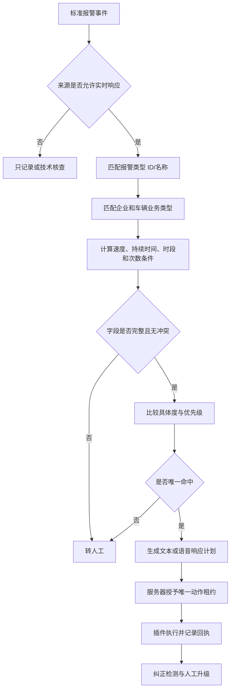

# 报警规则清单结构化与实现计划 V5

## 1. 文件理解

《报警规则清单.xlsx》包含三类内容：

1. 三客一危报警处置规则和流程：报警类型、适用车辆、预警条件、报警条件、提示方式、处置规则和注意事项。
2. 企业要求：客户对报警响应、纠正观察、通知企业、台账、巡检、离线、轨迹完整率、日报、周报和月报的要求及话术。
3. 报警申诉注意事项：用于人工核实和申诉的经验性话术。

原表是业务知识源，不是可以直接执行的生产规则。阈值、话术和部分处置要求存在组合描述、例外、人工判断以及“暂未实现/不纳入考核”等边界，必须先结构化、审核和仿真。

## 2. 规则分类

### 2.1 驾驶员行为和运行风险

- 驾驶员突发情况。
- 生理疲劳、超时驾驶和超速驾驶。
- 夜间异动。
- 接打手持电话、抽烟、未系安全带、分心驾驶。
- 单手/双手脱离方向盘。
- 驾驶员和押运员身份识别。
- 超员驾驶和疑似事故。

### 2.2 设备和运营管理

- 电子围栏和异地经营。
- 离线位移。
- 摄像头偏离、遮挡、定位异常等设备故障。
- 电子运单异常。

### 2.3 提醒或暂不纳入检测

- 前向车距提醒。
- 不规范变更车道。
- 风险路段提醒。
- 文件明确“不纳入检测管理”或“暂无处理”的项目。

这三类不能使用同一默认动作。提醒类、技术类和正式报警类必须分别设置来源和处理闸门。

## 3. 结构化规则模型

```json
{
  "id": "rule-example-v1",
  "name": "模拟报警规则",
  "enabled": true,
  "priority": 100,
  "scope": {
    "sourceKinds": ["REALTIME"],
    "enterpriseIds": [],
    "vehicleBusinessTypes": ["PASSENGER", "BUS", "HAZMAT"]
  },
  "match": {
    "alarmTypeIds": [],
    "alarmNames": ["模拟报警"],
    "alarmAliases": []
  },
  "conditions": [
    {"field": "locationSpeed", "operator": "GTE", "value": 30},
    {"field": "alarmDurationSeconds", "operator": "GTE", "value": 2}
  ],
  "handlingMode": "MANUAL",
  "riskLevel": "HIGH",
  "channels": [
    {
      "type": "TEXT",
      "templateId": "text-example-v1",
      "order": 1,
      "recipientType": "DRIVER_TERMINAL"
    }
  ],
  "channelStrategy": "SINGLE",
  "correctionPolicy": {
    "windowSeconds": 60,
    "evidence": ["ALARM_CLEARED"],
    "onUnknown": "MANUAL_REVIEW"
  },
  "escalation": {
    "notifyEnterpriseAfterSeconds": null,
    "onNotCorrected": "MANUAL_REVIEW"
  },
  "assessment": {
    "included": true,
    "appealAllowed": true
  },
  "allowRealAction": false
}
```

## 4. 原表字段映射

| Excel字段 | 系统字段 |
| --- | --- |
| 报警类型 | `match.alarmNames`，后续补平台 `alarmTypeIds` |
| 适用车辆 | `scope.vehicleBusinessTypes` |
| 预警规则 | `prewarningPolicy`，只用于预警或提前提醒 |
| 报警规则 | `conditions` 和正式响应入口 |
| 提示方式 | `channels`、文本模板或语音资产 |
| 警情处置规则 | `handlingMode`、纠正观察和人工升级 |
| 注意事项 | 例外、白名单、申诉提示和人工判断说明 |
| 企业要求 | `correctionPolicy`、`escalation`、企业联系和台账要求 |
| 话术 | 独立 `ResponseAsset`，不能直接保存在规则条件中 |

## 5. 规则执行顺序



## 6. 文本和语音策略

- 原表大量写作“喊话或 TTS 语音”，系统实现时必须拆成 `TEXT` 和 `VOICE` 两个渠道。
- 默认 `SINGLE`，由规则明确选择一种渠道。
- 只有明确批准的规则才允许顺序或兜底。
- `UNKNOWN` 不能自动切换渠道。
- 话术中的司机称呼、车牌、报警类型等变量使用白名单模板。
- 语音资产使用固定文件、版本和哈希。

## 7. 第一批规则建议

第一批不直接覆盖全部规则，建议选择：

1. 生理疲劳。
2. 超速驾驶。
3. 接打手持电话。
4. 抽烟。
5. 手部脱离方向盘。

原因是这些规则在真实平台样例和月报中均高频出现，且能够验证速度、持续时间、文本/语音、纠正观察和企业导出的完整链路。

驾驶员突发情况、疑似事故和超员属于高风险，第一阶段默认人工并立即升级；设备故障默认技术核查；提醒类和明确“不纳入检测管理”的项目只记录。

## 8. 每条规则发布前必须补齐

- 真实平台报警类型 ID 和名称映射。
- 适用车辆业务类型编码。
- 速度取定位速度还是脉冲/仪表速度。
- 持续时间和重复次数的计算来源。
- 白天、夜间和禁行时间定义。
- 文本或语音渠道选择。
- 平台成功、失败和未知回执。
- 纠正观察窗口和证据。
- 是否允许申诉及人工复核要求。
- 是否纳入企业报表、排名和考核。
- 规则配置人和不同的规则审核人员。

## 9. 报表事实设计

根据月报样例，规则执行不能只保存最终结果，还要写入可统计事实：

```text
eventId / enterpriseId / vehicleId
alarmTypeId / alarmName / riskLevel
alarmStartedAt / alarmEndedAt / duration
locationSpeed / pulseSpeed
sourceKind / platformStatus
responseChannel / responseResult
manualVerification / appealResult
correctionResult / finalState
ruleVersion / templateVersion
```

报表指标通过这些事实计算，不从历史 Excel 反向推断。

## 10. 实现计划

1. 将 Excel 每一行整理为规则草案，不自动发布。
2. 对多行合并的报警类型拆成独立子规则，例如单手和双手脱离方向盘。
3. 将复杂自然语言条件转换成字段、操作符和值。
4. 无法结构化的经验性判断保留为人工检查清单。
5. 话术进入文本/语音资产治理，不嵌入规则代码。
6. 使用脱敏历史样本执行仿真，输出命中、冲突、缺字段和误匹配报告。
7. 规则配置人提交后，由不同规则审核人员批准。
8. 完成授权测试车辆联调后，才允许新版本设置 `allowRealAction=true`。

