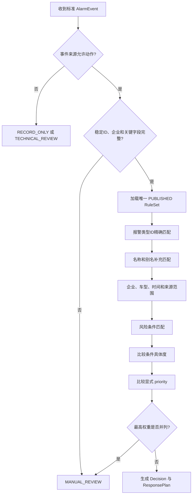
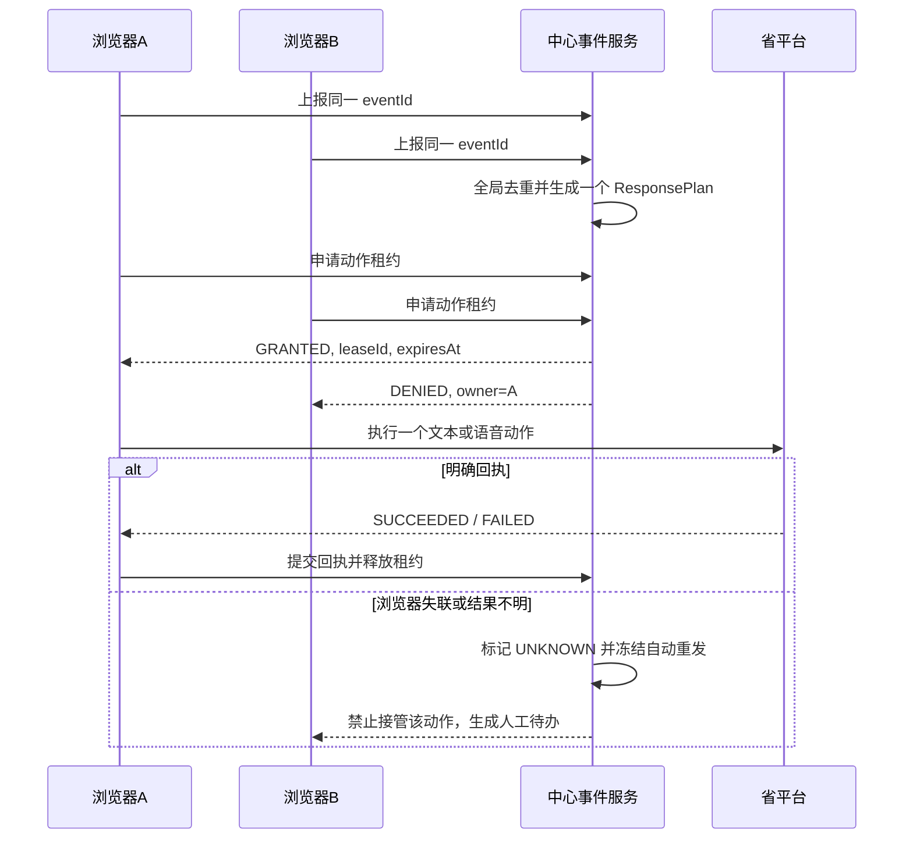

# 三客一危无人值守报警规则与动作编排设计 V3

## 1. 设计目标

本设计将报警来源、事实归并、业务规则、响应渠道、纠正检测、人工升级和多浏览器执行控制分离，满足以下要求：

- 相同事件和相同规则版本得到相同决策。
- 多个浏览器同时发现报警时只形成一个业务事件。
- 同一报警只允许一个浏览器执行文本或语音动作。
- 不完整、冲突、未审核或结果未知时自动转人工。
- 生产动作只能使用已发布规则和固定模板。
- 规则负责决定“做什么”，浏览器适配器负责“如何在当前省平台版本执行”。

## 2. 领域对象

| 对象 | 作用 |
| --- | --- |
| `Capture` | 一次脱敏接口响应或定点 DOM 观察 |
| `AlarmEvent` | 跨接口、跨标签页、跨工作站归并后的唯一报警事实 |
| `RuleSet` | 同时生效的不可变规则版本 |
| `Decision` | 某事件在指定规则版本下的处理决定 |
| `ResponsePlan` | 文本/语音渠道、顺序、条件、模板和兜底 |
| `ActionLease` | 中心授予某设备的短期唯一执行权 |
| `ActionAttempt` | 一个具体文本或语音动作及回执 |
| `CorrectionAssessment` | 干预后的观察窗口、证据和纠正结论 |
| `DisposalCase` | 自动失败或高风险产生的人工处置工单 |
| `NotificationAttempt` | 短信或其他内部升级通知及回执 |
| `LedgerRow` | 面向值班查询的完整处置时间线 |

## 3. 事件唯一性

优先使用平台报警记录 ID：

```text
eventId = platformAlarmRecordId
```

无稳定 ID 时才使用：

```text
vehicleId/vehicleNo + alarmTypeId/alarmName + alarmTime
```

兜底字段不完整的事件标记 `identityWeak=true`，不能执行真实自动动作。

中心数据库对 `eventId` 设置全局唯一约束。不同浏览器重复上报时只更新来源、最近出现时间、字段证据和冲突，不增加报警数量。

## 4. 报警来源规则

```text
REALTIME   priority=300  可进入自动规则
TECHNICAL  priority=200  默认人工技术核查
PREWARNING priority=100  只记录、关注和报表
HISTORY    priority=0    补字段、核验和报表
DETAIL     priority=0    补事实和证据
```

来源提升规则：同一事件先从历史或详情出现，随后在实时接口出现时，主来源可提升为 `REALTIME`。反向不得用历史来源覆盖实时来源。

`PREWARNING` 和 `HISTORY` 即使更新时间更新，也不因此触发司机提醒。

## 5. RuleSet V3 建议结构

```json
{
  "schemaVersion": 3,
  "version": "rules-v3.0.0",
  "status": "PUBLISHED",
  "effectiveFrom": "2026-08-01T00:00:00+08:00",
  "rules": [
    {
      "id": "smoking-realtime-voice-v1",
      "name": "实时抽烟报警语音提醒",
      "enabled": true,
      "approval": {
        "createdBy": "user-id",
        "reviewedBy": "different-user-id",
        "approvedAt": "2026-07-31T10:00:00+08:00"
      },
      "priority": 80,
      "scope": {
        "sourceKinds": ["REALTIME"],
        "enterpriseIds": [],
        "vehicleTypes": [],
        "timeRanges": []
      },
      "match": {
        "alarmTypeIds": ["62"],
        "alarmNames": ["抽烟报警"],
        "alarmAliases": ["驾驶员抽烟"]
      },
      "handlingMode": "AUTO",
      "riskLevel": "MEDIUM",
      "channels": [
        {
          "type": "VOICE",
          "assetKey": "voice-smoking-v1",
          "recipientType": "DRIVER_VEHICLE",
          "order": 1,
          "executeWhen": "ALWAYS",
          "timeoutSeconds": 20
        }
      ],
      "orchestration": "SINGLE",
      "correctionPolicy": {
        "windowSeconds": 60,
        "evidence": ["ALARM_CLEARED", "VIDEO_BEHAVIOR_STOPPED"],
        "minimumEvidenceCount": 1,
        "lowConfidenceAction": "MANUAL_REVIEW"
      },
      "escalation": {
        "onNotCorrected": "SMS_DUTY",
        "onUnknown": "SMS_DUTY",
        "onActionFailed": "SMS_DUTY",
        "requireReview": false
      },
      "failureAction": "MANUAL_REVIEW",
      "allowRealAction": false,
      "requireVehicleAllowlist": true
    }
  ]
}
```

示例中的 `allowRealAction=false` 是安全默认值。完成客户签字和测试车辆联调后，只能通过新规则版本改为 `true`。

## 6. 规则匹配顺序



排序原则：

1. 规则必须 `enabled=true`、`status=PUBLISHED` 且配置人与审核人不同。
2. 报警类型 ID 精确匹配优先于名称和别名。
3. 企业、车型、时段、来源和风险条件越具体，优先级越高。
4. 再比较显式 `priority`。
5. 最高权重并列、无规则或关键字段不足时转人工。
6. 同一事件已有动作后，规则版本变化不会自动重新执行。

## 7. 风险条件建议

V3 允许的运算符：

```text
EQ / NE / GT / GTE / LT / LTE / IN / EXISTS
```

首批建议支持字段：

- `locationSpeed`
- `pulseSpeed`
- `onlineStatus`
- `alarmDurationSeconds`
- `repeatCountWithinWindow`
- `timeOfDay`
- `videoAvailable`
- `platformStatus`

空值规则：凡风险条件依赖的字段缺失，不按“不满足风险”处理，而是输出 `UNKNOWN_INPUT` 并按规则转人工。

## 8. 处理策略与渠道

### 8.1 handlingMode

| 值 | 行为 |
| --- | --- |
| `AUTO` | 通过全部安全闸门后自动执行 ResponsePlan |
| `MANUAL` | 创建处置工单，由值班人员决定动作 |
| `RECORD_ONLY` | 只留痕和统计 |
| `DISABLED` | 规则停用，默认转人工 |

### 8.2 channels

| 渠道 | 要求 |
| --- | --- |
| `TEXT` | 已发布固定模板、明确接收对象、变量白名单、平台明确回执 |
| `VOICE` | 已发布固定音频、格式和哈希有效、车辆在线、对讲链路已验证 |

### 8.3 orchestration

| 方式 | 行为 |
| --- | --- |
| `SINGLE` | 只执行一个渠道，默认推荐 |
| `SEQUENTIAL` | 按顺序执行；前一渠道必须满足规则条件才继续 |
| `FALLBACK` | 主渠道明确失败后执行备用渠道 |
| `PARALLEL` | 同时执行；只允许明确批准的高风险规则 |

`UNKNOWN` 不是“明确失败”，不能触发自动兜底渠道。

## 9. 推荐报警处置矩阵

以下是根据现有建设方案形成的规划默认值，不代表客户已经批准的生产规则：

| 报警类型 | 默认策略 | 默认渠道 | 纠正依据 | 默认升级 |
| --- | --- | --- | --- | --- |
| 驾驶员突发情况 | `MANUAL/HIGH_RISK` | 语音可并行，但立即通知人工 | 驾驶员状态恢复、报警解除 | 立即短信 + 复核 |
| 生理疲劳 | `AUTO` 候选 | 语音 | 降速、安全停车或报警解除 | 未纠正/未知短信 |
| 手部脱离方向盘 | `AUTO` 候选 | 语音 | 手部恢复、报警不再持续 | 未纠正短信 |
| 超时驾驶 | `AUTO` 候选 | 语音 | 安全停车及客户确认休息时长 | 超时短信 |
| 超速驾驶 | `AUTO` 候选 | 语音或文本，待平台回执确认 | 速度低于阈值、超速状态解除 | 未纠正短信 |
| 夜间异动 | `MANUAL` 默认 | 语音候选 | 停止运行或低于风险阈值 | 值班人员确认 |
| 接打手持电话 | `AUTO` 候选 | 语音 | 视频行为停止、报警解除 | 未纠正短信 |
| 抽烟 | `AUTO` 候选 | 语音 | 视频行为停止、报警解除 | 未纠正短信 |
| 未系安全带 | `AUTO` 候选 | 语音 | 视频确认系好、报警解除 | 未纠正短信 |
| 分心驾驶 | `AUTO` 候选 | 语音 | 目视前方、停止接触手机 | 未纠正短信 |
| 驾驶员身份识别 | `MANUAL` 默认 | 文本或语音候选 | 身份识别成功 | 无法判断短信 |
| 电子围栏 | `MANUAL` | 不默认提醒司机 | 返回范围或企业确认 | 通知值班/企业 |
| 离线位移 | `MANUAL` | 不默认提醒司机 | 定位恢复或企业核实 | 通知值班 |
| 超员驾驶 | `MANUAL/HIGH_RISK` | 不默认自动 | 企业或现场确认 | 立即短信 + 复核 |
| 摄像头遮挡/偏离 | `AUTO` 候选 | 文本或语音 | 画面恢复 | 未恢复短信 |
| 其他设备故障 | `MANUAL/TECHNICAL` | 不提醒司机 | 设备、定位或GNSS恢复 | 技术工单 |
| 疑似事故 | `MANUAL/HIGH_RISK` | 不等待自动闭环 | 人工核查 | 立即短信 + 复核 |

在生产发布前，每一行必须补充报警类型 ID、适用企业、观察时长、模板、接收对象、成功回执和审批人。

## 10. 生产安全闸门

真实动作必须同时满足：

1. 事件主来源允许自动响应。
2. 事件具有稳定报警 ID。
3. 关键字段完整且无未处理冲突。
4. 企业属于当前规则和系统授权范围。
5. 规则和模板均为已发布不可变版本。
6. `allowRealAction=true`。
7. 当前模式为 `LIVE`。
8. 省平台会话为已登录且恢复补采已完成。
9. 车辆在真实动作白名单并且在线。
10. 省平台账号具有对应文本或语音权限。
11. 中心成功授予 `ActionLease`。
12. 同一车辆没有进行中的外部动作。
13. 当前适配器版本已经在测试车辆验证。

任一条件不满足，动作状态为 `BLOCKED`，并产生人工待办；不得通过本地设置临时绕过。

## 11. 多浏览器动作租约



租约建议：

- 授权前检查设备心跳、登录状态、页面路由和适配器版本。
- 租约有短期有效期，但开始执行后不能仅因租约到期就在另一台设备重发。
- `actionId + eventId + channelType` 作为幂等键。
- 只有 `PLANNED` 且从未开始的任务可以故障转移。

## 12. 纠正检测规则

`CorrectionAssessment` 至少记录：

```text
assessmentId / eventId / actionId
policyVersion / windowStartedAt / deadlineAt
requiredEvidence / observedEvidence
videoConfidence / platformStatus / speed / onlineStatus
result / reason / assessedBy / completedAt
```

结论规则：

- `CORRECTED`：满足规则指定的最低证据数量和阈值。
- `NOT_CORRECTED`：观察窗口结束且风险仍持续。
- `UNKNOWN`：证据缺失、来源冲突、视频不可用或置信度不足。
- `HIGH_RISK`：命中立即升级条件，不等待普通观察窗口结束。

模型输出不能覆盖平台事实。人工更正必须追加新版本并保留原始模型结论。

## 13. 通知和人工升级

建议通知策略：

```text
P0 高风险：立即短信，3分钟未接管升级班组负责人
P1 未纠正：观察窗口结束后短信，5分钟未接管升级
P1 结果未知：立即短信，禁止自动重试
P2 技术异常：生成技术工单，按值班策略通知
P2 会话/设备异常：无健康备用端时通知值班与运维
```

上述时间是规划默认值，生产发布前需要客户签字。

短信正文不包含完整司机、手机号、精确位置或证据 URL。详情链接必须短期有效，并在打开时重新校验实名身份和企业范围。

## 14. 状态机

事件状态：

```text
DISCOVERED → NORMALIZED → RULE_MATCHED
→ PLANNED → EXECUTING → OBSERVING → COMPLETED
                        ↘ MANUAL_REQUIRED → IN_MANUAL → PENDING_REVIEW → COMPLETED
→ RECORD_ONLY → RECORDED
COMPLETED → REOPENED → IN_MANUAL
```

动作状态：

```text
PLANNED → LEASED → EXECUTING → SUCCEEDED / FAILED / UNKNOWN / BLOCKED
```

通知状态：

```text
CREATED → SENDING → SENT → DELIVERED / FAILED / UNKNOWN
                        → OPENED → ACKNOWLEDGED
```

禁止的状态跳转包括：

- 无动作回执直接进入 `COMPLETED`。
- `UNKNOWN` 自动变为 `SUCCEEDED`。
- 已开始动作由另一浏览器重新执行。
- 高风险工单由执行人本人完成最终复核。
- 历史查询事件直接进入 `EXECUTING`。

## 15. 会话和无人值守规则

- 页面出现 `#/login`、401或403时，设备状态改为 `LOGIN_REQUIRED`。
- 设备失去登录后不得申请新租约。
- 已规划但未开始的任务可以转移到其他已登录设备。
- 已开始动作若失联，结果标记 `UNKNOWN`，转人工。
- 所有设备失去登录时发送系统异常通知。
- 恢复登录后必须补采实时报警和技术检测；补采完成前禁止真实动作。
- 历史补采只修复台账，不对退出期间的历史报警自动补发司机提醒。
- 会话续期只能调用客户批准的机制，并记录时间、设备和结果；不记录 Cookie 或 Token。

## 16. 规则治理与发布

```text
DRAFT → VALIDATING → SIMULATING → IN_REVIEW → APPROVED → PUBLISHED → RETIRED
                                  ↘ REJECTED
```

- 配置人不能审核或发布本人规则版本。
- 发布前必须完成结构校验、规则冲突检查、模板引用检查和脱敏样本回放。
- 真实动作规则还必须附带测试车辆联调证据和批准单号。
- 已发布规则不能原地修改；紧急停用产生审计并使规则进入 `RETIRED`。
- 浏览器只接受中心签发的唯一运行版本和内容哈希。

## 17. 测试矩阵

### 17.1 规则测试

- ID 精确匹配、名称和别名匹配。
- 企业、车型、时间段和跨午夜。
- 风险运算符和字段空值。
- 未命中、冲突、未审核、模板失效和企业越权。
- `REALTIME` 可响应，`TECHNICAL/PREWARNING/HISTORY` 默认安全分流。
- 单渠道、顺序、兜底、并行和 `UNKNOWN` 停止。
- 纠正、未纠正、无法判断和高风险立即升级。

### 17.2 多浏览器测试

- 两台设备同时上报只产生一个事件。
- 两台设备同时申请只授予一个租约。
- 主设备执行前离线，备用设备接管。
- 主设备执行中离线，备用设备不重发。
- 重复消息、网络重试和服务重启保持幂等。

### 17.3 无人值守测试

- 空闲一小时退出检测。
- 平台批准的会话续期成功、失败和超时。
- 全部执行端失效后的短信升级。
- 登录恢复后的实时/技术补采。
- 连续 72 小时的漏抓、重复、延迟、内存和磁盘检查。

## 18. 实施拆分

| 阶段 | 主要工作 | 完成条件 |
| --- | --- | --- |
| R1 | RuleSet V3 Schema、转换器和校验器 | 旧 Schema V2 可迁移，非法规则拒绝发布 |
| R2 | 中心事件唯一约束、设备注册和心跳 | 多浏览器重复事件归一 |
| R3 | ActionLease、幂等键和车辆锁 | 只有一个执行端获得动作资格 |
| R4 | 3至5类试点报警正式矩阵 | 渠道、模板、观察窗口和升级条件签字 |
| R5 | 真实文本适配器 | 成功/失败/未知可复现并留痕 |
| R6 | 真实语音适配器 | 启动、发送、保活、关闭和异常验证 |
| R7 | CorrectionAssessment | 规则证据和人工复核闭环 |
| R8 | 短信、安全详情页和升级 | 送达、打开、接管和超时升级可追溯 |
| R9 | 72小时多工作站试运行 | 达成双方确认的无人值守指标 |

## 19. 当前生产阻断项

以下内容未确认前，V3 规则可以仿真和沙箱运行，但不能发布真实动作：

1. 平台正式会话续期方式。
2. 首批报警的官方规则和客户 SOP 签字版本。
3. 文本接收对象及成功判据。
4. 语音播放完成和成功判据。
5. 观察窗口和纠正证据阈值。
6. 高风险报警清单和升级时间。
7. 测试账号、车辆、企业和联调窗口。
8. 短信通道、接收人和移动详情页网络方案。
