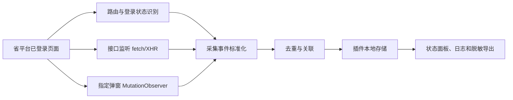

# 省平台数据监控与采集 Agent 开发计划

> 产品边界说明：本文只描述采集插件与本机采集服务的工程范围。目标产品的多角色职责分离、规则审核发布、文本/语音响应、企业日报月报和敏感证据包，以 [产品逻辑规划 V2](../product/三客一危值班助手-产品逻辑规划-v2.md) 为准；本文提到的 CSV/JSON 仅指当前本地开发诊断能力。

> 2026-07-18 状态更新：插件已在原始白名单采集之上实现标准报警事件归并、业务唯一键、版本化规则、演练动作、固定音频校验、分层台账和CSV/JSON导出。真实报警/查岗弹窗选择器与真实对讲调用链仍需在授权页面和测试车辆上联调。当前本机 Node 进程统一称为“本机采集服务”，不是中心化业务后台。

> 本地联调补充：仓库新增 `sandbox/` Django契约模拟器，覆盖当前已知白名单接口、报警列表/详情/证据/弹窗DOM以及重复、缺字段、结构变化、401、500、慢响应和模拟对讲失败场景。它用于回归测试，不代表已完整复刻省平台；正式接入仍需重新校准真实契约。

## 1. 文档说明

- 面向对象：省平台及业务协作团队。
- 当前阶段：网页插件一期 - 数据监控与采集。

## 2. 当前阶段目标

在不改造省平台、不影响原有视频监控和人工操作的前提下，建设一个运行在省平台登录页面中的浏览器 Agent，持续完成以下工作：

1. 识别当前页面、登录状态和监控路由。
2. 监听省平台已有接口和指定弹窗，及时发现报警、查岗和技术异常信息。
3. 抓取报警、车辆、企业/组织、时间、位置和处理状态等必要字段。
4. 将不同接口的数据归并为可查询、可导出的标准事件记录。
5. 记录采集失败、接口变化和页面结构变化，为后续处置辅助和报表建设提供可靠数据基础。

当前重点是“看得到、抓得到、存得准、查得清”。本阶段不以无人值守自动处置为目标。

## 3. 已确认的数据基础

| 数据类别 | 当前已确认入口 | 本阶段用途 |
| --- | --- | --- |
| 报警类型 | `alarmUserSet/listAll` | 建立报警类型字典；当前已确认返回 39 类报警。 |
| 实时未处理报警 | `getVideoUnprocessedAlarm` | 发现实时报警，作为弹窗监控的接口兜底。 |
| 报警查询 | `alarmQueryList` | 补充报警明细、状态，并为后续统计提供底表。 |
| 未处理报警计数 | `queryAlarmUnDealCount` | 监测指定时间和机构范围内的待处理数量。 |
| 技术报警 | `technology/detection` | 监测设备离线、视频存储故障等技术异常。 |
| 车辆组织树 | `loadAllVehicleGroupTree` | 补充车辆所属机构和企业层级。 |
| 车辆详情 | `getMonitorCarInfo/{carId}` | 补充车牌、司机、企业、位置、速度、在线状态等信息。 |
| 车辆分类 | `getMonitorCarBillMapInfo` | 辅助识别车辆类别。 |
| 查岗列表 | `checkPost/list` | 建立查岗监测和留痕的数据入口。 |

以下信息仍需要在真实业务场景出现时补采：

- 真实报警弹窗的 DOM、按钮和点击路径。
- `alarmDetails` 的真实请求参数。
- 查岗弹窗的页面结构、超时行为和响应链路。
- 报表中心、联网联控相关接口的真实请求体和字段口径。

## 5. Agent 最小实现

当前阶段采用 Chrome/Edge 浏览器插件的原生能力实现，不新增独立后台服务：

### 5.1 页面识别

- 识别省平台域名和 `#/vehicle-monitor/real-time` 等目标路由。
- 通过页面状态和接口响应判断登录是否有效。
- 页面切换后自动更新监听范围，不依赖全页面扫描。

### 5.2 接口监听

- 在页面上下文监听 `fetch` 和 `XMLHttpRequest` 请求/响应。
- 只采集白名单业务接口，不采集无关请求。
- 优先复用省平台页面已经发出的请求，避免额外高频轮询和平台负载。
- 记录接口、请求时间、当前路由、响应状态、必要业务字段和失败原因。
- 不保存登录密码和真实 token，不在导出文件中暴露认证信息。

### 5.3 定点页面监控

- 使用 `MutationObserver` 监听报警、查岗和详情等指定弹窗容器。
- 只读取必要字段和按钮状态，不做全量 DOM 扫描。
- 页面结构变化或选择器失效时产生异常日志，不静默丢失。

### 5.4 事件归一与去重

每条报警至少形成以下标准记录：

| 字段组 | 主要内容 |
| --- | --- |
| 事件标识 | 报警记录 ID、报警类型 ID、来源接口、采集时间。 |
| 车辆信息 | 车辆 ID、车牌号、车辆类别、在线状态。 |
| 组织信息 | 机构/企业 ID、机构/企业名称。 |
| 报警信息 | 报警名称、报警时间、位置、速度、处理状态。 |
| 采集状态 | 成功、字段缺失、接口失败、页面结构变化。 |
| 原始依据 | 来源页面、来源接口和脱敏后的响应摘要。 |

优先以报警记录 ID 去重；记录 ID 缺失时，使用车辆 ID、报警类型和报警时间组合识别重复事件。

## 6. 分阶段开发安排

| 阶段 | 主要工作 | 交付物 | 完成判定 | 当前状态 |
| --- | --- | --- | --- | --- |
| A. 页面与接口勘察 | 确认路由、接口、响应结构、动作边界和风险点。 | 页面/接口采集记录、接口字典。 | 已形成可开发的接口和字段清单。 | 已完成初步勘察 |
| B. 监控 Agent 基础 | 插件骨架、路由识别、接口白名单监听、运行日志。 | 可安装插件、运行状态面板。 | 打开省平台后能自动识别目标页面并记录指定接口。 | 当前重点 |
| C. 报警事件归并 | 报警类型、实时报警、报警查询、车辆详情和组织树关联；事件去重。 | 标准报警事件记录、脱敏样例数据。 | 同一报警可形成一条字段来源可追溯的记录。 | 当前重点 |
| D. 定点弹窗采集 | 监听报警/查岗弹窗，补采详情请求和异常状态。 | 弹窗采集规则、异常日志。 | 真实弹窗出现时能记录出现时间、关键字段和采集结果。 | 需真实场景联调 |
| E. 稳定性与交付 | 长时间运行检查、页面兼容检查、导出和安装说明。 | 安装包、使用说明、验收记录。 | 不影响原平台主要操作，采集失败可见且可定位。 | 后续阶段 |
| F. 处置辅助 | 固定话术、人工确认、文本下发或对讲、处置留痕。 | 处置辅助功能。 | 另行确认授权、规则和测试车辆后验收。 | 不在当前监控阶段 |

## 7. 当前开发任务清单

### P0 - 正在推进

- 建立插件最小运行框架和目标域名权限。
- 完成省平台路由、登录状态和页面切换识别。
- 建立已确认接口的监听白名单和统一采集日志。
- 完成报警类型、实时报警、报警查询、车辆详情和组织树的数据归一。
- 完成事件去重、字段缺失标记和接口失败记录。
- 提供本地状态面板和脱敏数据导出。

### P1 - 需要真实页面联调

- 在真实报警出现时补采报警弹窗和 `alarmDetails` 原始请求。
- 在真实查岗出现时补采弹窗结构、超时行为和通知所需字段。
- 验证不同账号、机构范围和页面切换下的采集完整性。
- 验证插件长时间运行时不会影响视频监控和平台操作。

### P2 - 当前阶段后再确认

- 报表中心和联网联控数据采集。
- 集团、分公司、企业关系校准。
- 固定话术、人工确认后的文本下发或语音对讲。
- 多台值班电脑的集中汇总和后台服务。

## 8. 当前阶段验收口径

| 验收项 | 验收标准 |
| --- | --- |
| 自动启动 | 进入已登录的省平台目标页面后，Agent 能自动识别并显示运行状态。 |
| 接口采集 | 已列入白名单的接口请求出现时，能记录时间、状态和约定业务字段。 |
| 报警归并 | 同一报警的类型、车辆、组织和状态信息可合并为一条标准事件。 |
| 去重 | 页面刷新或接口重复返回时，不重复生成同一报警事件。 |
| 异常可见 | 接口失败、字段缺失、登录失效、选择器失效均有明确日志。 |
| 页面无侵入 | 插件不改变省平台接口参数，不自动点击动作按钮，不影响原有视频和人工操作。 |
| 数据安全 | 不保存密码和真实 token；导出数据按双方确认规则脱敏。 |
