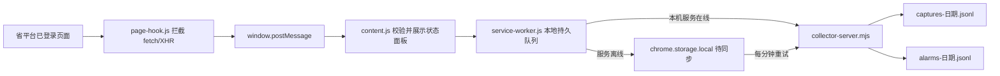

# 三客一危省平台 AI 报警处置助手 - 全栈接手 Handoff

> **2026-07-18 历史接手快照，技术状态已过期。** 当前实现状态以 [阶段实施文件说明](../deliverables/值班助手阶段实施文件/README.md) 为准，当前产品逻辑以 [产品逻辑规划 V2](../product/三客一危值班助手-产品逻辑规划-v2.md) 为准。本文保留当时背景，不应用于判断现有功能、角色权限、正式报表或敏感导出能力。

- 交接日期：2026-07-18
- 接手角色：全栈开发
- 当前仓库根目录：`.`
- 外部业务知识库：本机 `10X科技AI服务作战中枢` 项目（不在本仓库内）
- 文档目标：让新同事能够理解项目来龙去脉，运行当前插件和采集服务，辨别原型与真实实现，继续完成真实页面联调。
- 保密级别：客户项目内部资料。本文不包含账号、密码、Token、Cookie、手机号、车牌、司机姓名或车辆轨迹等敏感值。

## 1. 先看结论

当前已经交付的是一套“只读浏览器扩展 + 本机 Node.js JSONL 采集服务”，不是完整的 AI 报警处置系统。

已实现：

1. 在省平台页面的主世界拦截白名单 `fetch` 和 `XMLHttpRequest`。
2. 脱敏认证类字段后，将抓取记录送入扩展后台。
3. 扩展后台使用 `chrome.storage.local` 保存待同步队列。
4. 本机采集服务在线时，把完整抓取记录和拆出的报警记录追加写入 JSONL。
5. 页面右下角有状态面板，可查看最近 20 条抓取记录、服务连接状态和待同步数量。
6. 当前自动化测试 4/4 通过；本机健康检查通过。

未实现：

1. 真实报警弹窗和查岗弹窗的 `MutationObserver`。
2. 报警类型、车辆、组织、详情等多接口事件归一与业务级去重。
3. 文本下发、语音对讲、查岗响应、正报、申诉、忽略等任何处置动作。
4. 规则引擎、固定话术加载、VLM、LLM、TTS、ASR。
5. 纠正检测、短信通知、事件详情页、企业联系人协同。
6. 正式台账查询、Excel 报表、月报、排名表。
7. 多机汇总、生产部署、自启动、监控告警、数据保留策略。

最重要的交接边界：

> 现有 HTML 是交互原型，现有浏览器扩展是只读采集实现。原型里能点击、能流转的功能，不代表已经接通省平台或后端。

## 2. 项目背景与范围演进

### 2.1 最早建设设想

最初方案位于：

外部业务知识库：`raw/sources/两客车辆智能监管平台/三客一危 AI 智能值守助手建设方案.md`

最初方案提出五个模块：

1. 报警识别提醒。
2. 规则库管理。
3. 留痕与处置记录。
4. 报表中心。
5. 查岗/风控弹窗处理。

目标形态是浏览器插件叠加在现有省平台上，不重建省平台。方案中包含 AI 规则匹配、固定话术、语音对讲、转人工、记录留痕、月报/排名表和查岗通知。

### 2.2 2026-06-27 会议校准

会议纪要位于：

外部业务知识库：`raw/sources/会议纪要/2026-06-27-三客一危监控平台功能及报表需求-会议纪要.md`

会议形成的主要判断：

1. 一期先做报警捕获、规则识别、语音提醒、处理记录和人工复核。
2. 不强行自动判断所有报警是否已纠正。
3. 报表短期要能下载、归档和打印，月报优先于日报。
4. 报表数据主要来自报警查询、联网联控和报表中心。
5. 集团、分公司、企业、车辆和联系人关系需要业务方校准。
6. 查岗弹窗一期只监控、截图、通知，不自动通过。

### 2.3 后续技术收敛

后续材料把首版进一步收敛为“报警第一处置闭环”，并强调高风险、低置信度、无法判断和动作失败必须人工确认。

核心参考：

- `docs/product/三客一危省平台AI报警处置助手-项目建设方案-客户可发版.md`
- `docs/decisions/MVP-risk-control-review.md`
- `docs/product/会议纪要核心需求与网页小助手处理记录.md`
- `docs/engineering/省平台数据监控与采集Agent-开发计划.md`
- 知识库中的 `wiki/projects/三客一危省平台ai报警处置助手首版技术方案.md`

### 2.4 当前工程阶段

当前代码只实现了最前端的“看得到、抓得到、落得下”：



这条链路不会发起省平台业务请求，不会点击处置按钮，也不会修改请求参数。

## 3. 必须先处理的范围冲突

新同事不要自行选择一种口径并直接开发。以下冲突需要项目负责人确认：

| 冲突 | 材料现状 | 当前建议 |
| --- | --- | --- |
| 项目名称 | “二客一危”“两客一危”“三客一危”并存 | 新平台对外优先使用“三客一危”；引用旧制度和旧文件时保留原名。正式合同口径需负责人确认。 |
| 首版是否含正式报表 | 最初方案和 6 月 27 日会议把月报列入一期；后续首版技术方案又把正式报表后置 | 拆成独立里程碑：先只读采集和处置留痕，再单独确认月报是否属于同一合同首版。 |
| 是否有后台 | 开发计划写“不新增独立后台”；当前代码已有本机 Node 采集服务 | 当前服务只是本地落盘进程，不是中心化业务后台。文档应改称“本机采集服务”。 |
| 是否做纠正检测 | 早期原型强调 VLM 纠正检测；会议认为一期不必强判所有报警 | 只对双方确认的少量类型试点；其余输出“无法判断/人工复核”。 |
| 自动处置程度 | 原型演示文本下发、语音对讲和通知；当前插件明确只读 | 在测试车辆、动作白名单、固定话术和人工确认完成前，继续保持只读。 |

另一个常见表述错误：

> “没有公开 API 文档”不等于“平台没有接口”。当前已经记录了登录后页面使用的内部接口，但它们不是对外开放 API，仍需在授权账号和真实页面中复核。

## 4. 当前代码结构与调用逻辑

代码目录：

`browser-extension/`

### 4.1 `manifest.json`

- Chrome Manifest V3。
- 页面范围：`https://*.hnznjg.cn:7443/*`。
- 本机服务权限：`http://127.0.0.1:17321/*`。
- 权限：`alarms`、`storage`、`unlimitedStorage`。
- `page-hook.js` 在 `MAIN` world、`document_start` 注入。
- `debug-records.js` 和 `content.js` 在扩展隔离世界运行。
- 当前没有真正配置 Chrome `side_panel`；页面中的“Side Panel”只存在于 HTML 原型中。

### 4.2 `page-hook.js`

职责：

1. 保存原生 `window.fetch`、`XMLHttpRequest.open/send/setRequestHeader`。
2. 只匹配固定路径白名单。
3. 记录方法、URL、页面路由、开始时间、耗时、状态、请求体和响应体。
4. 对认证、密码、Token、手机号等敏感键做递归脱敏。
5. 单条文本响应最多保留 5MB。
6. 通过 `window.postMessage` 把记录交给扩展隔离世界。

当前白名单：

| 规则名 | 路径片段 | 类别 |
| --- | --- | --- |
| `alarm-types` | `/alarm-service/alarmUserSet/listAll` | alarm |
| `realtime-alarms` | `/alarm-service/alarm/center/getVideoUnprocessedAlarm` | alarm |
| `alarm-query` | `/alarm-service/alarm/center/alarmQueryList` | alarm |
| `alarm-count` | `/alarm-service/alarm/center/queryAlarmUnDealCount` | alarm |
| `alarm-details` | `/alarm-service/alarm/center/alarmDetails` | alarm |
| `technical-alarms` | `/alarm-service/alarm/center/technology/detection` | alarm |
| `vehicle-tree` | `/base-service/groupinfo/loadAllVehicleGroupTree` | vehicle |
| `vehicle-info` | `/base-service/vehicle/getMonitorCarInfo/` | vehicle |
| `vehicle-types` | `/base-service/vehicle/getMonitorCarBillMapInfo` | vehicle |
| `check-post` | `/base-service/checkPost/list` | check-post |

注意：

- `isAlarm=true` 只代表接口分类，不代表响应中的每一行都是真实报警。
- 当前测试专门防止把“报警类型字典”误写为报警事件。
- 脱敏是按字段名匹配，不是完整匿名化。车牌、企业、司机、位置、图片/视频地址等业务字段仍可能存在于 JSONL，必须按客户机密数据管理。

### 4.3 `content.js`

职责：

1. 只接收来自当前窗口、当前源、指定消息标识的数据。
2. 校验 `matchedRule` 和目标域名。
3. 把有效记录发送给扩展后台。
4. 用关闭的 Shadow DOM 挂载右下角状态面板。
5. 展示累计捕获、报警接口数、待同步数、本地服务状态和最近记录。
6. 页面内保留最近 20 条调试记录，可展开查看完整脱敏 JSON。
7. 每 5 秒刷新后台状态。

限制：

- 调试列表刷新页面后清空。
- 这不是 Chrome 原生 Side Panel。
- 当前没有登录态识别、路由守卫、弹窗监听或页面结构异常日志。

### 4.4 `service-worker.js`

职责：

1. 收到 `CAPTURE` 后先写入 `chrome.storage.local`。
2. 调用 `http://127.0.0.1:17321/captures` 落盘。
3. 请求超时为 2.5 秒。
4. 服务离线时保留待同步 ID 和完整记录。
5. Chrome alarm 每分钟重试。
6. 对外提供 `STATUS` 和手动 `FLUSH`。

当前统计字段：

- `captured`
- `alarms`
- `saved`
- `lastCaptureAt`
- `lastRule`
- `lastError`

限制：

- 离线队列没有容量上限和淘汰策略。
- 没有数据保存周期和磁盘空间保护。
- 没有扩展升级后的状态迁移。
- 缺少对 service worker 队列并发和 Chrome 重启场景的自动化测试。

### 4.5 `collector-server.mjs`

职责：

1. 使用 Node.js 标准库启动 HTTP 服务，不依赖第三方包。
2. 默认监听 `127.0.0.1:17321`。
3. `GET /health` 返回运行状态。
4. `POST /captures` 接收单条抓取记录。
5. 请求体上限 10MB。
6. 完整抓取写入 `captures-YYYY-MM-DD.jsonl`。
7. 从部分报警响应中拆出报警行，写入 `alarms-YYYY-MM-DD.jsonl`。
8. 进程内按 `captureId` 去重。

可用环境变量：

| 变量 | 默认值 | 说明 |
| --- | --- | --- |
| `HOST` | `127.0.0.1` | 不建议改成公网监听地址 |
| `PORT` | `17321` | 修改后还需要同步扩展代码和权限 |
| `DATA_DIR` | 当前目录下的 `collector-data` | 建议从 `browser-extension` 目录启动 |

限制：

- 去重只在当前 Node 进程内有效，重启后同一 `captureId` 可能再次落盘。
- 当前只接受单条记录，没有批量接口。
- 只做最小字段校验，没有正式 JSON Schema。
- 没有日志轮转、保留周期、磁盘水位、审计和访问控制。
- CORS 当前允许任意源；虽然默认只绑定回环地址，后续仍应收紧来源。
- 报警拆行是局部提取，不等于跨接口归一、关联和业务去重。

### 4.6 测试

测试目录：`browser-extension/test`

当前 4 项：

1. 报警类型字典不会误写成真实报警事件。
2. 采集服务同时保存完整抓取和逐条报警数据，并阻止同进程重复写入。
3. 最近抓取记录按新到旧展示，可查看完整 JSON。
4. `fetch` 和 XHR 只读捕获并脱敏凭证类字段。

2026-07-18 实测：

```text
tests 4
pass 4
fail 0
```

## 5. 当前数据与证据状态

目录：

历史快照位于本地私有目录 `private/captures/browser-extension/`；运行时新数据仍写入 `browser-extension/collector-data/`，两者都不进入版本库。

2026-07-17 本地快照：

| 文件 | 行数 | 含义 |
| --- | ---: | --- |
| `captures-2026-07-17.jsonl` | 350 | 完整白名单请求/响应抓取 |
| `alarms-2026-07-17.jsonl` | 7 | 从实时报警响应中拆出的报警行 |

350 条抓取的规则分布：

| 规则 | 数量 | HTTP 状态 |
| --- | ---: | --- |
| `alarm-types` | 4 | 200 |
| `check-post` | 130 | 200 |
| `alarm-query` | 6 | 200 |
| `realtime-alarms` | 11 | 200 |
| `technical-alarms` | 1 | 200 |
| `vehicle-tree` | 99 | 200 |
| `vehicle-types` | 99 | 200 |

尚未在该快照中出现：

- `alarm-count`
- `alarm-details`
- `vehicle-info`

安全检查：

- 已识别的认证/联系类敏感键在该快照中均为 `[REDACTED]`。
- 这不代表文件已经匿名化。车辆、企业、人员、位置和证据 URL 等业务内容仍属于客户机密。
- 不要把 JSONL、原始接口记录、视频、帧截图或平台静态包发到公开仓库、聊天群或外部模型。

重要解释：

- 7 行报警记录不一定是 7 条业务唯一报警。
- 当前只按 `captureId` 去重，没有按报警 ID 或“车辆 + 类型 + 时间”去重。
- 样本只证明某次授权环境中抓到了这些接口，不代表所有账号、机构和平台版本一致。

## 6. 运行与部署

### 6.1 环境要求

- macOS/Windows/Linux 均可运行本机采集服务。
- Node.js 20+。
- Chrome 或 Edge。
- 不需要安装 npm 第三方依赖。
- 需要合法授权且已经登录的省平台账号。

### 6.2 测试

```bash
cd browser-extension
npm test
```

期望：4 项通过。

### 6.3 启动采集服务

```bash
cd browser-extension
npm start
```

健康检查：

```bash
curl http://127.0.0.1:17321/health
```

2026-07-18 已验证服务可启动，健康检查返回 `ok:true`。

### 6.4 安装扩展

1. 打开 Chrome/Edge 扩展管理页。
2. 开启开发者模式。
3. 选择“加载已解压的扩展程序”。
4. 选择仓库中的 `browser-extension/`。
5. 刷新已经登录的省平台页面。
6. 观察右下角状态面板。

最小成功标志：

1. `监听状态=运行中`。
2. `本地服务=已连接`。
3. 操作省平台页面后，白名单接口计数增加。
4. `collector-data` 中对应日期的 JSONL 继续增加。
5. 页面原有视频、按钮和人工操作没有受到影响。

### 6.5 当前不具备的生产部署能力

- 没有 `.crx` 或商店发布包。
- 没有安装脚本。
- 没有 launchd/systemd/Windows Service 自启动配置。
- 没有 Docker 配置。
- 没有集中式后端和多机汇总。
- 没有升级、回滚、配置迁移和版本检查。
- 当前目录不是 Git 仓库，没有可追溯 commit、tag 或远端。

在把它称为“已部署”之前，至少要完成版本管理、扩展打包、本机服务自启动、日志/数据目录约定、升级回滚和真实值守电脑试运行。

## 7. 原型说明

### 7.1 早期高保真原型

文件：

`prototypes/archive/v1-full-product.html`

特征：

- 单文件静态 HTML，约 3000 行。
- 包含报警驾驶舱、管理看板、MVP 风控、验收演练、记录中心、事件通知、报表、规则和移动端页面。
- 内置模拟状态机、角色权限、审计日志、记录版本和一致性检查。
- 适合演示完整产品方向和风险控制。

边界：

- 数据全部是前端内存中的模拟对象。
- 动作按钮只改变模拟状态。
- 没有连接浏览器扩展、省平台、数据库、短信、电话、模型或真实报表。

### 7.2 新版交互原型

文件：

`prototypes/current/index.html`

特征：

- 单文件静态 HTML，约 3000 行。
- 更聚焦省平台插件工作台、事件中心、处理记录台账、规则库、首版范围和接入检查。
- 模拟省平台页面与 Chrome Side Panel 并排工作的形态。
- 有动作阻断、上线准备项、故障演练和人工确认边界。

建议：

- 默认把 v2 作为后续产品沟通原型。
- 但仓内未找到负责人明确宣布“v2 为唯一基准”的记录，正式设计基线仍需确认。
- 真实扩展目前是页面右下角 Shadow DOM 面板，不是 v2 中演示的 Chrome Side Panel。

### 7.3 其他演示材料

- `prototypes/presentation/index.html`：演示汇报页，不是运行系统。
- `docs/deliverables/“三客一危”智能监管平台AI 报警处置助手项目建设方案.docx`
- `docs/deliverables/“三客一危”智能监管平台AI 报警处置助手项目建设方案.pdf`
- `private/backups/`：本地方案文档历史备份，不进入版本库。

不要直接从原型反推接口或数据模型。真实实现以扩展代码、授权页面抓包和双方确认的业务规则为准。

## 8. 平台技术背景

### 8.1 已确认的页面与能力线索

仓内材料记录了以下页面/能力：

- 实时视频与车辆详情。
- 报警提示弹窗、报警列表、报警详情和证据弹窗。
- 文字下发和语音对讲。
- 报警查询、正报、申诉、忽略等平台动作。
- 车辆组织树、车辆详情、车辆分类。
- 技术报警。
- 查岗列表和查岗/风控弹窗。
- 报表中心和联网联控。

入口材料：

- `docs/research/platform-video-requirements-analysis.md`
- `docs/engineering/网页插件建设-省平台页面与数据采集记录.md`
- `private/platform-evidence/省平台实时监控页接口请求响应记录.md`
- `private/platform-static/snapshot-2026-06-30/`
- `private/source-media/ebf21d6305723e06a28206521e65742e_raw.mp4`
- `private/source-media/video-review-frames/`

### 8.2 对讲技术线索

内部静态 JS 记录显示：

1. 页面先调用对讲启动接口取得 WebSocket 地址和文件名。
2. 浏览器申请麦克风权限。
3. 音频为 8kHz、16bit、单声道 PCM。
4. 每帧 320 个采样点，通过 WebSocket 二进制发送。
5. 关闭和保活另有接口。

相关内部记录：

`docs/engineering/网页插件建设-省平台页面与数据采集记录.md`

当前结论：

- 技术上存在复用平台对讲能力的可能。
- 当前扩展没有实现对讲。
- 动作接口必须在测试车辆、授权账号、固定话术和人工确认下重新抓包验证。
- 不要把静态 bundle 中的历史参数直接用于生产动作。

### 8.3 静态资源快照

`private/platform-static/snapshot-2026-06-30/` 保存了当时平台首页和主要压缩 JS chunk，用于反查路由、组件和接口；该目录不进入版本库。

注意：

- 它是时点快照，不保证与当前线上版本一致。
- 属于平台内部前端资源，不要外传。
- 优先用于查线索，不要把压缩 bundle 当稳定接口文档。

## 9. 业务数据模型建议

当前实现只保存抓取记录。后续做业务归一时，至少需要分开以下实体：

1. `Capture`：一次页面网络请求/响应证据。
2. `AlarmEvent`：业务唯一报警。
3. `VehicleSnapshot`：报警时点车辆、司机、组织、位置和状态。
4. `RuleDecision`：规则版本、命中依据、建议动作和人工确认要求。
5. `ActionAttempt`：文本、语音、通知等动作的请求、结果和失败原因。
6. `CorrectionObservation`：提醒后的观察窗口、证据和三态结果。
7. `ManualHandoff`：值班人员接收、查看、复制、拨号和备注。
8. `AuditRecord`：操作者、时间、版本、来源和状态流转。

规则：

- 抓取证据和业务事件必须分表/分层，不要把每次接口响应直接当一条报警。
- 事实字段、规则判断、模型推测和人工结论必须分开。
- 缺字段写缺失，无法判断写无法判断，不用默认值伪装完整。
- 司机提醒话术必须引用审核模板；企业沟通话术可由 AI 生成，但要保留版本和人工修改记录。

字段参考：

外部业务知识库：`wiki/assets/ai报警处置台账字段表.md`

## 10. 已知问题和风险

### P0 - 阻碍真实交付

1. 当前目录不是 Git 仓库，无法审查版本历史、提交和回滚。
2. 尚未在本次交接中使用授权浏览器重新验证扩展；测试只覆盖本地逻辑。
3. 当前样本没有覆盖 `alarm-count`、`alarm-details`、`vehicle-info`。
4. 真实报警弹窗、查岗弹窗 DOM 和超时链路未实现。
5. 没有业务级事件唯一键和跨接口归一。
6. JSONL 含客户业务敏感信息，但没有保留周期、加密、权限或删除流程。
7. 本机服务没有开机自启、守护、日志监控和磁盘保护。
8. 当前扩展没有发布包和版本升级机制。

### P1 - 稳定性和安全

1. `fetch/XHR` monkey patch 依赖页面加载顺序和平台实现，平台升级后可能失效。
2. key-based 脱敏不等于匿名化，未知敏感字段可能漏过。
3. 待同步队列无上限，长期离线可能占满浏览器存储。
4. 采集服务重启后去重集合清空。
5. CORS 为 `*`，需要在保留回环监听的同时收紧允许来源。
6. JSONL 没有轮转、压缩、索引和并发写入压力验证。
7. 没有 service worker、内容面板和长时间运行测试。
8. 不同账号、机构权限和页面版本差异未验证。

### P2 - 业务和产品

1. 官方 19 项规则、内部记录的 39 类报警和平台实际枚举尚未建立映射。
2. “三客一危/两客一危”交付范围尚未正式冻结。
3. 部分报警的纠正判定阈值、观察窗口和人工升级条件未确认。
4. 企业组织关系、联系人和通知责任边界未确认。
5. 报表字段来源、分子分母和统计口径未确认。
6. VLM、TTS、ASR、短信和电话能力都没有真实接入或验收样本。

## 11. 建议接手路线

### 阶段 0：冻结事实边界

1. 由项目负责人确认正式名称。
2. 确认正式首版是否包含月报。
3. 确认 v2 是否为产品原型基线。
4. 确认当前目录是否建立 Git 仓库及远端。
5. 确认数据保留、脱敏、访问和外发规则。

Done when：

- 有一页签字/确认后的范围、命名、验收和数据安全边界。

### 阶段 1：真实只读联调

1. 在授权账号中运行当前扩展。
2. 逐项复核 10 个白名单接口。
3. 为缺失的 3 个接口取得脱敏证据，或明确无法触发原因。
4. 验证刷新、路由切换、登录失效和本机服务离线/恢复。
5. 取得至少一条真实报警的完整跨接口证据链。
6. 验证插件不改变请求、不点击按钮、不影响视频和人工操作。

Done when：

- 一个真实报警可以从抓取证据追溯到类型、车辆、组织、时间和状态。
- 所有失败都有明确记录，没有静默漏采。

### 阶段 2：最小事件归一

1. 定义一个稳定的 `AlarmEvent` JSON Schema。
2. 优先按平台报警 ID 去重。
3. 无 ID 时使用“车辆 ID + 报警类型 + 报警时间”作为受控兜底。
4. 只关联真实已验证字段。
5. 留下一个最小回归测试。

Done when：

- 页面重复响应和刷新不会重复生成同一业务报警。
- 每个字段都能指出来源接口或页面证据。

### 阶段 3：弹窗与异常监控

1. 只对真实报警和查岗容器增加定点 `MutationObserver`。
2. 不做全页面扫描。
3. 选择器失效、弹窗超时和页面升级要显式告警。
4. 查岗只截图、记录和通知，不自动答题。

Done when：

- 真实报警/查岗弹窗出现时能记录时间、关键字段和截图状态。

### 阶段 4：人工确认后的处置试点

前置条件：

- 测试车辆。
- 客户书面授权。
- 固定话术审核。
- 动作白名单。
- 人工确认开关。
- 完整失败日志。

建议只试点一种高频报警和一种动作，不同时上文本、语音、VLM、短信和报表。

Done when：

- 一条受控报警能完成“读取 -> 规则 -> 人工确认 -> 动作 -> 结果 -> 留痕”。
- 动作失败不会标记成功。

### 阶段 5：AI 与报表

只有真实处置链路稳定后再加入：

- 固定模板内的 LLM 摘要。
- TTS 对讲。
- VLM 纠正辅助判断。
- ASR 司机回复。
- 短信/电话/企微协同。
- 月报和排名表。

这些应分别定义样本、准确率、人工兜底和验收口径，不要作为一个“大 AI 模块”整体上线。

## 12. 新同事第一天建议

按以下顺序，不要先改代码：

1. 阅读本 handoff。
2. 阅读最初建设方案和 2026-06-27 会议纪要。
3. 阅读 `browser-extension/README.md` 和 5 个运行文件。
4. 运行 `npm test`。
5. 启动本机采集服务并检查 `/health`。
6. 打开 v2 原型，理解最终用户操作目标，但不把它当真实实现。
7. 在授权页面完成一次只读采集复核。
8. 输出一张“已验证 / 未验证 / 不在当前范围”表，再开始设计下一步。

## 13. 资料索引

### A. 当前工程 - 必读

根目录：当前仓库 `.`。

| 文件 | 用途 |
| --- | --- |
| `browser-extension/README.md` | 当前运行、安装和边界 |
| `browser-extension/manifest.json` | 扩展权限和注入范围 |
| `browser-extension/page-hook.js` | 页面 fetch/XHR 拦截 |
| `browser-extension/content.js` | 消息校验和页面状态面板 |
| `browser-extension/service-worker.js` | 离线队列和本机同步 |
| `browser-extension/collector-server.mjs` | 本机 JSONL 服务 |
| `browser-extension/test/` | 当前自动化检查 |
| `docs/engineering/网页插件建设-省平台页面与数据采集记录.md` | 页面、接口、动作边界和下一步补采 |
| `private/platform-evidence/省平台实时监控页接口请求响应记录.md` | 本地内部接口证据；含敏感业务数据，不进入版本库 |
| `docs/product/会议纪要核心需求与网页小助手处理记录.md` | 需求、数据模型、一期 Done when |
| `docs/engineering/省平台数据监控与采集Agent-开发计划.md` | 只读采集阶段计划；部分状态已落后于代码 |

### B. 原型与产品材料

| 文件 | 用途 |
| --- | --- |
| `prototypes/current/index.html` | 建议优先看的新版原型 |
| `prototypes/archive/v1-full-product.html` | 完整方向和风控演示 |
| `prototypes/presentation/index.html` | 汇报演示 |
| `docs/decisions/MVP-risk-control-review.md` | 风险收敛和上线红线 |
| `docs/research/platform-video-requirements-analysis.md` | 视频中的页面事实和流程修正 |
| `docs/product/三客一危省平台AI报警处置助手-项目建设方案-客户可发版.md` | 客户沟通版整体方案 |
| `docs/deliverables/` | 对外 DOCX/PDF 版式快照 |

### C. 原始业务来源

以下资料位于外部业务知识库，不随本仓库发布。

优先读：

1. `raw/sources/两客车辆智能监管平台/三客一危 AI 智能值守助手建设方案.md`
2. `raw/sources/会议纪要/2026-06-27-三客一危监控平台功能及报表需求-会议纪要.md`
3. `raw/sources/两客车辆智能监管平台/AI 报警处置助手草案.md`
4. `raw/sources/两客车辆智能监管平台/报警规则清单(1).xlsx`
5. `raw/sources/两客车辆智能监管平台/报警规则清单(1)-mineru.md`
6. `raw/sources/两客车辆智能监管平台/附件1.湖南省“两客”车辆智能监管平台报警规则及管理细则2025版_2065112097865162752 (1).md`
7. `raw/sources/两客车辆智能监管平台/湖南省交通运输“二客一危”智能监管平台.md`
8. `raw/sources/我的笔记/省平台三客一危 AI 智能值守助手开发进度说明.md`

报表阶段再读：

1. `raw/sources/两客车辆智能监管平台/测试片区智能监管平台监控月报表.xlsx`（脱敏示例路径）
2. `raw/sources/两客车辆智能监管平台/企业处理率报表2026.2.1-2.28.xlsx`
3. 对应的 MinerU 解析稿和 `wiki/synthesis/2026年2月邵阳两客一危报警处置率报表分析.md`

### D. 知识库中的规则与交付资产

| 文件 | 用途 |
| --- | --- |
| `wiki/projects/两客一危智能监管平台ai报警处置助手.md` | 当前项目总入口 |
| `wiki/projects/三客一危省平台ai报警处置助手首版技术方案.md` | 首版技术范围 |
| `wiki/assets/两客一危报警处置首版范围.md` | 报价和验收边界 |
| `wiki/assets/两客一危报警类型处置矩阵.md` | 报警类型和动作建议 |
| `wiki/assets/两客一危司机提醒固定话术模板.md` | 司机固定话术 |
| `wiki/assets/ai报警处置台账字段表.md` | 台账字段 |
| `wiki/playbooks/AI报警处置人机协同规则.md` | 人工确认和责任边界 |
| `wiki/workflows/两客一危报警处置闭环.md` | 业务流程 |
| `wiki/workflows/两客一危报警处置SOP.md` | 操作 SOP |
| `wiki/queries/三客一危与两客一危范围差异待确认问题.md` | 命名和适用范围冲突 |
| `wiki/assets/三客一危官网与省平台调研交接-2026-07-17.md` | 公开官网与内部实操证据分层 |
| `wiki/assets/两客一危报警处置待业务确认清单.md` | 未确认业务口径 |

## 14. 验证记录

本次交接实际执行：

```text
cd browser-extension
npm test
```

结果：4/4 通过。

实际执行：

```text
npm start
curl http://127.0.0.1:17321/health
```

结果：服务正常启动，健康检查返回 `ok:true`，随后已手动停止服务。

实际执行：

- 解析并校验 `manifest.json`、`package.json`。
- 统计 2026-07-17 JSONL 行数和接口分布。
- 检查当前敏感键是否被 `[REDACTED]`。

本次未验证：

- 未进入授权登录的省平台执行浏览器联调。
- 未触发真实报警或查岗弹窗。
- 未验证 Chrome 长时间运行、浏览器重启和操作系统重启。
- 未验证任何文本、语音、短信、电话、模型或报表能力。

## 15. Suggested skills

下一位执行者建议按任务调用：

- `chrome:control-chrome` 或 `browser-harness`：在用户已授权且登录的真实页面做只读复核。
- `repo-local-runtime-check`：启动、停止和核验本机采集服务。
- `diagnose`：接口监听丢失、页面升级、选择器失效或长时间运行异常时做根因诊断。
- `tdd`：实现事件归一、业务去重和字段映射时留下最小回归检查。
- `handoff`：每次真实联调后继续更新脱敏交接。

## 16. 给接手同事的一句话

先把一条真实报警“只读、脱敏、可追溯、不重复”地跑通，再做弹窗、规则、对讲、模型和报表；任何原型能力在真实入口和失败状态未验收前，都只能算规划。
