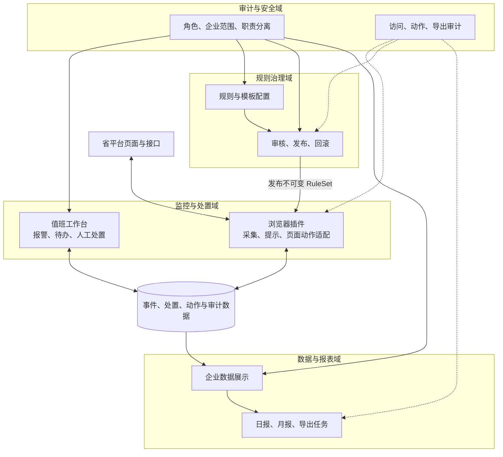
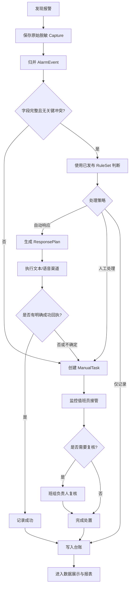
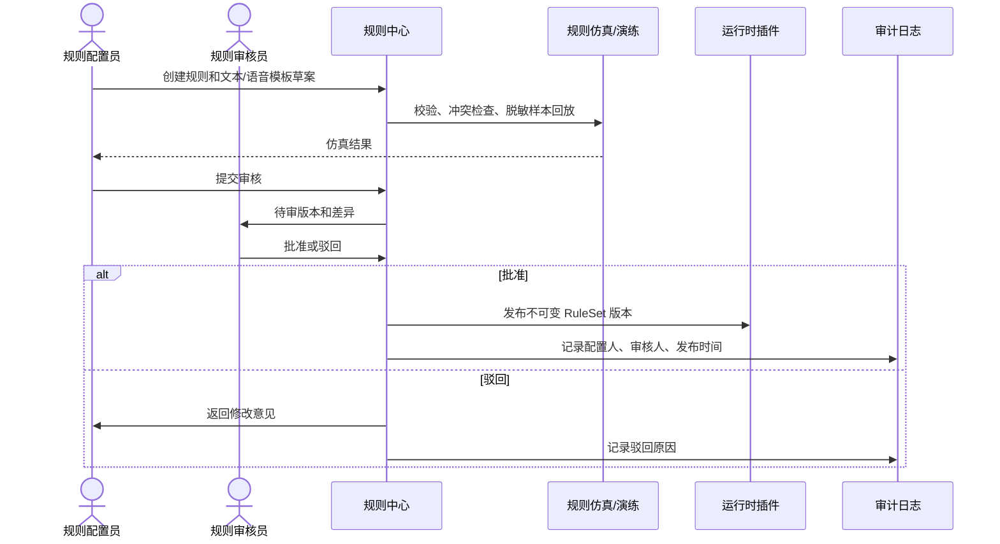

# 三客一危值班助手：产品逻辑规划 V2

> 历史版本提示：本文件的渠道和平台语音结论属于早期阶段。当前以 V8 规则逻辑和服务器计划部署书 V3 为准；自动规则可选择单一 `TEXT_TTS` 或 `VOICE_INTERCOM`，真实动作仍受测试车辆和授权闸门限制。

> 当前产品与执行规则以《三客一危值班助手-最新规则逻辑-v8》和服务器计划部署书 V3 为准。

> 2026-07-21 需求确认修订：自动规则可选择单一 `TEXT_TTS` 或单一 `VOICE_INTERCOM`。`VOICE_INTERCOM` 是 AI 自动触发平台语音通道并播放固定语音，不是人工实时通话；没有测试车辆前真实适配器保持阻断。明确失败按5秒、10秒重试，30秒内转人工；超时和结果未知不重试。预报警实时抓取、展示和入库，但默认不进入司机提醒优先队列。

版本：`2.0`  
形成日期：`2026-07-19`  
文档性质：产品逻辑基线，优先于早期“单一值班人员”假设

## 1. 本次调整结论

保留现有设计中已经正确的部分：字段来源追踪、跨接口归并、业务去重、失败转人工、演练与真实动作隔离、固定模板、动作留痕和敏感导出审计。

产品逻辑调整为：

1. 产品面向多个职责角色，不再定义为只有一个值班人员。
2. 监控操作、规则配置和规则审核必须职责分离。
3. 报警响应不只包括语音，还包括文本提醒，以及文本与语音的组合策略。
4. 数据展示、日报、月报和企业维度导出独立成“数据与报表中心”，不放在监控插件的普通操作区。
5. 完整 JSON 包含车辆、司机、企业、位置和原始接口等敏感信息，不能作为普通导出能力。
6. 浏览器插件是省平台侧的采集与执行端，不承担完整的角色审批、报表治理和数据权限管理。

## 2. 产品定位

产品是叠加在现有省平台之上的报警处置与数据治理辅助系统，不重建省平台，也不替代省平台生成报警、保存证据和执行监管业务。

目标产品由四个业务域组成：

- 监控与处置：发现报警、补齐字段、规则判断、文本/语音响应、失败转人工、处置留痕。
- 规则治理：规则草拟、校验、审核、发布、回滚和历史版本追溯。
- 数据与报表：按企业和组织展示报警、处置、响应和趋势，生成日报、月报和授权导出。
- 审计与安全：权限、职责分离、敏感字段、导出审批、访问日志和数据保留。

## 3. 产品角色

### 3.1 角色定义

| 角色 | 主要职责 | 明确禁止 |
| --- | --- | --- |
| 监控值班员 | 查看报警、接管失败事件、备注、人工重试、提交处置结果 | 不得审核或发布规则；默认不得导出完整明细 JSON |
| 班组负责人/处置复核员 | 查看班组待办、复核高风险或异常处置、关闭需要复核的事件 | 不得审核自己配置的规则；不得修改原始报警事实 |
| 规则配置员 | 创建规则草案、配置匹配条件、文本模板、语音模板和适用范围 | 不得审核、发布自己创建或修改的规则版本 |
| 规则审核员 | 审核规则、模板、动作边界和生效范围，批准或驳回 | 不得直接修改待审内容；不得审核本人提交的版本 |
| 数据分析/报表员 | 查看授权企业数据、生成日报月报、导出脱敏报表 | 不得执行对讲、修改规则或查看超出企业范围的数据 |
| 系统管理员 | 用户、组织、企业范围、运行参数和技术配置 | 默认不具备规则审核、报警处置和敏感明细导出权限 |
| 安全审计员 | 查看登录、规则、动作、导出和敏感访问日志 | 不得修改业务规则、处置结果或原始证据 |

### 3.2 职责分离原则

- 规则配置员与规则审核员不能是同一人在同一规则版本上的两个身份。
- 同一自然人不得同时拥有监控值班员、规则配置员和规则审核员三项生产权限；监控值班员不得兼任生产规则审核员。
- 监控值班员不能通过修改规则来改变自己正在处理的报警结果。
- 系统管理员的技术权限不自动等于业务审批权限。
- 报表员只能访问授权企业或组织范围。
- 完整敏感证据导出至少需要专门权限、用途说明和审计记录；是否增加二次审批由客户安全制度确认。
- 高风险处置的执行人与复核人应分离。

### 3.3 助手身份与省平台账号

目标产品存在两套不同含义的身份，不能混用：

- 助手系统身份：决定用户角色、企业范围、规则审批、报表和敏感数据权限。
- 省平台登录账号：决定页面是否可见、文本/语音按钮是否可用，以及省平台侧动作权限。

真实动作必须同时通过两套权限校验。审计记录保存助手用户 ID、当时角色与企业范围，以及省平台账号的可追溯标识；不保存省平台密码、Cookie 或 Token。仅有省平台登录态不代表可以审核规则或导出报表，仅有助手系统权限也不能绕过省平台本身的动作限制。

目标版本不使用多人共享的助手账号。若省平台客观上仍使用共享值班账号，必须由实名助手用户认领本次班次并记录交接；无法确认当前操作者时，禁止真实自动动作和敏感导出。

## 4. 产品总体结构



说明：当前仓库已经实现浏览器插件、本机加密采集服务、实名身份/RBAC/班次、规则治理、文本/语音资产治理、人工处置、企业日报月报中心和第一版敏感证据包。数据库全字段保护、密钥轮换、外部不可抵赖审计和真实平台动作联调仍属于后续能力。

## 5. 核心业务对象

| 对象 | 作用 |
| --- | --- |
| `Capture` | 一次脱敏接口或弹窗采集证据 |
| `AlarmEvent` | 跨接口归并后的唯一报警事实 |
| `DisposalCase` | 围绕报警产生的处置任务、负责人、响应和最终结果 |
| `RuleSet` | 一批同时发布的版本化规则 |
| `RuleReview` | 规则提交、审核、意见、批准和发布记录 |
| `ResponsePlan` | 处理策略、文本/语音渠道、顺序、模板和兜底 |
| `ActionAttempt` | 一次文本或语音动作尝试及回执 |
| `ManualTask` | 自动动作失败、冲突或字段不足产生的人工待办 |
| `LedgerRow` | 处置台账的标准化记录 |
| `ReportSnapshot` | 某企业、某周期、某口径下的不可变日报/月报快照 |
| `ExportJob` | 一次授权导出任务及文件、参数、用途和审计信息 |

### 5.1 数据权威与不可覆盖原则

同一个页面会同时出现平台事实、插件判断和人工输入，产品必须明确来源，不能互相覆盖：

| 数据类别 | 示例 | 权威来源 | 修改规则 |
| --- | --- | --- | --- |
| 省平台事实 | 报警 ID、车辆、司机、企业、位置、速度、平台状态 | 省平台接口或 DOM Capture | 原始值不可改；不同来源冲突时并列保留并转人工 |
| 助手派生结果 | 规则命中、字段完整度、风险标签、响应建议 | 指定算法/规则版本 | 新版本产生新结果，不回写成平台事实 |
| 配置事实 | 已发布规则、文本模板、音频、企业范围 | 规则中心和权限中心 | 发布后不可原地覆盖，只能新版本或撤回 |
| 人工业务记录 | 接管、备注、处置结论、复核意见 | 实名操作人员 | 追加留痕；更正保留原值、原因和更正人 |
| 报表事实 | 某企业某周期的统计结果 | 锁定数据截止时间的 `ReportSnapshot` | 已发布快照不改写，更正时生成新版本 |

车辆和企业归属按事件发生时保存快照。后续车辆转入其他企业时，不能用当前归属重写历史事件和历史报表。

### 5.2 报警事件与处置工单的关系

- `AlarmEvent` 表达“发生了什么”，去重后保持唯一，不因处置方式变化而重建。
- `DisposalCase` 表达“这次报警如何被处理”，包含负责人、人工待办、复核和最终结果。
- 一个报警事件默认对应一个主处置工单；自动失败、人工重试和多渠道响应都作为同一工单下的多个 `ActionAttempt`，不能复制成多条报警。
- 同一车辆短时间内发生不同报警时保持不同事件；是否合并展示为风险会话由单独聚合规则决定，不改变原始报警数量。

处置工单状态：

```text
OPEN → AUTO_PROCESSING → COMPLETED
  └──────────────→ MANUAL_REQUIRED → IN_MANUAL → COMPLETED
                                      └────────→ PENDING_REVIEW → COMPLETED
COMPLETED → REOPENED → IN_MANUAL
```

只有具备权限的人员才能重开已完成工单，且必须填写原因。高风险、异常结果或规则指定场景进入 `PENDING_REVIEW`，执行人与复核人不得相同。

## 6. 报警处置主流程



## 7. 响应策略：文本与语音分离

处理策略和响应渠道不能混为一个字段。

### 7.1 处理策略

- `AUTO`：满足全部安全条件时自动执行响应计划。
- `MANUAL`：由监控值班员决定文本、语音或其他人工方式。
- `RECORD_ONLY`：只记录，不向司机或企业发送提醒。
- `DISABLED`：规则停用，默认转人工。

### 7.2 响应渠道

- `TEXT`：使用已审核固定文本模板，通过省平台已有文本下发能力执行。
- `VOICE`：使用已审核固定音频，通过省平台已有语音对讲能力执行。
- 后续可扩展站内提醒、短信或电话协同，但必须独立授权。

每个渠道动作还必须明确接收对象。`TEXT` 可能发送到车载终端、司机账号、企业联系人或平台站内对象；在真实接口确认前不得把“文本提醒”默认等同于“发给司机”。接收对象类型、目标 ID、企业范围和平台回执必须进入 `ActionAttempt`。

### 7.3 渠道编排

| 编排方式 | 说明 | 示例 |
| --- | --- | --- |
| 单渠道 | 只执行文本或只执行语音 | 一般设备提醒只发文本 |
| 顺序执行 | 先文本，满足条件后再语音 | 文本失败或高风险时升级语音 |
| 并行执行 | 文本与语音同时触发 | 仅限明确批准的高风险场景 |
| 兜底执行 | 主渠道失败后执行备用渠道 | 语音通道不可用时转文本或人工 |

文本和语音都必须使用版本化固定模板。生产模式不允许 AI 自由生成司机提醒内容。

一个 `ResponsePlan` 至少记录：处理策略、渠道列表、执行顺序、每个渠道的接收对象、模板版本、触发条件、超时、明确成功判据和失败兜底。每个渠道分别生成动作记录；某一渠道成功不能抹掉另一渠道的失败或未知状态。

## 8. 规则治理流程



状态：

```text
DRAFT → VALIDATING → IN_REVIEW → APPROVED → PUBLISHED → RETIRED
                     ↘ REJECTED
```

规则配置员不能审核本人提交的版本；已发布规则不能原地修改，只能生成新版本。

规则批准后的发布可以由审核员执行，也可以由独立发布岗或系统自动完成，具体由客户制度选择；无论采用哪种方式，配置人都不能自行完成审核和发布闭环。运行时插件只接收已发布的不可变版本，不接收草案或待审版本。

## 9. 人工处置逻辑

以下情况产生 `ManualTask`：

- 无匹配规则。
- 规则冲突。
- 关键字段缺失或来源冲突。
- 文本或语音模板未审核。
- 车辆离线、无权限或不在白名单。
- 文本下发失败。
- 语音启动、发送、保活或关闭失败。
- 动作结果为 `UNKNOWN`。
- 同车已有进行中动作。
- 规则要求人工确认或负责人复核。

人工待办至少包含：报警摘要、失败原因、规则版本、已经尝试的渠道、建议下一步、负责人、接管时间、处理备注、复核要求和最终结果。

## 10. 独立数据展示与报表中心

数据展示和导出不作为插件报警列表底部的附属按钮，而是独立产品模块。

### 10.1 展示视图

- 实时运行概览：报警量、待处理、自动成功、失败转人工、超时。
- 企业报警视图：按企业、分公司、集团和车辆查看报警。
- 处置质量视图：响应时间、处置时长、成功率、转人工率、未完成量。
- 渠道效果视图：文本成功率、语音成功率、渠道升级和失败原因。
- 趋势与风险视图：日报趋势、月度趋势、重复高风险车辆和报警类型分布。
- 数据质量视图：字段缺失、来源冲突、接口异常和页面结构变化。

### 10.2 企业数据范围

每条报警、处置和报表必须关联组织/企业范围。用户只能查看角色授权与企业范围的交集：

```text
可见数据 = 角色权限 ∩ 组织范围 ∩ 企业范围 ∩ 数据敏感级别
```

集团用户可查看授权下级汇总；企业用户只能查看本企业；跨企业比较需额外权限。

### 10.3 日报

建议字段：日期、企业、车辆数、报警总数、报警类型分布、自动文本次数及成功率、自动语音次数及成功率、转人工数量、未完成数量、平均响应时间、主要失败原因和数据质量异常。

### 10.4 月报

建议字段：月份、组织层级、企业、车辆规模、报警趋势、各类报警数量、处置率、自动响应率、人工接管率、文本/语音成功率、重复报警车辆、高风险事件、环比变化和数据完整性。

日报和月报必须保存统计口径、筛选参数、生成时间、数据截止时间和规则版本，确保后续可以复核。

统计默认使用北京时间，并按报警发生时间归属日/月；跨午夜、迟到数据和平台后补数据必须有明确补数规则。已经发布的日报/月报不直接覆盖，发现迟到数据或口径错误时生成带原因的更正版，并保留原版本和差异。

## 11. 导出产品逻辑

### 11.1 普通报表导出

- 在独立报表中心按企业、日期、月份和模板生成。
- 支持 XLSX；需要打印或对外归档时支持 PDF。
- CSV 只作为明细交换格式，不作为正式月报唯一格式。
- 默认使用脱敏或聚合数据。
- 每次导出产生 `ExportJob`，记录发起人、企业范围、筛选条件、模板版本、用途、文件哈希和下载记录。

### 11.2 完整 JSON

完整 JSON 可能包含车辆、司机、企业、位置、精确时间、备注、原始接口摘要和证据引用，属于敏感业务数据，不是普通值班员的日常导出能力。

目标控制：

- 从普通“导出”入口移除。
- 改为“敏感证据包”或“技术诊断导出”。
- 仅授予明确角色和企业范围。
- 导出前展示字段清单、用途和数据范围。
- 记录导出人、时间、理由、文件哈希和下载次数。
- 文件加密或进入受控目录，设置保留期限。
- 默认不包含 Cookie、Authorization、Token 和未脱敏原始抓包。
- 是否需要二次审批由客户制度确认。

## 12. 数据敏感级别

| 级别 | 示例 | 默认控制 |
| --- | --- | --- |
| L1 汇总公开级 | 不含企业和个人的总量趋势 | 授权报表用户可查看 |
| L2 内部业务级 | 企业汇总、报警类型、处置率 | 按企业范围控制，可脱敏导出 |
| L3 敏感明细级 | 车牌、司机、企业、精确位置、备注 | 最小权限、页面掩码、导出审计 |
| L4 高敏证据级 | 原始响应、视频、图片、完整 JSON、证据 URL | 专门授权、受控存储、禁止普通导出 |

账号、密码、Cookie、Authorization、Token 不进入业务存储和导出，属于禁止采集项。

## 13. 产品模块与界面边界

### 13.1 浏览器插件

- 平台连接和监听状态。
- 当前报警和待人工事项。
- 规则判断与文本/语音动作进度。
- 必要的人工接管、备注和重试。
- 演练/真实动作状态提示。
- 不承担规则最终审核和正式报表管理。

### 13.2 规则中心

- 规则草案、模板、差异、仿真、审核、发布、回滚。
- 配置人与审核人职责分离。
- 企业适用范围和生效时间。

### 13.3 数据与报表中心

- 多企业授权展示。
- 日报、月报、排名和趋势。
- 报表模板、生成任务和历史快照。
- 脱敏导出和敏感导出控制。

### 13.4 审计与安全中心

- 角色和企业范围。
- 规则审核、动作、人工处置和导出日志。
- 敏感数据访问和异常访问记录。

## 14. 当前实现与目标产品差距

| 能力 | 当前实现 | 产品目标 |
| --- | --- | --- |
| 用户角色 | 已实现实名用户、七类角色、企业授权、职责互斥、班次认领及规则/插件/工单企业闸门 | 将企业范围继续落实到集中事件查询和报表查询 |
| 规则管理 | 已实现后台草拟、企业范围、审核、发布、回滚及响应资产发布校验 | 增加规则差异和真实样本回放仿真 |
| 响应渠道 | 已实现文本/语音资产治理、组合 ResponsePlan、分渠道回执和沙箱适配 | 完成真实平台授权联调和生产成功判据 |
| 数据展示 | 插件最近事件、人工中心和独立企业报表中心 | 增加企业趋势、排名和数据质量专题看板 |
| 人工处置 | 已实现工单接管、备注、完成、复核、退回和重开 | 增加超时升级、交接班和班组调度 |
| 报表 | 已实现企业日报/月报、不可变版本、XLSX/PDF、下载和过期删除审计 | 客户确认正式模板、口径和接收对象 |
| 完整 JSON | 普通接口已禁用；本机采集改为强制密钥加密；证据包已具备双人审批、加密、哈希和过期审计 | 继续补齐数据库敏感标量保护、密钥轮换和外部不可抵赖审计 |
| 权限 | 服务端会话、RBAC 和企业授权已实现 | 数据查询与执行层强制企业隔离、强化审计 |

## 15. 产品阶段路线

| 阶段 | 产品目标 | 主要交付 |
| --- | --- | --- |
| P1 产品逻辑冻结 | 角色、流程、对象、渠道、报表和安全边界确认 | 本文档及配套文档 |
| P2 真实数据只读校准 | 接口、字段、组织企业关系和 DOM 校准 | 字段字典、企业映射、脱敏样例 |
| P3 监控处置工作台 | 报警、待办、人工处置和台账 | 值班工作台 |
| P4 规则治理 | 配置、审核、发布和回滚 | 规则中心、审批审计 |
| P5 文本与语音适配 | 固定文本、固定音频和组合策略 | 双渠道适配器、失败转人工 |
| P6 数据与报表中心 | 企业展示、日报和月报 | 报表中心、XLSX/PDF |
| P7 敏感数据治理 | 角色范围、证据包和导出审计 | RBAC、审计中心、保留策略 |
| P8 受控真实联调 | 测试车辆和少量企业试运行 | 联调报告、上线清单 |

## 16. 产品验收标准

- 监控人员、规则配置人员和规则审核人员权限明确且不能越权。
- 同一规则版本配置人与审核人不同。
- 文本和语音可独立配置、组合、失败和追溯。
- 所有自动动作使用已审核固定模板。
- 自动失败、冲突和字段不足产生人工待办。
- 数据展示按组织和企业范围隔离。
- 日报、月报保存口径、参数、截止时间和版本。
- 普通导出默认脱敏或聚合。
- 完整 JSON 不出现在普通导出入口。
- 所有规则发布、真实动作、人工处置和导出都有审计记录。

## 17. 待业务确认问题

1. 最终角色名称、人员数量和替岗机制。
2. 哪些报警允许自动文本、自动语音或组合响应。
3. 哪些高风险报警必须人工确认或负责人复核。
4. 文本和语音模板的审核部门与有效期。
5. 企业、分公司、集团的权威关系表。
6. 日报和月报模板、统计口径、生成时间和接收对象。
7. 是否允许跨企业排名及展示方式。
8. 完整 JSON/证据包的申请人、审批人、保留时间和加密要求。
9. 人工处置的完成标准、复核条件和超时规则。
10. 真实动作的授权账号、测试车辆和联调窗口。
