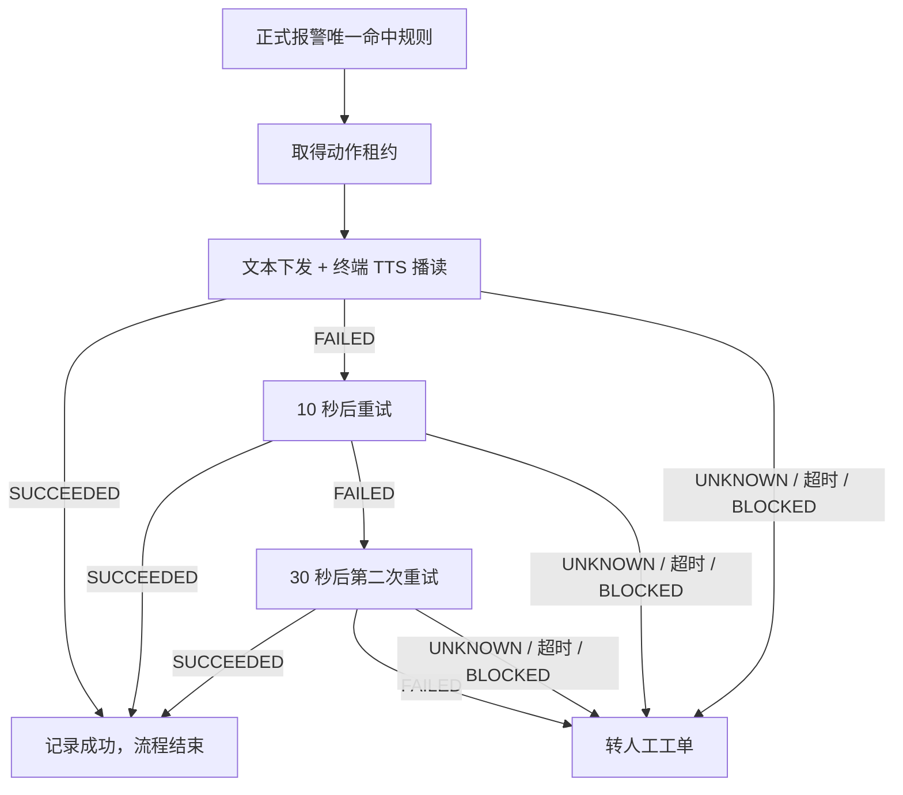

# 三客一危值班助手：最新规则逻辑 V7

> 历史版本提示：本文件中的“自动 VOICE 仅人工”结论已被 V8 修正。当前以《三客一危值班助手-最新规则逻辑 V8》和服务器计划部署书 V3 为准；`VOICE_INTERCOM` 的真实适配器仍需测试车辆和授权联调。

版本：`7.0`  
形成日期：`2026-07-20`  
对应扩展版本：`0.5.3`  
文档性质：当前产品、开发与测试的唯一规则逻辑基线；与早期文档冲突时以本文件为准。

## 1. 当前产品边界

本产品是叠加在省平台上的浏览器采集与处置助手，不替代省平台产生、升级或解除报警。

系统负责：

- 秒级读取省平台已经返回的报警和预报警数据；
- 统一字段、识别来源、服务器去重并集中保存；
- 对正式报警匹配已发布规则；
- 按规则规划“文本下发 + 终端 TTS 播读”；
- 保存动作结果，失败或未知时转人工；
- 按企业沉淀后续日报、月报和正式导出需要的数据；
- 保存人员、设备、平台账号引用、规则版本、动作和人工处置审计。

系统不负责：

- 判断预报警何时升级为实时报警；
- 判断超速持续时间、风险解除或报警结束；
- 修改省平台报警状态；
- 自动登录、填写验证码或绕过人机挑战；
- 自动发起语音对讲；
- 在模板未确认前把当前导出称为正式日报或月报。

## 2. 报警来源定义

来源名称必须严格区分，不能再把“预警列表”叫作“实时报警”。

| 来源代码 | 产品名称 | 当前页面或接口语义 | 是否进入优先队列 | 是否自动提醒司机 | 是否入库和报表 |
| --- | --- | --- | --- | --- | --- |
| `PREWARNING` | 预报警 | 实时监控页“预警列表”或预警查询；省平台尚未升级的预报警 | 否 | 否 | 是 |
| `REALTIME` | 正式实时报警 | 省平台已经判定成立的实时报警 | 是 | 按已发布规则 | 是 |
| `TECHNICAL` | 技术检测 | 技术检测类正式事件 | 是 | 按已发布规则，规则可配置仅转人工 | 是 |
| `PENDING` | 待处理正式报警 | 报警预处理页面中的正式待处理事件 | 是 | 按已发布规则 | 是 |
| `HISTORY` | 历史查询 | 历史补采或核对数据 | 否 | 否 | 是 |
| `OTHER` | 其他/待识别 | 尚未完成来源确认的数据 | 否 | 否，转人工确认 | 是 |

优先队列定义固定为：

```text
REALTIME + TECHNICAL + PENDING
```

`PREWARNING` 不进入优先队列，不触发司机提醒；它需要秒级采集、展示、存储，并用于后续报表和升级前后关联分析。

## 3. 秒级采集规则

### 3.1 实时监控页

批准的实时页面为：

```text
https://hn.hnznjg.cn:7443/#/vehicle-monitor/real-time
```

扩展 `0.5.3` 在该路由执行以下逻辑：

1. 先监听页面自己成功发出的预报警只读查询。
2. 只复用该成功请求，不猜测接口参数，不构造通用请求。
3. 每 1 秒最多发起一次只读查询。
4. 上一次请求未结束时跳过本周期，禁止请求重叠。
5. 相同响应只更新时间，不重复形成报警事实或采集来源。
6. 响应发生变化时，立即进入标准化、规则判断和后台同步。
7. 离开实时监控路由后停止秒级轮询。
8. 遇到 `401`、`403` 立即停止并标记需要人工登录。
9. 连续三次失败后停止轮询，提示人工检查。
10. 秒级查询不授予文本、TTS、对讲或其他业务动作权限。

目标时效：省平台接口返回新数据后，插件应在 1 秒内展示；后台同步异步执行，不阻塞页面展示。

### 3.2 其他报警来源

- 正式实时报警、技术检测和待处理报警继续监听页面实际请求和响应。
- 当前只有已确认契约的实时监控预报警接口启用 1 秒主动只读轮询。
- 其他来源若需要主动秒级查询，必须先确认接口、请求频率和授权，不能复制成任意接口轮询器。

## 4. 标准报警事实

每条报警统一形成 `AlarmFact`。主要字段包括：

- 全局事件 ID、业务指纹、省平台报警 ID；
- 来源类型、报警类型、报警时间、首次发现和最后发现时间；
- 企业 ID、企业名称快照；
- 车辆 ID、车牌、车辆类型；
- 驾驶员信息（省平台返回时保存，未返回时允许为空）；
- 位置、速度和页面返回的相关状态；
- 字段来源和字段冲突；
- 命中规则、规则版本和判断结果；
- 文本/TTS 动作计划、每次投递结果和最终状态；
- 人工工单及其查看、复制、拨打、备注、确认和关闭记录；
- 采集设备、助手用户、脱敏省平台账号引用、插件版本和采集时间。

省平台没有返回的字段必须记录为缺失，禁止自行编造。平台返回相互冲突的字段时保留来源和冲突状态，不静默覆盖。

## 5. 服务器全局去重

插件本地去重只用于降低重复传输，业务唯一性由 Django 服务器负责。

去重顺序：

1. 有可靠省平台报警 ID：优先使用报警 ID 生成业务指纹。
2. 没有可靠报警 ID：使用车辆、报警类型、报警时间和企业生成规范化指纹。
3. 同一报警由多个账号或浏览器采集：只保留一个 `AlarmFact`。
4. 每个账号和设备的观察分别保留为 `CaptureSource`。
5. 相同设备与相同采集幂等键不能重复创建来源记录。
6. 企业归属冲突时拒绝静默合并，进入冲突处理。

正式多浏览器部署使用 PostgreSQL 唯一约束和事务；SQLite 只用于当前本机开发和演示。

## 6. 规则匹配

运行时只能使用后台审核并发布的不可变规则版本。插件不接受本地临时规则覆盖。

判断顺序：

```text
来源是否属于正式报警
  ↓
助手身份、班次和企业范围是否有效
  ↓
是否唯一命中已发布规则
  ↓
模板和终端 TTS 配置是否有效
  ↓
生成 TEXT_TTS 响应计划或转人工
```

必须转人工的情况：

- 正式报警没有命中规则；
- 同优先级命中多条冲突规则；
- 企业范围无法确认或越权；
- 缺少车辆标识或必要动作字段；
- 文本模板不存在、未发布或变量缺失；
- 规则配置了自动语音对讲、多个自动渠道或并行渠道；
- 会话失效、挑战出现或动作权限不满足；
- 真实动作租约冲突；
- 动作最终失败、超时或结果未知。

规则可能变化，因此报警类型、匹配条件、处理方式、文案、企业范围和启停状态必须由版本化规则配置，不硬编码在页面操作中。

## 7. 自动司机提醒

### 7.1 唯一自动渠道

当前自动渠道固定为：

```text
TEXT_TTS = 文本下发 + 终端 TTS 播读
```

自动规则必须满足：

```json
{
  "handlingMode": "AUTO",
  "channels": [
    {
      "type": "TEXT",
      "terminalTts": true,
      "recipientType": "DRIVER_TERMINAL"
    }
  ],
  "channelStrategy": "SINGLE",
  "retryPolicy": {
    "maxRetries": 2,
    "delaysMs": [10000, 30000],
    "retryOn": ["FAILED"]
  },
  "fallback": "MANUAL"
}
```

旧的 `AUTO_VOICE` 规则必须强制转人工，不能兼容执行。

### 7.2 动作状态与重试



规则解释：

- `SUCCEEDED`：有明确成功回执，立即结束，不再发送。
- `FAILED`：只有明确失败才允许自动重试。
- 第一次明确失败后等待 10 秒，第二次明确失败后等待 30 秒。
- 最多两次重试，总投递次数最多三次。
- `UNKNOWN`、超时或结果不确定：禁止自动重试，直接转人工，防止重复提醒司机。
- 最终失败：转人工，不自动切换到语音对讲。
- 一个正式报警同一动作类型同一时刻只能有一个有效服务器租约。

### 7.3 真实动作当前实现状态

- 真实平台“文本下发 + 终端 TTS 播读”的人工页面调用链已经验证成功。
- 沙箱 `TEXT_TTS` 计划、重试、回执和转人工逻辑已经实现。
- 真实平台自动页面适配器尚未启用；在选择器、动作租约和回执审计完成正式联调前，系统继续阻断自动真实发送。
- 因此不能把当前版本描述为“已经能够无人值守自动向真实车辆下发文本”。

## 8. 语音对讲规则

省平台“语音对讲”是值班人员与车辆之间的实时通话，不是固定文案语音播报。

因此：

- 自动流程禁止调用 `VOICE_INTERCOM`；
- 规则配置中的自动 `VOICE` 无效并转人工；
- 语音对讲只能由具有权限且处于有效班次的值班人员手动发起；
- 自动文本失败后不能自动切换到语音对讲；
- 插件不能自动重拨、自动说话或使用固定音频冒充人工通话；
- 人工对讲的发起、结束和结果需要写入台账。

## 9. 人工处置

以下情况形成或更新人工工单：

- 正式报警未命中或规则冲突；
- `TEXT_TTS` 最终明确失败；
- `TEXT_TTS` 超时或结果未知；
- 会话、权限、企业范围、字段、模板或动作租约被阻断；
- 规则明确要求人工确认；
- 技术检测规则要求通知值班人员。

人工工单保存：报警事实、转人工原因、负责人、状态、查看时间、复制、拨打、备注、人工确认、关闭和交接记录。后续短信和移动详情页暂不属于当前阶段。

## 10. 会话保活

省平台已授权在报警预处理页面定时点击唯一“查询”按钮用于空闲会话保活：

- 默认周期 30 分钟，允许范围 20 至 50 分钟；
- 仅限 `#/alarm-center/alarm-preprocessing`；
- 只允许可见、启用、文字严格等于“查询”的唯一按钮；
- 不导航、不刷新、不抢焦点；
- 登录页、验证码、人机挑战、目标缺失或重复时不点击；
- 不自动登录，不绕过平台安全机制；
- 保活动作与报警查询、文本下发和人工对讲权限相互独立。

## 11. 企业、账号、设备与权限

- 多个省平台账号可能看到相同企业和车辆数据。
- 每个浏览器和账号独立采集，服务器统一去重。
- 所有授权数据进入同一 Django 系统，后续按企业展示和导出。
- 省平台账号只保存脱敏引用，不保存密码、Cookie、Authorization 或 Token。
- 助手用户、班次、省平台账号引用和设备 ID 分开留痕。

当前核心角色：

| 角色 | 职责 |
| --- | --- |
| 系统管理员 | 用户、企业范围、设备、会话保活和系统配置 |
| 单位使用人员 | 监控、查看报警、接管人工工单和后续按企业查询导出 |
| 规则配置人员 | 创建和修改规则、模板及适用范围 |
| 规则审核人员 | 独立审核、发布、驳回和回滚规则 |

监控操作、规则配置和规则审核不能由同一人包办；规则配置人与规则审核人必须分离。

## 12. 数据存储与后续报表

当前优先目标是把数据正确、持续、可追溯地保存。正式日报和月报模板尚未确定。

现阶段要求：

- 所有来源均形成标准报警事实；
- 按企业和报警时间建立查询索引；
- 保存来源分类、报警类型、车辆、司机、位置、动作、工单和数据质量；
- 保存首次发现、最后发现和多设备采集来源；
- 相同响应不因秒级轮询而重复落库；
- 支持未来按企业、日或月统计；
- 报表模板确定后从 Django 数据库生成，不依赖浏览器本地缓存重新计算。

未来导出维度至少包括：企业、时间范围、来源、报警类型、车辆、处理状态、文本/TTS 结果、人工工单和数据缺失情况。具体表头、统计口径、截止时间、格式和提交对象等待客户模板确认。

## 13. 敏感数据规则

- 车辆、司机、企业、位置和原始页面内容属于敏感业务数据。
- 报警、规则和动作快照使用加密字段保存。
- 原始完整抓取由本机采集服务以 AES-256-GCM 加密行保存。
- 浏览器只保留有界的运行缓存，不长期排队保存完整原始 JSON。
- 普通日志和会话保活审计禁止写入车辆、司机、企业、位置、账号引用和页面原文。
- 普通插件不提供完整 JSON 导出。
- 完整敏感证据只能走受控证据包、用途说明、授权范围和审计流程。

## 14. 当前验收状态

已经验证：

- 扩展 `0.5.3` 在真实实时监控页面正常注入；
- 预报警接口每秒只读轮询，面板显示最近轮询状态；
- 不刷新页面时，新增预报警能进入插件和 Django；
- 相同响应不每秒重复入库；
- 预报警不进入优先队列且不产生真实业务动作；
- `TEXT_TTS` 沙箱计划、明确失败重试、未知结果转人工；
- 自动语音对讲被规则层和执行层双重阻断；
- Django 企业权限、全局去重、采集来源、动作租约和报表基础模型；
- 30 分钟限定页面会话保活。

仍待验证或实现：

- 真实正式报警样本出现后的完整自动规则匹配验收；
- 真实 `TEXT_TTS` 自动页面适配器、动作租约和回执审计；
- 真实失败、超时、未知结果及 10 秒/30 秒重试联调；
- 多浏览器 PostgreSQL 并发压测；
- 客户正式日报、月报模板和统计口径；
- 短信和移动详情页方案。

## 15. 一句话业务流程

```text
省平台产生或更新数据
→ 插件秒级采集
→ Django 全局去重并保存多设备来源
→ 预报警只记录；正式报警进入优先队列
→ 匹配已发布规则
→ 规划文本下发 + 终端 TTS 播读
→ 成功结束；明确失败按 10 秒、30 秒重试；未知或最终失败转人工
→ 全过程进入企业数据、动作台账和人工工单
→ 后续按企业生成日报、月报和正式导出
```
