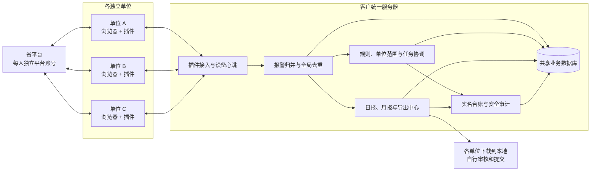

# 三客一危多单位协同报警系统：产品逻辑规划 V4

## 1. 本次更新结论

V4 在 V3 的无人值守、规则治理、失败转人工和真实动作安全边界上，补充客户当前明确的实际部署方式：

1. 系统由客户或项目负责人部署一套长期在线的统一服务器，各单位无需自行搭建后台。
2. 每个使用人员代表一个独立单位，在自己的 Chrome/Edge 浏览器中登录省平台并运行插件。
3. 每个人使用自己独立的省平台账号。助手系统同时记录实名用户、所属单位、平台账号引用和插件设备，形成清晰的责任链。
4. 插件负责页面查询、数据采集、会话状态和经授权的页面动作；服务器负责集中数据、跨插件去重、权限、规则、台账和报表。
5. 人员或电脑下线后，已上传的数据仍保存在服务器，其他有权限人员可以继续查看；离线电脑不能继续采集省平台数据。
6. 日报和月报由服务器按单位或企业生成，人员下载到本地后自行审核和提交。
7. 移动端不是建设服务器的唯一目的。移动事件详情和短信链接是后续能力，服务器首先解决多单位共享、数据连续性和统一管理。

未取得真实动作授权前，系统先按“自动查询、集中记录、报表导出”运行；文本、语音和自动处置继续保持生产阻断。

## 2. 产品定位

产品定义调整为：

> 叠加在省平台之上的多单位分布式报警采集、集中治理、受控处置和报表服务系统。

它不是一个只服务单个值班人员的浏览器工具，也不是只为手机显示而建设的移动后台。产品由四个层级组成：

| 层级 | 主要职责 |
| --- | --- |
| 省平台 | 产生报警，提供实时报警、技术检测、预警、历史、详情及页面动作能力 |
| 各单位浏览器插件 | 自动查询、读取字段、上报事件、报告登录状态、执行经服务器授权的页面动作 |
| 客户统一服务器 | 单位和用户管理、集中数据库、全局去重、规则、任务分配、台账、报表、审计和健康监测 |
| 人员使用端 | 在网页后台查看授权数据，下载日报/月报；后续可通过安全链接在手机查看事件 |

## 3. 总体架构



### 3.1 服务器边界

- 服务器原则上不直接登录省平台，不集中保存省平台密码、Cookie、Token 或验证码。
- 省平台访问仍发生在各单位人员自己的浏览器中，利用其当前已登录会话。
- 服务器保存标准化业务事件、单位归属、处理状态、报表和审计记录。
- 服务器是共享数据的权威来源；插件本地缓存只用于断网续传，不作为正式台账。
- 服务器可以部署在客户现有 Windows/Linux 服务器、虚拟机，试运行时也可暂时部署在一台长期在线的固定电脑上。

## 4. 单位、人员、账号和设备模型

必须区分四种身份：

| 身份 | 含义 | 关键要求 |
| --- | --- | --- |
| 单位身份 | 当前人员代表哪个独立单位 | 决定可见企业、车辆、事件和报表范围 |
| 助手用户身份 | 谁在使用插件或后台 | 必须实名，记录登录、查询、导出和人工动作 |
| 插件设备身份 | 哪台电脑、哪个浏览器实例在运行 | 独立注册、心跳、版本、在线和会话状态 |
| 省平台账号身份 | 每个人登录省平台所使用的独立账号 | 与实名助手用户建立映射，只保存可追踪引用，不保存密码和会话凭据 |

最终数据权限为：

```text
最终权限 = 功能角色 ∩ 单位/企业范围 ∩ 数据敏感级别 ∩ 当前任务范围
```

每个省平台账号对应明确的实际使用人员和单位。服务器通过助手用户、平台账号引用和设备注册共同识别采集来源，并校验该账号实际可见企业范围是否符合单位授权范围。

服务器还需要维护“账号覆盖范围表”：记录每个省平台账号能够查看哪些企业或车辆，以及是否存在具备相同数据权限的备用账号。该表只保存权限范围和脱敏账号引用，不保存登录凭据。

## 5. 两种产品运行模式

### 5.1 模式 A：查询与报表模式（首期默认）

适用于当前“每个单位独立查看，下载日报/月报后自行提交”的场景：

1. 插件定时查询实时报警、技术检测、预警和历史数据。
2. 按来源正确分类，实时报警优先，技术检测重点展示，预警和历史用于记录与核验。
3. 数据上传服务器并进行去重、归属和字段来源追踪。
4. 不自动发送文本、语音，不执行忽略、正报、申诉、查岗等真实动作。
5. 服务器按单位和企业形成日报、月报。
6. 有权限人员下载 XLSX/PDF 到本地，自行审核并向业务渠道提交。

该模式即使存在重复采集，也由服务器归并为一条共享事件，不会造成重复真实动作。

### 5.2 模式 B：自动第一处置模式（授权后启用）

在模式 A 基础上增加：

- 匹配已审核的官方规则和客户 SOP。
- 由服务器选择唯一插件获得动作租约。
- 按规则选择文本或语音，不默认双发。
- 检测司机是否纠正或风险是否解除。
- 未纠正、无法判断、高风险或动作结果未知时转人工并通知值班人员。
- 已经开始但结果未知的动作禁止其他插件自动重发。

模式 B 必须经过真实平台联调、测试车辆授权、动作回执确认和生产签字后才能开放。

## 6. 报警归属与去重逻辑

服务器收到插件上报后依次处理：

1. 识别报警来源：`REALTIME`、`TECHNICAL`、`PREWARNING`、`HISTORY`、`DETAIL`。
2. 生成平台报警唯一标识；无可靠报警 ID 时使用车辆、类型、开始时间、企业和位置摘要构造业务指纹。
3. 全局去重：同一报警被多个插件采集时只形成一条主事件，同时保留多条采集来源记录。
4. 确定责任单位：优先使用客户维护的企业—单位关系；无法唯一归属时进入待分配队列。
5. 每个单位只查看授权范围。跨单位事件是否允许共同查看由客户权限表决定。
6. 同一单位的人员下线后，事件责任和处理进度不消失，其他授权人员可以继续查看。

如果各单位负责的企业范围完全不重叠，服务器按归属直接分发；如果不同账号的数据权限存在交叉，同一报警仍可能被多个插件同时采集，必须由服务器去重和权限过滤，不能让各插件自行判断唯一性。

## 7. 报表与本地提交逻辑

报表不由插件直接拼装，而由服务器的独立报表中心生成：

- 支持按单位、企业、日期和报警来源生成日报、月报。
- 默认只包含当前用户授权范围内的数据。
- 已生成报表保存版本和数据截止时间；迟到数据通过更正版体现，不直接改写已提交版本。
- 支持 XLSX/PDF 下载到本地，下载行为写入审计台账。
- 本地文件属于报表副本，正式事件事实仍以服务器数据库为准。
- 普通报表不得包含密码、Cookie、Token、验证码和完整原始 JSON。
- 车辆、司机、企业、精确位置等敏感字段按岗位和用途脱敏；完整证据通过单独审批流程获取。

各单位人员的标准动作是“生成/查看 → 下载 → 本地审核 → 自行提交”。系统首期不强制连接客户外部报送渠道。

## 8. 在线、离线与一小时退出

服务器能够保证数据和台账连续，但不能让已退出省平台的浏览器继续采集：

- 人员关闭浏览器、电脑关机/休眠或网络中断后，该插件停止采集。
- 省平台空闲一小时退出后，该插件标记为“平台会话失效”，停止真实动作并通知人员重新登录。
- 其他仍在线且已登录的插件可以继续采集，并把共享数据写入服务器。
- 如果离线账号拥有其他账号看不到的独有企业范围，该范围后续的新报警会暂时失去采集来源；服务器只能保留已有数据并发出覆盖缺口通知。
- 只有当另一名人员的独立账号也拥有相同企业范围时，系统才能由其插件继续采集。生产无人值守应为关键范围配置至少一个备用覆盖账号或取得正式只读接口。
- 服务器持续保存此前事件，因此其他授权人员仍可查看和导出。
- 如果所有插件都离线或失去登录，服务器只能报警和记录采集中断，不能凭空读取省平台最新报警。
- 本条为 V4 时点的旧边界；平台方已在 2026-07-20 确认允许报警预处理页定时点击唯一“查询”按钮，现行边界以产品系统设计 V6 和并发技术栈决策为准。

## 9. 角色与职责分离

独立单位场景不取消职责分离。建议至少保留：

| 角色 | 主要职责 |
| --- | --- |
| 单位使用人员 | 运行插件、查看本单位数据、生成和下载本单位报表 |
| 监控/处置人员 | 接收异常、人工接管和填写处理结果 |
| 规则配置人员 | 编写规则和模板草案 |
| 规则审核人员 | 审核、发布和回滚规则，不得审核本人草案 |
| 报表管理人员 | 配置正式模板、数据截止时间和报表版本 |
| 系统管理员 | 管理服务器、用户、单位、设备和运行状态，不自动获得业务审核权限 |
| 安全审计人员 | 查看登录、采集、动作、导出和敏感访问记录 |

省平台账号实行一人一号，不得多人借用。监控操作、规则配置和规则审核也不能由同一个自然人全部完成。

## 10. 服务器解决与不解决的问题

| 服务器能够解决 | 服务器不能单独解决 |
| --- | --- |
| 多插件报警全局去重 | 各省平台账号本身的数据权限配置错误或范围不一致 |
| 数据集中保存和人员接替查看 | 省平台一小时空闲退出 |
| 发现账号覆盖缺口并告警 | 在没有同范围备用账号时替代离线账号采集新数据 |
| 单位、企业和人员权限隔离 | 电脑关机、休眠或浏览器关闭 |
| 规则和插件配置统一下发 | 省平台页面或接口改版 |
| 唯一动作执行和重复动作防护 | 未经授权开放文本、语音等真实动作 |
| 统一日报、月报和版本管理 | 手机在没有 VPN/内网通道时访问内网页面 |
| 插件在线、离线和会话失效监测 | 业务方尚未确认的报表口径和责任范围 |

## 11. 部署方案

### 11.1 试运行

- 部署位置：客户或老板提供的一台长期在线 Windows/Linux 电脑。
- 网络：固定内网地址，所有单位工作电脑能够访问。
- 后台：现有 Django 服务改为生产配置。
- 数据库：生产建议 PostgreSQL；本地 SQLite 仅用于开发和单机演示。
- 文件：报表、审计和受控证据使用独立目录并定期备份。
- 插件：配置统一服务器地址、单位身份、用户身份和设备注册信息。

### 11.2 正式运行

- 客户内网服务器或虚拟机长期在线。
- HTTPS、访问控制、数据库备份、日志留存、密钥管理和异常自动恢复。
- 如需移动端，通过办公 Wi-Fi、VPN、企业微信安全入口或客户批准的网关访问；不得使用公网裸露链接。
- 服务器部署和网络权限由客户/老板负责提供，我方负责部署包、配置、联调和验收。

## 12. 分阶段实施顺序

1. 部署统一服务器和生产数据库，建立备份与固定内网地址。
2. 建立单位、用户、企业范围和插件设备注册。
3. 核对各省平台账号的数据覆盖范围，为关键企业配置备用覆盖账号或明确单点风险。
4. 让至少两台电脑的插件连接服务器，验证上传、心跳和全局去重。
5. 上线模式 A，完成自动查询、集中台账、日报/月报和本地下载。
6. 验证不同省平台账号的企业可见范围、一小时退出行为以及重新登录恢复。
7. 冻结正式报表模板、数据截止时间、敏感字段和提交责任。
8. 在取得授权后选择少量报警联调模式 B 的文本/语音和纠正检测。
9. 最后接入短信、移动详情和完整无人值守验收。

## 13. 首期验收标准

- 至少两个独立单位、两台电脑、两个插件同时在线。
- 同一报警被多插件发现时，服务器只生成一条主事件。
- 每条事件保留采集单位、用户、设备、时间和字段来源。
- 单位人员只能查看和导出授权企业数据。
- 某人员下线后，其他授权人员仍能查看服务器已有数据。
- 任一关键企业范围至少有一个在线采集账号，或系统能够明确告警“该范围当前无人采集”。
- 插件登录失效、离线和恢复均有明确状态与记录。
- 日报/月报能够按单位、企业和时间生成并下载到本地。
- 报表版本、数据截止时间、下载人和下载时间可追踪。
- 普通导出不包含完整 JSON、认证信息和未授权敏感字段。
- 未授权真实动作始终被阻断。

## 14. 仍需老板或客户确认

1. 服务器操作系统、固定内网地址、访问端口和备份位置。
2. 单位、企业、车辆之间的正式归属关系，以及是否允许跨单位查看。
3. 每个省平台账号对应的人员、单位、企业可见范围，以及是否存在账号间数据交叉。
4. 哪些关键企业范围必须配置第二个备用账号，哪些范围允许短时无人采集。
5. 各单位是只查询和导出，还是后续也承担人工/自动处置。
6. 日报、月报模板、统计口径、截止时间、文件格式和提交对象。
7. 报表中车辆、司机、企业和位置字段的显示与脱敏规则。
8. 平台批准的会话续期方式或正式只读接口。
9. 后续短信、移动详情页的网络和实名访问方式。
10. 真实文本、语音动作的授权范围、测试车辆和成功回执口径。

## 15. 当前产品基线判断

当前推荐先交付“统一服务器 + 多单位插件 + 集中台账 + 单位报表本地导出”的模式 A。该方案能够直接支撑真实查询和报表工作，也能为后续无人值守自动处置建立统一数据和协调基础。

服务器上线不代表自动处置立即上线。真实文本、语音、纠正判断、短信升级和移动接管仍按照 V3 的规则治理、安全闸门和授权要求逐项开放。
