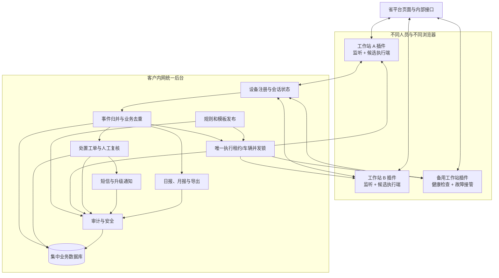
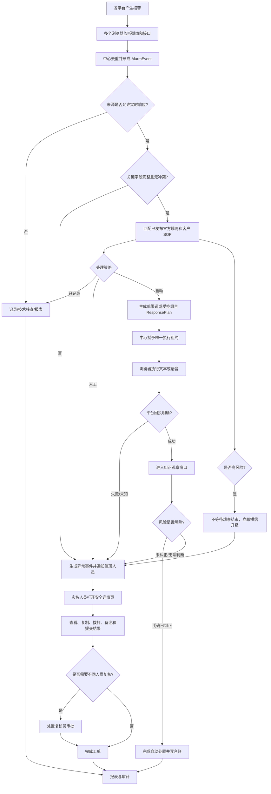

# 三客一危无人值守报警处置系统：产品逻辑规划 V3

## 1. 文档结论

本版本在产品 V2、多角色权限、真实平台接口核验和浏览器插件 `0.3.1` 的基础上，加入以下已明确目标：

1. 系统面向不同人员、不同电脑和不同 Chrome/Edge 浏览器运行。
2. 目标是无人值守完成报警第一处置，而不是仅在有人盯屏时提示。
3. 无人值守的边界是“自动发现、规则判断、受控提醒、纠正检测、失败升级和留痕”；高风险、无法判断和外部动作结果未知仍交给实名人员处理。
4. 浏览器插件只是分布式采集和页面动作端，事件、规则、锁、工单、短信、台账、报表和审计必须集中管理。
5. 本条记录 V3 时点的未授权状态；平台方已在 2026-07-20 确认允许报警预处理页定时点击唯一“查询”按钮，禁止自动登录和处理人机挑战的边界继续有效。

本文是 V3 规划草案。未取得客户对真实动作、会话续期、测试车辆和短信通道的正式授权前，生产文本、语音和自动登录继续保持阻断。

## 2. 产品定义

产品是叠加在省平台之上的“无人值守报警第一处置与人工升级系统”，由五个域组成：

| 产品域 | 主要职责 |
| --- | --- |
| 浏览器运行端 | 监听省平台、读取页面和接口、执行经授权的文本/语音页面动作、报告会话状态 |
| 事件与处置中心 | 事件去重、字段归并、纠正检测、工单、跨浏览器执行锁和状态机 |
| 规则与响应治理 | 官方规则、客户 SOP、文本模板、语音资产、审核、发布、回滚和仿真 |
| 通知与人工协同 | 短信、事件详情、安全链接、接管、复制、拨打、备注和复核 |
| 数据、报表与安全 | 企业日报/月报、脱敏导出、证据包、权限、审计、保留和密钥治理 |

## 3. 推荐总体架构



### 3.1 架构原则

- 所有浏览器可以采集，同一报警只能由一个执行端获得动作租约。
- 浏览器关闭、网络中断或会话失效时，执行租约自动到期，其他健康工作站可以接管尚未开始的任务。
- 已经开始且结果未知的文本/语音动作不得在另一台浏览器自动重发，必须转人工确认。
- 规则、模板和企业权限从中心下发，浏览器不能本地修改生产规则。
- 浏览器短期缓存不是系统事实源，中心数据库才是事件、工单和审计的权威来源。

## 4. 用户与职责

推荐保留 V2 七类角色，试点阶段至少配置四个不同职责：

| 角色 | 生产职责 | 不允许 |
| --- | --- | --- |
| 监控值班员 | 接收异常短信、接管工单、查看详情、复制、拨打、备注和提交结果 | 修改或审核生产规则 |
| 处置复核员 | 复核高风险、未知结果和重大异常 | 修改原始报警事实 |
| 规则配置员 | 创建官方规则、客户 SOP、文本和语音模板草案 | 审核本人版本 |
| 规则审核员 | 审核动作边界、企业范围、模板和规则版本 | 直接修改待审规则 |
| 报表员 | 生成授权企业日报/月报和脱敏导出 | 执行车辆动作 |
| 系统管理员 | 设备、用户、组织、配置和运行健康 | 自动获得业务审批权限 |
| 安全审计员 | 查看登录、动作、通知、导出和敏感访问 | 修改业务结果 |

权限始终为：

```text
最终权限 = 功能角色 ∩ 企业/组织范围 ∩ 数据敏感级别 ∩ 当前班次 ∩ 省平台账号能力
```

省平台使用共享账号时，助手系统仍必须实名到人并认领班次。无人值守期间的自动动作记录为系统执行，同时记录当班责任人、执行设备和规则版本。

## 5. 报警来源与优先级

| 优先级 | 来源 | 产品行为 |
| ---: | --- | --- |
| 3 | 实时报警 `REALTIME` | 进入规则判断，可生成司机响应计划 |
| 2 | 技术检测 `TECHNICAL` | 优先展示，默认人工技术核查；只有已批准细分类别可提醒司机 |
| 1 | 预警列表 `PREWARNING` | 关注、复盘和报表，默认不执行司机动作 |
| 0 | 历史查询 `HISTORY` | 补字段、核验和报表，不触发实时响应 |
| 0 | 报警详情 `DETAIL` | 仅补充事实和证据 |

默认规则：实时报警和技术检测优先处理；预警与历史不得因为数据更新时间较新而晋级为自动动作来源。

## 6. 无人值守主流程



## 7. 响应策略默认值

### 7.1 处理策略

- `AUTO`：通过全部生产闸门后执行。
- `MANUAL`：立即生成工单，不自动触发外部动作。
- `RECORD_ONLY`：只记录和统计。
- `DISABLED`：规则停用，默认转人工。

### 7.2 渠道原则

- 不默认文本和语音双发。
- 一般驾驶行为类报警优先按已审核规则选择单一渠道。
- 文本失败可以按规则转语音或人工；语音失败可以转文本或人工。
- 任一渠道结果为 `UNKNOWN` 时停止自动切换，防止重复提醒司机。
- 技术检测默认不向司机发送语音。
- 高风险报警可以在提醒司机的同时通知值班人员，但必须由规则明确批准。

### 7.3 模板原则

- 司机文本和语音只使用已发布固定模板。
- AI 不在生产模式自由生成司机喊话内容。
- 企业沟通话术可以由 AI 在固定结构内生成，但必须保留模板版本和人工修改记录。

## 8. 纠正检测

纠正检测是独立对象 `CorrectionAssessment`，不能把“文本/语音已发送”直接等同于“风险已解除”。

结果枚举：

```text
OBSERVING / CORRECTED / NOT_CORRECTED / UNKNOWN / HIGH_RISK
```

建议证据优先级：

1. 省平台报警状态解除或明确业务状态变化。
2. 速度、停车、位置、ACC、设备在线等平台事实。
3. 视频/VLM 在批准阈值内的判断。
4. 司机语音回复，只作为辅助证据。
5. 实名人员确认。

高风险、低置信度、视频不可用、字段冲突或观察窗口超时均不得自动判定 `CORRECTED`。

观察窗口按报警类型配置，默认不写死统一时长。试点前至少确认 30 秒、60 秒、120 秒或停车时长等具体口径。

## 9. 短信和移动接管

短信触发条件：

- 高风险报警。
- 提醒后未纠正。
- 无法判断。
- 文本/语音失败或结果未知。
- 省平台登录失效且没有健康备用执行端。
- 所有采集端离线或长时间没有心跳。

短信只包含最小信息，推荐使用脱敏车牌尾号、报警类型、风险等级和安全链接。司机、完整车牌、企业联系人、精确位置和证据应在实名详情页展示。

移动详情页必须部署在客户可访问的内网/VPN环境，链接短期有效且需要实名身份、角色和企业范围校验。查看、复制、拨打、备注和提交都写入审计。

## 10. 省平台一小时空闲退出

目标处理分为三层：

1. `SessionMonitor`：每个浏览器上报页面路由、401/403、最近授权接口响应和登录页状态。
2. `SessionRenewal`：仅使用平台批准的续期接口、服务账号或正式只读心跳。不得使用隐藏模拟点击作为生产方案。
3. `Failover`：某执行端失去登录时撤销其新动作资格，由其他已登录工作站接管尚未开始的任务。

如果所有工作站均失去登录：

- 停止真实文本和语音。
- 保留事件和处理进度。
- 发送值班与运维通知。
- 恢复登录后优先补采实时报警和技术检测。
- 对退出期间可能遗漏的数据执行历史核验，但历史查询只补数据，不触发补发司机提醒。

## 11. 多浏览器一致性

中心后台至少提供以下控制：

| 控制 | 目的 |
| --- | --- |
| `eventId` 全局唯一约束 | 防止不同浏览器重复生成报警 |
| `actionLease` 执行租约 | 保证一个报警只有一个动作执行端 |
| `vehicleLock` 车辆锁 | 防止同一车辆并发文本/语音 |
| 幂等键 | 防止网络重试导致重复动作 |
| 设备心跳 | 判断执行端是否在线、登录和可用 |
| 租约到期 | 允许尚未开始的任务由备用设备接管 |
| `UNKNOWN` 冻结 | 已开始但结果未知时禁止其他设备重发 |

## 12. 报表和敏感数据

- 插件不提供日报、月报和完整 JSON 下载。
- 独立报表中心按企业生成日报、月报、XLSX和PDF。
- 已发布报表为不可变快照，迟到数据生成更正版。
- 完整 JSON、视频、图片和证据 URL 属于 L4 高敏证据，只能通过审批后的加密证据包获得。
- 密码、Cookie、Authorization、Token 和验证码禁止进入业务存储、短信和导出。

## 13. 当前实现与 V3 目标差距

| 能力 | 当前 `0.3.1` | V3 目标 |
| --- | --- | --- |
| 真实平台采集 | 已验证实时、技术、历史、详情和辅助接口 | 补预警专用接口、弹窗和完整班次稳定性 |
| 会话失效 | 已识别登录页和401/403，暂停真实动作并提示补采 | 平台批准的续期、设备心跳和跨工作站故障接管 |
| 多浏览器 | 每个插件可独立采集，本地事件去重 | 中心全局去重、执行租约、设备注册和故障转移 |
| 规则治理 | 已有多角色审核发布和 Schema V2 | 补正式报警处置矩阵、风险条件和真实样本仿真 |
| 文本/语音 | 已有资产治理、ResponsePlan和沙箱 | 真实平台适配器与明确成功回执 |
| 纠正检测 | 产品设计和字段基础 | 实现观察窗口、证据聚合、VLM辅助和人工复核 |
| 短信与移动详情 | 产品设计 | 接入短信网关、移动访问、安全链接和升级策略 |
| 报表 | 已有基础日报/月报中心 | 冻结正式模板、指标、接收人和生产部署 |

## 14. 推荐实施顺序

1. 建设中心事件服务、设备注册、心跳、全局去重和动作租约。
2. 完成省平台会话续期的客户授权和技术验证。
3. 选择 3 至 5 类高频报警，形成正式规则、固定模板和纠正标准。
4. 在测试车辆上分别联调文本和语音，建立成功、失败和未知判据。
5. 实现纠正观察和高风险立即升级。
6. 接入短信、安全事件详情页和人工工单。
7. 完成多工作站故障转移和 72 小时无人值守试运行。
8. 冻结日报/月报模板、数据保留和安全制度后上线报表。

## 15. 生产验收建议

- 连续运行至少 72 小时。
- 至少两台工作站同时监听，验证只产生一个事件和一个动作。
- 主执行端关闭后，尚未开始的任务可由备用端接管。
- 已开始且结果未知的动作不会在备用端自动重发。
- 省平台空闲超时、重新登录和断点补采有完整记录。
- 报警漏抓率、重复率、发现延迟、动作成功率、短信送达率和人工接管时间达到双方确认指标。
- 高风险、字段冲突、无规则、无模板和结果未知全部正确转人工。
- 未授权角色无法查看其他企业、修改规则、执行动作或下载敏感证据。

## 16. 已采用的默认判断与仍需签字项

本规划已直接采用以下默认判断，不再反复询问：实时报警最高优先、技术检测默认人工核查、预警/历史只记录、不默认文本语音双发、未知结果不自动重试、多浏览器由中心去重、规则配置和审核分离、短信最小化、完整 JSON 受控。

仍需老板或客户签字的生产事项只有：

1. 平台允许的会话续期方式。
2. 首批试点报警及逐类文本/语音/观察窗口矩阵。
3. 文本和语音的明确成功回执口径。
4. 测试账号、测试车辆、企业范围和真实联调窗口。
5. 高风险报警清单及短信升级时限。
6. 短信服务商、接收人排班和移动详情页网络方案。
7. 企业组织权威关系、正式日报/月报口径和接收人。
8. 数据保留、证据包审批和生产密钥制度。
