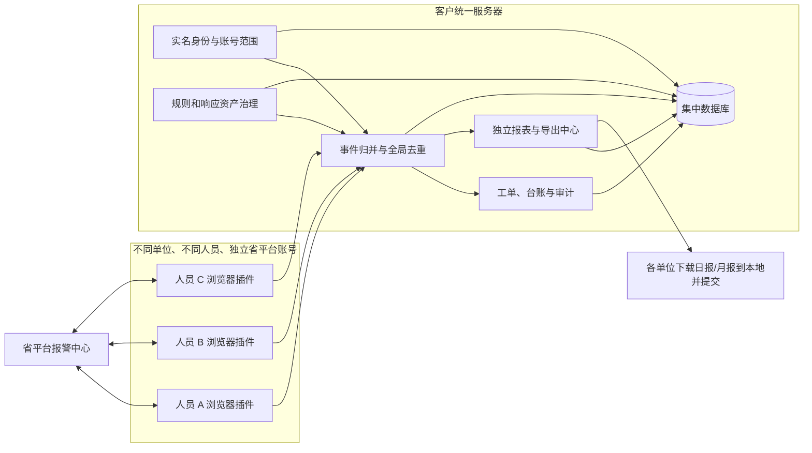
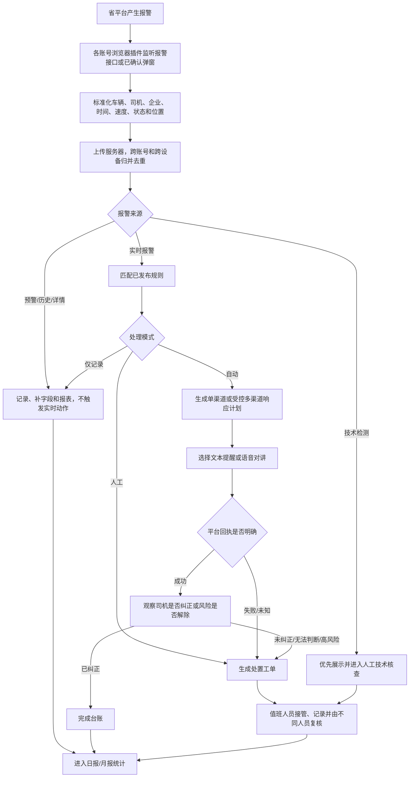

> 历史版本提示：本文件保留早期真实平台联调结论。当前自动 `VOICE_INTERCOM` 语义、服务器部署和身份边界以 V8 规则逻辑及服务器计划部署书 V3 为准。

# 三客一危多单位报警助手：项目产品理解与阶段规划 V5

> 当前执行规则请以 V8 规则逻辑和服务器计划部署书 V3 为准：自动规则可选择单一 `TEXT_TTS` 或单一 `VOICE_INTERCOM`；真实语音适配器需测试车辆和授权联调。

## 1. 我的产品理解

本项目不是一个只给单个值班人员使用的语音喊话插件，而是叠加在省平台上的“多单位报警采集、规则判断、受控响应、人工接管、集中台账与企业报表系统”。

每个人使用自己的省平台账号、自己的浏览器和插件；各账号可见企业范围可能不同，也可能交叉。插件利用当前浏览器已登录会话读取报警，统一服务器负责归并数据、识别责任单位、控制权限、发布规则、保存台账和生成报表。

产品的第一价值是减少人工盯屏和重复整理，第二价值是在规则明确、平台授权和真实回执验证后，逐步完成报警第一处置。移动端事件页是后续人工接管入口，不是搭建服务器的唯一目的。

## 2. 产品目标与边界

### 2.1 目标

- 自动发现实时报警、技术检测、预警和历史记录。
- 提取报警类型、车辆、司机、企业、时间、速度、状态和位置等业务字段。
- 保留每个字段来自哪个页面或接口，字段冲突不静默覆盖。
- 使用可版本化、可审核、可回滚的通用规则作出处理决定。
- 支持文本提醒和语音对讲，不默认两个渠道同时发送。
- 记录自动判断、页面动作、失败、人工接管和复核全过程。
- 按不同企业生成日报、月报，在独立报表中心下载到本地后自行提交。
- 对车辆、司机、企业、位置和完整 JSON 实施分级、脱敏、加密与审计。

### 2.2 边界

- 插件不保存或上传省平台密码、Cookie、Authorization、Token 和验证码。
- 未经客户和项目负责人授权，不执行真实文本、语音、忽略、正报、申诉或查岗动作。
- 本条为 V5 时点旧结论；平台方已确认允许报警预处理页定时点击唯一“查询”按钮。登录失效、验证码和人机挑战仍只允许人工处理。
- 服务器能保存已有数据，但不能替代已离线账号继续读取其独有权限范围的新报警。
- AI 不自由生成生产喊话内容；司机提醒使用已审核、已发布的固定模板或固定音频。

## 3. 使用角色与职责分离

| 角色 | 主要职责 | 不能同时承担 |
| --- | --- | --- |
| 单位使用人员 | 登录本人省平台账号、运行插件、查看本单位报警 | 不能自然获得规则审核权限 |
| 监控/处置人员 | 接管异常、联系司机或企业、填写处置结果 | 不能修改正在运行的生产规则 |
| 处置复核人员 | 复核高风险和人工处置结果 | 不能复核本人完成的高风险处置 |
| 规则配置人员 | 编写规则、文本模板和语音资产草案 | 不能审核本人版本 |
| 规则审核人员 | 审核、发布、回滚规则和响应资产 | 不能同时承担全部监控操作 |
| 报表人员 | 生成、发布、下载企业日报和月报 | 不能执行车辆页面动作 |
| 系统管理员 | 管理用户、单位、设备、服务和备份 | 不自动获得业务审核权限 |
| 安全审计人员 | 查看登录、动作、导出和敏感数据访问记录 | 不修改业务结果 |

最终权限为：

```text
最终权限 = 功能角色 ∩ 单位/企业范围 ∩ 数据敏感级别 ∩ 当前任务/班次
```

## 4. 总体产品架构



插件是采集和页面动作执行端，服务器才是共享事件、规则、权限、工单、台账和报表的权威来源。

## 5. 标准业务流程



## 6. 报警来源与优先级

| 优先级 | 来源 | 默认产品行为 |
| ---: | --- | --- |
| 300 | 实时报警 `REALTIME` | 唯一可默认进入自动响应规则的来源 |
| 200 | 技术检测 `TECHNICAL` | 优先展示，默认人工技术核查，不直接提醒司机 |
| 100 | 预警列表 `PREWARNING` | 关注、复盘和报表，不触发实时响应 |
| 0 | 历史查询 `HISTORY` | 补数据、核验和报表，不补发司机提醒 |
| 0 | 报警详情 `DETAIL` | 补字段和证据，不独立触发响应 |

同一报警先从历史出现、后从实时出现时，可以提升为实时来源；历史数据不能反向覆盖实时来源。

## 7. 文本与语音响应设计

- `TEXT` 和 `VOICE` 是同等级正式响应渠道，不把产品定义成自动语音系统。
- 默认使用 `SINGLE`，每条规则只选择一个最合适渠道。
- 需要组合时可使用顺序、兜底或并行策略，但必须明确审核。
- 前一渠道结果为 `UNKNOWN` 时禁止自动切换，防止重复提醒司机。
- 文本只能使用已发布固定模板及白名单变量。
- 语音只能使用已发布固定音频，并校验格式、版本和哈希。
- 动作成功不等于风险解除，必须单独执行纠正判断。

## 8. 多账号和人员下线逻辑

- 每个人使用独立省平台账号，服务器记录脱敏账号引用、实名用户、单位和设备。
- 不同账号可见数据交叉时，同一报警由服务器全局去重。
- 人员下线后，其他授权人员可以查看服务器中已经上传的数据。
- 如果离线账号负责独有企业范围，后续新报警会失去采集端；系统必须告警“该范围当前无人采集”。
- 关键企业范围应配置另一个具备相同权限的备用账号，或者取得平台正式只读接口。

## 9. 独立报表中心

插件只同步标准事件和处理事实，不承担正式日报/月报导出。

报表中心负责：

- 按企业、单位、日期生成日报和月报。
- 保存数据截止时间、版本、生成者、发布者和更正原因。
- 支持 XLSX/PDF 下载到本地，由各单位自行审核和提交。
- 已发布报表不直接改写；迟到数据形成更正版。
- 普通报表不提供完整原始 JSON。
- 每次生成、发布、下载和过期删除都写入审计记录。

## 10. 敏感数据设计

完整报警 JSON 可能包含车辆、司机、企业、位置、经纬度、证据地址和平台内部标识，应按高敏数据处理：

- 浏览器不长期保存原始抓取，只保留有界的标准事件短期缓存。
- 本机采集文件和服务器敏感快照加密保存。
- 普通展示按角色和企业范围控制，普通导出默认脱敏。
- 完整 JSON 只能通过独立证据申请、不同人员审批和加密证据包获取。
- 密码、Cookie、Authorization、Token、验证码和真实认证头永不进入业务存储或导出。
- 报表、证据包和数据库必须配置访问控制、备份、保留期限和密钥轮换。

## 11. 当前实现覆盖

| 能力 | 当前状态 |
| --- | --- |
| 白名单 fetch/XHR 只读监听 | 已实现并测试 |
| 实时、技术、预警、历史、详情分类 | 已实现；预警真实专用接口仍需完整班次复核 |
| 字段标准化、来源追踪和冲突保留 | 已实现 |
| 文本/语音 ResponsePlan 和沙箱适配器 | 已实现并测试 |
| 真实文本和语音平台适配器 | 未授权，生产硬阻断 |
| 实名角色、企业范围、班次和职责分离 | 本地 Django 后台已实现 |
| 人工工单与不同人员复核 | 已实现 |
| 独立日报/月报与 XLSX/PDF | 基础能力已实现，正式模板待确认 |
| 敏感快照、证据包和加密落盘 | 已实现第一版 |
| 多账号统一服务器和全局去重 | 产品与工程目标已明确，当前仍以本机服务为主 |
| 一小时退出检测和恢复补采 | 已实现检测与安全暂停；正式续期未解决 |

## 12. 阶段规划

### 阶段一：真实查询与集中报表

1. 部署统一服务器和 PostgreSQL。
2. 配置单位、实名用户、独立省平台账号引用、企业范围和设备。
3. 插件连接统一服务器，上报心跳和标准事件。
4. 完成多账号全局去重、覆盖缺口告警和集中台账。
5. 冻结日报/月报模板，允许各单位下载到本地提交。

### 阶段二：规则与受控响应联调

1. 选取 3 至 5 类高频报警。
2. 确认报警 ID、适用企业、风险级别和纠正标准。
3. 分别联调文本和语音的真实页面动作及成功回执。
4. 仅在授权测试车辆上开放真实动作白名单。
5. 完成失败、未知、高风险转人工和审计验证。

### 阶段三：无人值守与移动接管

1. 取得平台批准的会话续期、专用账号或正式接口。
2. 完成跨设备唯一动作租约和故障转移。
3. 接入短信、安全事件链接和移动详情。
4. 完成至少两台工作站、72 小时连续运行验收。

## 13. 当前推荐交付口径

当前先交付“多账号插件自动查询 + 统一服务器集中记录 + 独立企业日报/月报导出”。文本和语音的规则、模板治理、沙箱执行和安全闸门继续保留；真实页面动作必须在取得授权并完成测试车辆联调后逐类开放。
