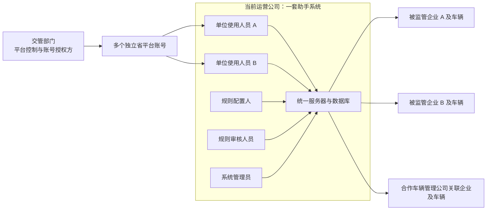
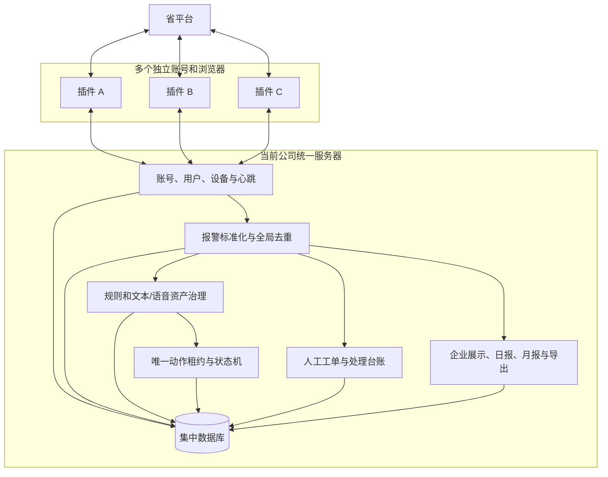
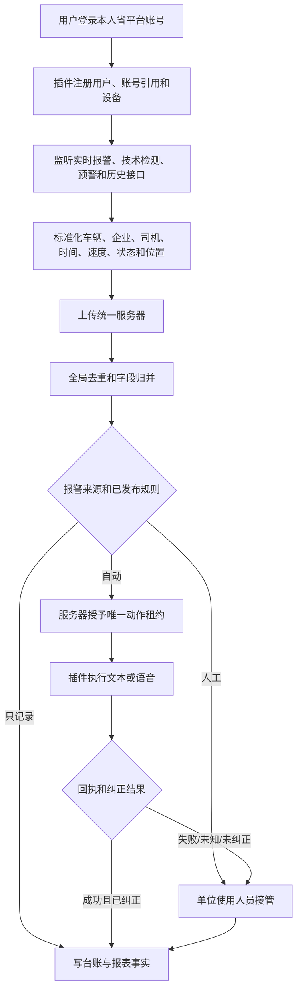

# 三客一危报警助手：产品逻辑与系统设计 V6

## 1. 最新业务结论

本系统的实际使用关系为：

1. 省平台受交管部门管控，由交管部门向当前运营公司授权多个独立登录账号。
2. 当前运营公司下面存在多个使用人员，也可能协同多家车辆管理合作公司，但所有插件数据统一发送到当前公司的一套后台系统。
3. 每个使用人员使用自己的省平台账号和自己的 Chrome/Edge 插件。
4. 不同省平台账号能够看到不同企业的车辆数据，账号之间可能完全重叠、部分重叠或不重叠。
5. 同一报警可能被多个账号和插件重复采集，必须由服务器全局去重，插件不能自行认定唯一性。
6. 当前产品不再单独建立“单位身份”。助手用户本身就是单位使用人员，所属公司是统一租户属性。
7. 所有数据集中保存；展示可以跨企业查看，正式报表和导出必须支持按被监管企业拆分。
8. 月报样例只作为字段、指标和版式参考，正式模板等待业务方后续整理。

## 2. 产品定位

产品定义为：

> 由交管部门授权账号、由当前运营公司集中使用的多账号报警采集、规则响应、台账和企业报表系统。

插件负责利用当前浏览器的省平台登录会话进行只读监听，并在授权后执行页面文本或语音动作；本地/内网服务器负责统一身份、数据归并、全局去重、规则、台账和报表。

## 3. 业务主体模型



### 3.1 不再使用独立“单位身份”

当前所有助手用户属于同一运营公司，因此不再建立“单位身份 + 助手用户身份”两套身份。保留以下对象即可：

| 对象 | 含义 |
| --- | --- |
| `TenantCompany` | 当前运营公司，当前阶段只有一个 |
| `AssistantUser` | 使用后台和插件的实名人员 |
| `PlatformAccountBinding` | 用户所使用的省平台账号脱敏引用，不保存密码和 Cookie |
| `DeviceRegistration` | 当前电脑、浏览器和插件实例 |
| `ManagedEnterprise` | 省平台中被监管的运输企业或车辆管理企业 |
| `AccountVisibility` | 某省平台账号实际能够看到哪些企业和车辆 |
| `VehicleSnapshot` | 报警发生时车辆及所属企业快照 |

一个用户可以绑定一个主要省平台账号；需要换号或备用账号时保留历史绑定记录。账号可见企业范围通过真实采集持续校准。

## 4. 角色与职责分离

当前角色精简为四类：

| 角色 | 主要权限 | 关键限制 |
| --- | --- | --- |
| 系统管理员 | 用户、账号引用、设备、服务器配置、备份和运行健康 | 不自动获得规则审核和真实业务动作权限 |
| 规则配置人 | 创建和修改规则、文本模板、语音资产草案；查看多企业数据；按企业导出 | 不能审核或发布本人规则 |
| 规则审核人员 | 审核、发布、回滚规则和响应资产；复核异常规则结果 | 不能同时作为规则配置人；不得承担日常插件监控操作 |
| 单位使用人员 | 登录本人省平台账号、运行插件、查看报警、人工接管、按企业生成和下载报表 | 不能配置或审核生产规则 |

强制互斥关系：

```text
规则配置人 != 规则审核人员
单位使用人员 != 规则审核人员
系统管理员权限 != 业务审核权限
```

自动文本/语音动作记录为“系统依据已发布规则执行”，同时记录发现该报警的账号、设备和当时在线的单位使用人员。

## 5. 账号、企业范围与统一入库

### 5.1 账号范围

- 每个省平台账号都有独立的可见企业和车辆范围。
- 多个账号可看到相同企业和相同车辆。
- 账号可见范围只影响“该插件能采到什么”，不决定服务器是否重复保存。
- 所有账号采集的数据都发送到同一服务器和同一业务数据库。

### 5.2 全局去重

优先使用平台报警记录 ID：

```text
globalEventId = platformAlarmRecordId
```

没有可靠 ID 时使用业务指纹：

```text
fingerprint = hash(vehicleKey + alarmTypeKey + alarmTime + enterpriseKey)
```

服务器收到重复报警时：

1. 只保留一条主事件。
2. 保留所有采集账号、用户、设备、接口和采集时间作为来源记录。
3. 选择字段更完整、来源优先级更高的数据补充主事件。
4. 字段冲突进入冲突列表，不静默覆盖。
5. 同一报警只允许生成一个响应计划和一个真实动作租约。

## 6. 总体系统架构



## 7. 插件业务流程



## 8. 会话与半小时主动检查

用户提出希望每半小时通过插件主动触发平台活动，降低一小时空闲退出概率。产品设计拆分为两层：

### 8.1 默认允许：30 分钟会话健康检查

- 上报插件、浏览器、页面路由和省平台登录状态。
- 检查是否进入登录页，是否出现 401/403。
- 在用户已打开报警页面时执行一次低频、只读的数据刷新或状态查询。
- 记录检查时间、接口结果和是否需要重新登录。
- 多插件错峰执行，避免同一时刻集中请求。

### 8.2 已确认授权：限定页面只读查询续期

平台方现已确认允许插件通过定时点击模拟人工活动。交付实现固定为 `AuthorizedKeepaliveAdapter`：仅在报警预处理路由 `#/alarm-center/alarm-preprocessing` 点击页面中唯一、可见、可用且文字严格为“查询”的按钮；默认每 30 分钟一次，并对不同设备错峰。用户处于其他页面时本周期跳过，不自动导航、不刷新、不使用坐标或任意选择器。

该授权不包含自动登录、验证码、人机挑战，也不包含文本下发、语音对讲、查岗、正报、申诉或忽略。遇到登录失效、挑战或目标歧义时，插件暂停本次操作、记录结果并提示人工完成。

## 9. 报表和企业导出

所有用户数据进入同一系统，但报表按被监管企业生成。

### 9.1 权限

- 规则配置人可以查看多个企业车辆数据并按企业导出。
- 单位使用人员可以查看授权范围内多个企业车辆数据并按企业导出。
- 系统管理员负责技术管理，不默认生成业务报表。
- 规则审核人员只在审核和复核所需范围内查看数据。

### 9.2 导出规则

- 用户先选择统计周期，再选择一个或多个企业。
- 选择多个企业时，默认生成“每企业一个文件”或一个文件内“每企业一个工作表”。
- 同时支持当前公司汇总视图，但企业明细不能混淆归属。
- 报表是服务器生成的不可变快照，记录数据截止时间和版本。
- 用户下载到本地后自行提供给对应车辆企业。

### 9.3 月报样例提供的参考模块

根据现有月报目录，系统先预留以下报表模块：

1. 企业报警和违法明细。
2. 各报警类型次数、车辆数和发生率。
3. 超速、超时、夜间违规等专项核实表。
4. 企业或片区排名。
5. 轨迹完整率和低完整率车辆。
6. 报警处理率、核实结果和处置方式。
7. 本月与上月报警趋势对比。
8. 企业处罚、教育、停班等后续处理字段。

这些模块先作为可配置报表组件，不直接复制历史 Excel 的所有合并单元格和计算口径。

## 10. 报表字段与敏感数据

业务方当前确认：授权用户查看和导出车辆、司机、企业和位置字段时不要求脱敏。因此：

- 授权范围内的正式企业报表可以显示完整业务字段。
- 系统仍必须通过登录、角色和企业范围阻止越权查看。
- 每次查看、生成和下载均记录人员、时间、企业和用途。
- 密码、Cookie、Authorization、Token、验证码和认证头在任何情况下都不能进入报表。
- 完整原始抓取 JSON 仍不属于普通报表，保留在受控证据流程中。

## 11. 文本、语音和 WebSocket 联调

- 文本提醒和语音对讲均作为正式渠道。
- 不默认双发，由规则选择单渠道、顺序或兜底。
- 当前真实动作调用方式尚未确认，语音可能使用 WebSocket，也可能组合 HTTP 和 WebSocket。
- 必须通过授权测试车辆记录开始、保持、停止、成功、失败和未知回执。
- 未完成测试前，生产适配器继续硬阻断，插件只运行演练或沙箱模式。

## 12. 当前暂不纳入

- 关键企业范围的第二备用账号规划。
- 短信和移动事件详情页。
- 自动向企业邮箱、网站或微信发送报表。
- 正式日报/月报最终模板和统计截止口径。

这些能力保留扩展位置，但不影响先建设统一服务器、全局去重、规则、台账和企业导出。

## 13. 实施顺序

1. 将本地 Django 改造成统一服务器部署配置。
2. 将当前七角色模型迁移为四角色模型。
3. 建立用户、平台账号引用、设备和账号可见企业范围。
4. 插件统一连接服务器并上报心跳和标准报警。
5. 实现数据库全局去重和跨插件唯一动作租约。
6. 上线多企业展示和按企业导出框架。
7. 将报警规则清单整理为结构化规则草案并走配置/审核流程。
8. 进行真实文本和语音/WebSocket只读勘察及测试车辆联调。
9. 在平台方确认后决定半小时只读刷新是否具备正式续期资格。

## 14. 当前无需再确认的事项

- 服务器环境由老板负责提供。
- 所有账号数据统一进入一个后台系统。
- 账号数据范围允许交叉，服务器必须全局去重。
- 不再把每个使用人员理解为独立公司或独立单位。
- 展示允许跨多个企业，导出按企业拆分。
- 当前先设计系统，报表模板、移动端和短信后续再定。
